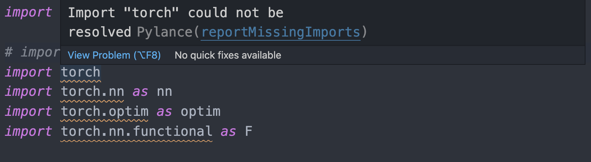
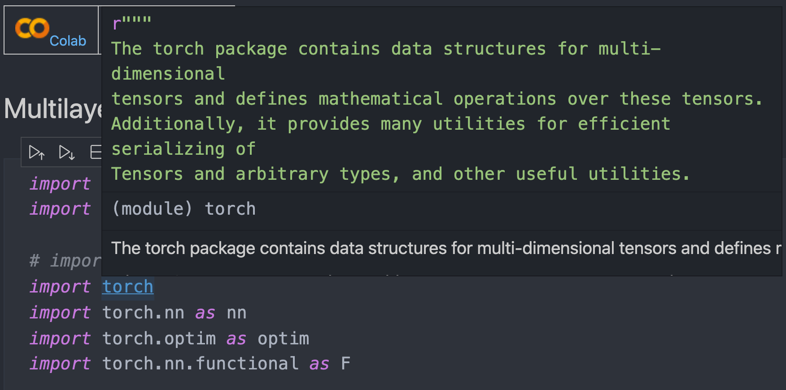

## Problem

For some time, I've been facing this issue on my Jupyter Notebook files.

```
Import "torch" could not be resolved Pylance(reportMissingImports)
```



This error was frustrating for the following reasons.

- The error appears on some Jupyter Notebooks but sometimes it doesn't.
- Packages like Django didn't have such errors. But when I used torch, this error frequently arose.
- This means I don't get any suggestion right next to `nn.` on vscode. Missing autocomplete feature while scripting in torch was a nusiance.

So I double-checked my VSCode and Python environment.

- torch library was properly installed as expected.
- I already selected proper python interpreter for that jupyter kernal.

## Diagnosis

To begin with, I had to understand what Pylance was. [Pylance is useful extension in VSCode.](https://marketplace.visualstudio.com/items?itemName=ms-python.vscode-pylance)

1. Pylance helps autocompletion when working in Python.
2. You can check what is under the hood for the imported library while pressing CMD key.
3. It is faster than Jedi and is compatible for Jupyter Notebook.

I suspected that my Python version management environment pyenv could be the source of the problem.

- I didn't install torch library for my local Python 3.8.3.
- I previously installed Django library on my local Python 3.8.3. This explains why Pylance was able to detect Django classes but not Pytorch classes.
- [I used pyenv to separate virtual environments on my laptop.](https://github.com/pyenv/pyenv) My pyenv virtual environment did have torch library.

### Conclusion

I realized that Pylance was connected to my local Python 3.8.3, not to my virtual environment.

Thus I added `.vscode/config.json` file to my working directory. This file will inform my Pylance library to look for which Python to connect to.


I added path of my pyenv virutalenvironment to `.vscode/config.json`.

```json
{
  "python.analysis.extraPaths": [
    "/Users/noopy/.pyenv/versions/3.8.3/envs/aitech/lib/python3.8"
  ]
}
```

**Now it works!**



FYI, If you don't want to go through such procedures, you can just install torch library for your local python environment. Then Pylance will be able to detect based on that package you installed on the local python. However, I didn't want to install any packages on my local python environment being afraid of version collision between NLP and Computer Vision projects. Thus I chose the method above instead.

### Reference

- [MS Pylance Trouble Shooting Reference](https://github.com/microsoft/pylance-release/blob/main/TROUBLESHOOTING.md#unresolved-import-warnings)
