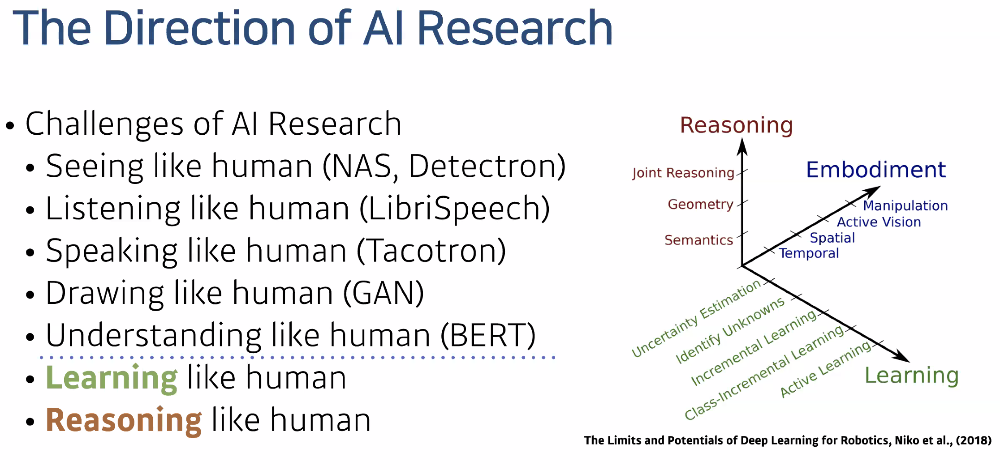

## 네이버 부스트캠프 마스터클래스 (임성빈)
### 수학을 어떻게 공부해야 할까요? 
- 머리로는 수학이 원래 어렵지만, 머리로 이해하는 건 너무 어렵고요. 여러분들 손에 익히는 걸 더 추천드리고 있어요. 머리로 이해하려면 시간이 너무 오래 걸리고요.
- 손으로 익히는 걸 어떻게 하는 걸 추천드릴게요. "In mathematics you don’t understand things. You just get used to them"이라고 폰노이만이 얘기하기도 했죠. 익숙해지려는 모습이 더 중요한 것 같습니다. 한 번에 이해하려고 노력하지는 않고요. 이게 뭔지 계속 생각하고 뜯어보려고 하고 노력하려는 편이에요. 
- 처음 배운 용어들은 일단 definition을 외우는 것부터 시작을 하세요. 위키피디아 내용을 보고 외우려고 노력을 하시고. 하루 정도 지난 다음에 그 내용을 다시 한 번 보세요. 용어의 definition이 무엇인지 헷갈리면, 인공지능 커뮤니티(AI Korea, Pytorch KR, TensorFlow KR)에 물어보면 됩니다.
- 예를 들어서, likelihood를 언제 어디서 어떻게 사용하는지 예제를 찾아보세요. 어떤 걸 적어도 알 수 있냐면, 이 개념을 언제 어떻게 어디에서 인용이 된다는 걸 알 수 있거든요. (ex: likelihood example을 검색해보면 이런 예제들이 나옴. 수식이 아니라 말/도표로 설명해주는 게 큰 도움이 됨)

- 인공지능 수학은 여러분들이 수학자로 만드는 게 아니라, 수학을 갖고 여러분들의 문제를 풀게 하는 거임. 이 수학적 개념을 언제 어떻게 어디서 쓰게 하는 게 중요함. 

### 여러 모델들의 수학적 원리를 이해하고 있어야 하나요?
- 모두 이해하는 것은 어렵지만 적어도 원리를 이해하는데 필요한 기초는 갖춰야 합니다. 저도 아침에 매일 수학 교과서를 1시간씩 공부를 합니다.
- 인공지능 분야는 특히나 수학자들이 이것저것 개념들을 퍼붇고 있기 때문에. 원리를 설명하는 기초적인 단어들이 있어요. likelihood, expectation, vector 등. 그런 기초적인 부분들을 알아두어야 필요할 때 가져다가 쓸 수 있는 거겠죠.

### 어떤 게 기초이냐?

- 미적분은 간단하게 gradient descent에 필요한 정도면 되지 않을까?
- **제일 중요한 수학 분야는 선형대수 / 확률론 / 통계학이에요.** 이 분야들은 first round 질문으로 나와요. 거기에서 떨어지면 신뢰도가 확 깎이거든요? 
- **알고리즘이랑 최적화 등 CS 공부를 하면 시너지가 좋습니다.** 공부를 할 때 시간을 단축하는 방법은 증명은 건너 뛰시고, 얘를 어디다가 갖다 쓰는지 사용법 등을 검색을 해보세요. 시중 책에 있는 example들보다는 google에서 찾는 게 제일 나은 듯 합니다. 
- 수학적 개념이 언제 어디에서 쓰이는지 찾아보면서 공부하시기를 추천드립니다.  Classification에서 loss function을 왜 cross entropy를 사용하느냐는 수학 부분, 어떻게 사용하느냐는 코드 부이겠죠?
- 항상 추천하는 책은 [dive into deep learning](https://d2l.ai/)입니다! 
	- [Math Appendix](https://d2l.ai/chapter_appendix-mathematics-for-deep-learning/index.html)에서 딱 필요한 정도로 다룹니다. 
	- TF랑 pytorch 구현 코드가 둘 다 있기 때문에, 수학을 코드로 옮기는 연습을 하기에는 제일 좋은 것 같습니다. 어차피 우리의 목적은 수학을 공부하는 게 아니라 딥러닝을 공부하는 거니까요. 

### ML 엔지니어는 수학을 어느 정도 알아야 할까요?
- 다 알 수는 없지만, 필요한 걸 공부해서 **빠르게 따라잡을 수 있을만큼** 알아야 합니다. 기초를 잘 다져놓아서, 필요로 할 때 따라잡을 수 있습니다. 수업시간에 다룬 게 굉장히 중요한 기초적인 내용이기도 하고요. upstage에 있는 내용만 충분히 이해해도 될 것 같아요.
- 우주선에 있는 엔지니어들 역할이 무언가 고장났을 때 고치는 역할이거든요. 언제 어떤 상황에서 문제를 어떻게 해결할 지 빠르게 하는 게 역할입니다. 
- 빠르게 deploy해야 하는 상황이 있는데, 미리미리 준비를 하는 게 엔지니어의 덕목이 아닐까 싶어요. 

### 수학이 언제 필요할까요?

- 엔지니어라면 기술적으로 해결할 수 있는 방안을 세워야 하거든요.
- 문제를 잘 define해서 어떤 개념들이 문제를 해결할 때 도움이 된다는 걸 알 때 수학을 공부해야 한다고 생각합니다.

### 추천시스템 공부는 어떻게 할까요?
[Dive into Deep Learning 16장](https://d2l.ai/chapter_recommender-systems/index.html) 내용을 보면 관련 내용들이 많이 나오니 추천합니다.
예를 들어서 추천 시스템에서 등장하는 Matrix Factorization model에서 rank 개념들이 나옵니다.

Bayesian theory를 쌓고 계시면 bandit(추천시스템 테크닉) 분야에 쓰이니까, 미리 기초를 공부해놓으시면 이 분야를 공부할 때 활용하시는 걸 추천드립니다. 

흠… 그러면 무슨 분야를 공부하고 싶은지 나는 충분히 알아봤으니까, 그 분야에서 사용하는 수학적 개념들이 무엇인지부터 정리를 하고, 그 다음에 수학을 공부하는 게 좋겠네.

### AI 분야에서 학석박 간에 어떤 차이가 있을까요?
- CV, NLP 분야는 기술적으로 많이 성숙이 됐고, 오픈소스 라이브러리에 많은 내용이 있기 때문에 굳이 대학원이 안 가도 공부할 수 있는 확률이 높아요. Image Classifcation, Segmentation은 이미 인터넷에 공부할 수 있는 소스들이 많아서.
- 요즘에 뜨는 분야, 새로운 분야들은 학위가 요구되는 경우가 많습니다. 그런 분야들이 아직 블로그로 누가 쉽게 설명되는 게 아니라 논문으로 쓰고, 디펜스 검증을 받기 때문에. 
- 국내에 전문가가 많이 않은 상황에서는 대학원이 중요할 수 있어요. 기술적인 성숙도에 따라서 / 대중화가 된 정도에 따라서 다른 것 같아요. 인과학습이나 강화학습 같은 경우는 대중화된 개념이 아니에요. 강화학습은 대중화 되기 쉽지 않거든요. Reasoning / Hardware 등은 학부로 부족한 경우가 많습니다.

- AutoML은 대학원보다 회사가 더 잘하는 분야인 것 같아요. 시스템 레벨이 있어서, 개발력이 자신이 있다면 현업에서 배우는 게 맞을 수 있고요. 그렇지 않으면 이론적인 부분을 공부하시는 게 좋을 것 같습니다. 

### 대학원 필수?
- 필수는 아닙니다. 하지만 본인이 관심을 가진 분야가 새로운 분야라면 대학원을 추천합니다.
- 학위만 가지고 이 사람을 뽑지는 않으니까요. 
- 대학원생들은 새로운 문제를 풀라고 던져주면 연구적인 문제로 training을 받는 경험이 있거든요. 스펙을 선호하는 게 아니고, 의외로 학력을 신경을 안 써요. 
- **저희가 신경을 쓰는 건 보냐면 어느 교수 랩 출신이냐, 그 랩에서 어떤 걸 연구했냐를 많이 봐요.** 그래서 일단 논문을 썼냐 안 썼냐를 보고요. 논문은 있는데, 코드 라이브러리에서 공개가 안 된 것들을 직접 구현을 해서 그 사람이 공유를 했는지를 봐요. 구글 애들이 논문 쓰고 코드 구현 안하는 경우가 많거든요. 그래서 연구자가 논문만 보고 코드를 구현을 했다면 되게 좋아요. 그러면 그 사람은 실제로 구현 능력이 있다고 해서 좋아하죠. 애초에 그런 트레이닝을 하려고 대학원을 가는 경우가 많죠. 랩에 가면 대학원 선배도 있고, 교수님들한테도 물어볼 수 있기 때문에. **여기서 중요한 건 1) 코드가 공개가 안 됐다, 2) 중요한 논문이다, 3) 퍼포먼스가 비슷하게 나온다는 게 조건들입니다.**  (그러면 나는 중요한 논문을 비슷한 퍼포먼스가 나오도록 따라하는 것부터 해야 겠네)
- 대학원을 보통 가게 되면은 랩에서 인턴을 연결을 많이 해줘요. 같이 일해본 사람들에게 마음이 가는 건 사실이니까 ㅎㅎ 인턴이 했던 경력이 있으면 많이 보려는 게 있어요. 

### 쉬운 수학 책?
- 여러 개가 있는데… 어떤 책으로 공부를 하셔도 익숙해지려는 노력을 하지 않으면 쉽지 않은 경우가 많거든요. 밑바닥부터 공부하는 딥러닝이 numpy부터 시작하는 책인데. 그런 책을 보면서 공부를 하실 때 처음부터 끝까지 수학을 이해하면서 본다는 것보다는, 부딛치는 빈도수를 늘리면서 공부하는 걸 추천드립니다. 

### 다른 책을 추천한다면?
- 상관관계가 인과관계를 뜻하는 게 아니다라는 사례입니다: https://www.amazon.com/Book-Why-Science-Cause-Effect/dp/046509760X
- 머신러닝을 현업에서 deploy하거나 data scientist들이 빠질 수 있는 함정들이 많이 있어요. 이런 분들에게 The book of why를 추천드립니다. 수학책이 아니라 술술술술 읽히는 책입니다 ㅎ

### 수학이든 모델이든 line-by-line으로 구현해보는 연습을 해보는 것이 좋을 지? 아니면 기초적인 개념(Gradient Descent) 정도만 구현할 수 있어도 충분한 지 여쭙고 싶습니다.
- 제가 추천드리는 건 line-by-line으로 연습을 하는 게 제일 좋아요. 현업에서 쓰시는 게 목적이라면 line-by-line으로 하는 걸 피할 수는 없는 거거든요. 회사 들어가서 하려면 진짜 힘들어요. 들어가기 전에 직접 연습하는 게 제일 좋은데. 
- 문제는 양이 너무 많다는 건데. 얘기를 하고 싶은 건, 모든 건 기초레벨로 하면 부족해요. 논문 자체를 구현하다보면 중요한 것들은 line-by-line을 하는 게 좋아요. 
- Deep learning framework에서 제공하는 건 기초적인 개념만 알아도 충분할 것 같고요. 문제는 딥러닝 프레임워크에서 제공되지 않는 부분은 우리가 line-by-line으로 해보는 수 밖에 없거든요. 
- 나중에 시니어 엔지니어가 된다면, 주니어 엔지니어가 물어보면 그때 답할 수 있어야죠? 나중에 가셔서 성장하시게 되면은 디테일을 하나하나 잡아가면서 하셔야 할 것 같습니다. 

### 논문을 읽다 보면 모델의 구조나 학습 방법이 명확하지 않은 경우가 있는것같은데요, 이런 논문을 구현함에 있어서 중요한 점은 무었이 있을까요??
- 엔지니어의 상상력입니다. 논문을 실제로 구현하는 데에 있어서 명확하지 않은 부분은 상상력이 필요하고요.
- 비슷한 상황에서 어떻게 했는지 여러분들이 직접 찾아보는 수 밖에 없습니다. stackexchange 열심히 찾아보셔야 하는데. 논문 구현도 쉬운 논문 구현이 있고, 어려운 논문 구현이 있어요. 구현하기 쉬운 논문부터 보시면 될 듯 합니다. 구현하기 쉬운 논문들부터 구현하기 시작하면 자신감이 생겨요. 이런 경우에는, 이런 테크닉을 쓰면 되는구나라는 게 체득이 될 겁니다. 
- **공부는 절대 혼자하지 마세요.** 커뮤니티도 있고, 궁금한 게 있으면 언제나 주변에게 물어볼 수 있는 사람들이 부캠에/페북에 많습니다. 
- 저분에게 질문하면 답을 얻을 수 있을 것 같다면 질문을 하시면 될 것 같습니다. 
