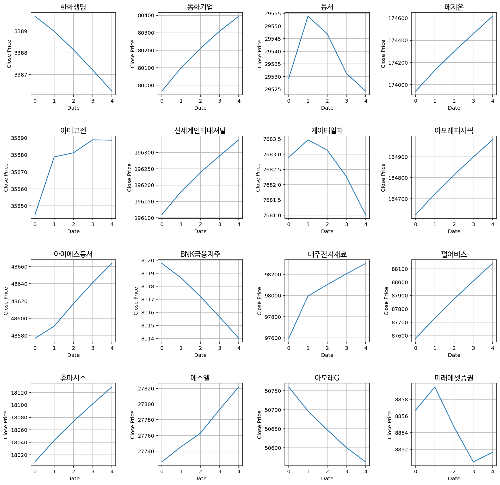

### Purpose of participation

Stock price prediction is pretty distant from the field of my interest, which is NLP.

But there are several purpose that I spent time participating in no-reward competition.

- **Data wrangling practice**: whatever datatype it be, I think it is important to wrangle as many data as possible. It is for the numpy & pandas practice
- **Refreshing**: I love studying the field of machine learning and deep learning. Although it is important to study deep enough, I think some refreshment helps the continuity of studying.
- **Somehow connected!**
  - The usage of cross validation
  - Markov-chain vs matrix approach
  - usage of sine, cosine function for timeseries annotation
  - Regularization at ElasticNet might be also regarded as weight decay.

## Using ElasticNetCV for stock price prediction

### Adding more data

- external data: WTI, NASDAQ, was tested, but it was no good
- derivative data: after @SangHoeKim constructed derivative data, I added VWAP and SMI but didn't increase the model's performance

### Choosing Adaquate Model

- When choosing a model, it was important that the model 1) don't fluctuate its performance over periods of time, 2) has higher performance than Linear Regression.
- The original plan was to ensemble 1) time-series forecast model with 2) regression model. Regression model ElasticNetCV turned out to be the best model, but ARIMA model's performance was too overfit for specific periods only to use. For example, ARIMA was good for predicting overall bear market / overall bull market but was bad at predicting fluctuation between the spand of 5 days.

  - ElasticNetCV was the right choice. It was advanced version of Linear Regression, and it has provided K-fold validation structure so that it comparably had more robustness compared to ElasticNet.
  - ARIMA(0,1,1) showed pretty good performance. This was out of expectation, since (p, q, d) = (0, 1, 1) is just moving average model with constant uprise/downfall of differentiation.
  - RandomForestRegressor and pmdARIMA was selected since its criteria can be customized as MAE instead of MSE.
  - pmdARIMA is implementation of AutoARIMA from RStudio, but its performance was too low to use.

- XGBoostRegressor turned out to be not good. Not only this was my team's conclusion, but the general consensus over the Dacon community was similar. However @tjy3090 pointed out that XGB captured the turning point and the pattern of the graph, even though its NMAE score was low.
- Compared between ffill vs dropna(), but concluded that ffill outperformed on more recend dates.

|       Model       | NMAE (2021-09-06 ~ 2021-09-10) | NMAE (2021-09-15 ~ 2021-09-24) |
| :---------------: | :----------------------------: | :----------------------------: |
|   ElasticNetCV    |              3.02              |              2.93              |
|   ARIMA(0,1,1)    |              3.03              |               -                |
|    ElasticNet     |              3.12              |               -                |
|      XGBoost      |              3.87              |               -                |
| Linear Regression |              4.03              |               -                |
|    RFRegressor    |              4.11              |               -                |
|     pmdARIMA      |              8.81              |               -                |

- Experimented with ARIMA, pmdARIMA, ElasticNetCV, RandomForestRegressor and XGBoost.

- Competition's criteria is based on NMAE. Grading criteria function was constructed as following:

```python
def NMAE(true_df, pred_df_input):
    """ grading criteria for public leader board """
    return (abs(true_df_copy - pred_df_input) / true_df_copy * 100).iloc[:5].values.mean()
```

- Thanks for setting up grading criteria, the team was able to experiment different kinds of models without being limited by submission quota.

### Code and Outputs

```python
# import python modules
import os
import copy

# import data wrangling modules
import pandas as pd
import numpy as np

# import visualization modules
from tqdm import tqdm
import matplotlib.pyplot as plt
import seaborn as sns

# import dataloader & stock data downloader
import FinanceDataReader as fdr

# import machine learning modules
from sklearn.preprocessing import MinMaxScaler, RobustScaler, StandardScaler
from sklearn.model_selection import train_test_split

# import machine learning models
from sklearn.linear_model import LinearRegression, ElasticNet, ElasticNetCV
from xgboost import XGBRegressor

# import cell output cleaner
from IPython.display import clear_output

# import stock data derivatives module
from talib import RSI, BBANDS, MACD, ATR
```

```python
import warnings
warnings.filterwarnings('ignore') # remove warnings from pandas
```

```python
# set options pandas: display more columns and reduced digits of float numbers
pd.set_option('display.max_columns', 100)
pd.options.display.float_format = '{:.4f}'.format
```

```python
path = './open'
list_name = 'Stock_List.csv'
stock_list = pd.read_csv(os.path.join(path,list_name))
stock_list['종목코드'] = stock_list['종목코드'].apply(lambda x : str(x).zfill(6))
display(stock_list.head())
display(stock_list.tail())
```

<div>
<style scoped>
    .dataframe tbody tr th:only-of-type {
        vertical-align: middle;
    }

    .dataframe tbody tr th {
        vertical-align: top;
    }

    .dataframe thead th {
        text-align: right;
    }

</style>

<table border="1" class="dataframe">
  <thead>
    <tr style="text-align: right;">
      <th></th>
      <th>종목명</th>
      <th>종목코드</th>
      <th>상장시장</th>
    </tr>
  </thead>
  <tbody>
    <tr>
      <th>0</th>
      <td>삼성전자</td>
      <td>005930</td>
      <td>KOSPI</td>
    </tr>
    <tr>
      <th>1</th>
      <td>SK하이닉스</td>
      <td>000660</td>
      <td>KOSPI</td>
    </tr>
    <tr>
      <th>2</th>
      <td>NAVER</td>
      <td>035420</td>
      <td>KOSPI</td>
    </tr>
    <tr>
      <th>3</th>
      <td>카카오</td>
      <td>035720</td>
      <td>KOSPI</td>
    </tr>
    <tr>
      <th>4</th>
      <td>삼성바이오로직스</td>
      <td>207940</td>
      <td>KOSPI</td>
    </tr>
  </tbody>
</table>
</div>

<div>
<style scoped>
    .dataframe tbody tr th:only-of-type {
        vertical-align: middle;
    }

    .dataframe tbody tr th {
        vertical-align: top;
    }

    .dataframe thead th {
        text-align: right;
    }

</style>

<table border="1" class="dataframe">
  <thead>
    <tr style="text-align: right;">
      <th></th>
      <th>종목명</th>
      <th>종목코드</th>
      <th>상장시장</th>
    </tr>
  </thead>
  <tbody>
    <tr>
      <th>371</th>
      <td>더네이쳐홀딩스</td>
      <td>298540</td>
      <td>KOSDAQ</td>
    </tr>
    <tr>
      <th>372</th>
      <td>코엔텍</td>
      <td>029960</td>
      <td>KOSDAQ</td>
    </tr>
    <tr>
      <th>373</th>
      <td>원익홀딩스</td>
      <td>030530</td>
      <td>KOSDAQ</td>
    </tr>
    <tr>
      <th>374</th>
      <td>웹케시</td>
      <td>053580</td>
      <td>KOSDAQ</td>
    </tr>
    <tr>
      <th>375</th>
      <td>신흥에스이씨</td>
      <td>243840</td>
      <td>KOSDAQ</td>
    </tr>
  </tbody>
</table>
</div>

```python
# define dates
""" Make dataset for training & evaluation """
from datetime import datetime
import os

# determines whether it is public leaderboard period or new_public period
BOOL_PUBLIC_PERIOD = False

# Determines whether to use public way or private way to utilize data
BOOL_PUBLIC = False

# set data window range
start_date = None # if this was set to 2021-01-04, then the mae shoots up to from 3.0 to 4.7
today = datetime.now()
data_end_date = today.strftime('%Y-%m-%d')

# public_start_date = '2021-09-10'
public_start_4th = '2021-09-06'
public_end_date = '2021-09-10'

check_point = '2021-09-14'
recent_known_date = '2021-09-24'

private_start_4th = '2021-09-27'
private_end_4th = '2021-10-01'
```

```python
if BOOL_PUBLIC_PERIOD:
    sample_name = 'sample_submission.csv' # week 4 submission
    pred_df = pd.read_csv(os.path.join(path,sample_name)).set_index('Day')
else:
    new_public_name = "new_public.csv"
    pred_df = pd.read_csv(os.path.join(path,new_public_name)).set_index('Day')
pred_df
```

<div>
<style scoped>
    .dataframe tbody tr th:only-of-type {
        vertical-align: middle;
    }

    .dataframe tbody tr th {
        vertical-align: top;
    }

    .dataframe thead th {
        text-align: right;
    }

</style>
<table border="1" class="dataframe">
  <thead>
    <tr style="text-align: right;">
      <th></th>
      <th>000060</th>
      <th>000080</th>
      <th>000100</th>
      <th>000120</th>
      <th>000150</th>
      <th>000240</th>
      <th>000250</th>
      <th>000270</th>
      <th>000660</th>
      <th>000670</th>
      <th>000720</th>
      <th>000810</th>
      <th>000880</th>
      <th>000990</th>
      <th>001230</th>
      <th>001440</th>
      <th>001450</th>
      <th>001740</th>
      <th>002380</th>
      <th>002790</th>
      <th>003000</th>
      <th>003090</th>
      <th>003380</th>
      <th>003410</th>
      <th>003490</th>
      <th>003670</th>
      <th>003800</th>
      <th>004000</th>
      <th>004020</th>
      <th>004170</th>
      <th>004370</th>
      <th>004490</th>
      <th>004800</th>
      <th>004990</th>
      <th>005250</th>
      <th>005290</th>
      <th>005300</th>
      <th>005380</th>
      <th>005385</th>
      <th>005387</th>
      <th>005490</th>
      <th>005830</th>
      <th>005850</th>
      <th>005930</th>
      <th>005935</th>
      <th>005940</th>
      <th>006260</th>
      <th>006280</th>
      <th>006360</th>
      <th>006400</th>
      <th>...</th>
      <th>253450</th>
      <th>256840</th>
      <th>263720</th>
      <th>263750</th>
      <th>267250</th>
      <th>267980</th>
      <th>268600</th>
      <th>271560</th>
      <th>272210</th>
      <th>272290</th>
      <th>273130</th>
      <th>278280</th>
      <th>278530</th>
      <th>282330</th>
      <th>285130</th>
      <th>287410</th>
      <th>290510</th>
      <th>290650</th>
      <th>292150</th>
      <th>293490</th>
      <th>293780</th>
      <th>294090</th>
      <th>294870</th>
      <th>298000</th>
      <th>298020</th>
      <th>298050</th>
      <th>298380</th>
      <th>298540</th>
      <th>299030</th>
      <th>299660</th>
      <th>299900</th>
      <th>307950</th>
      <th>314130</th>
      <th>316140</th>
      <th>319400</th>
      <th>319660</th>
      <th>321550</th>
      <th>323990</th>
      <th>326030</th>
      <th>330590</th>
      <th>330860</th>
      <th>336260</th>
      <th>336370</th>
      <th>347860</th>
      <th>348150</th>
      <th>348210</th>
      <th>352820</th>
      <th>357780</th>
      <th>363280</th>
      <th>950130</th>
    </tr>
    <tr>
      <th>Day</th>
      <th></th>
      <th></th>
      <th></th>
      <th></th>
      <th></th>
      <th></th>
      <th></th>
      <th></th>
      <th></th>
      <th></th>
      <th></th>
      <th></th>
      <th></th>
      <th></th>
      <th></th>
      <th></th>
      <th></th>
      <th></th>
      <th></th>
      <th></th>
      <th></th>
      <th></th>
      <th></th>
      <th></th>
      <th></th>
      <th></th>
      <th></th>
      <th></th>
      <th></th>
      <th></th>
      <th></th>
      <th></th>
      <th></th>
      <th></th>
      <th></th>
      <th></th>
      <th></th>
      <th></th>
      <th></th>
      <th></th>
      <th></th>
      <th></th>
      <th></th>
      <th></th>
      <th></th>
      <th></th>
      <th></th>
      <th></th>
      <th></th>
      <th></th>
      <th></th>
      <th></th>
      <th></th>
      <th></th>
      <th></th>
      <th></th>
      <th></th>
      <th></th>
      <th></th>
      <th></th>
      <th></th>
      <th></th>
      <th></th>
      <th></th>
      <th></th>
      <th></th>
      <th></th>
      <th></th>
      <th></th>
      <th></th>
      <th></th>
      <th></th>
      <th></th>
      <th></th>
      <th></th>
      <th></th>
      <th></th>
      <th></th>
      <th></th>
      <th></th>
      <th></th>
      <th></th>
      <th></th>
      <th></th>
      <th></th>
      <th></th>
      <th></th>
      <th></th>
      <th></th>
      <th></th>
      <th></th>
      <th></th>
      <th></th>
      <th></th>
      <th></th>
      <th></th>
      <th></th>
      <th></th>
      <th></th>
      <th></th>
      <th></th>
    </tr>
  </thead>
  <tbody>
    <tr>
      <th>2021-09-15</th>
      <td>0</td>
      <td>0</td>
      <td>0</td>
      <td>0</td>
      <td>0</td>
      <td>0</td>
      <td>0</td>
      <td>0</td>
      <td>0</td>
      <td>0</td>
      <td>0</td>
      <td>0</td>
      <td>0</td>
      <td>0</td>
      <td>0</td>
      <td>0</td>
      <td>0</td>
      <td>0</td>
      <td>0</td>
      <td>0</td>
      <td>0</td>
      <td>0</td>
      <td>0</td>
      <td>0</td>
      <td>0</td>
      <td>0</td>
      <td>0</td>
      <td>0</td>
      <td>0</td>
      <td>0</td>
      <td>0</td>
      <td>0</td>
      <td>0</td>
      <td>0</td>
      <td>0</td>
      <td>0</td>
      <td>0</td>
      <td>0</td>
      <td>0</td>
      <td>0</td>
      <td>0</td>
      <td>0</td>
      <td>0</td>
      <td>0</td>
      <td>0</td>
      <td>0</td>
      <td>0</td>
      <td>0</td>
      <td>0</td>
      <td>0</td>
      <td>...</td>
      <td>0</td>
      <td>0</td>
      <td>0</td>
      <td>0</td>
      <td>0</td>
      <td>0</td>
      <td>0</td>
      <td>0</td>
      <td>0</td>
      <td>0</td>
      <td>0</td>
      <td>0</td>
      <td>0</td>
      <td>0</td>
      <td>0</td>
      <td>0</td>
      <td>0</td>
      <td>0</td>
      <td>0</td>
      <td>0</td>
      <td>0</td>
      <td>0</td>
      <td>0</td>
      <td>0</td>
      <td>0</td>
      <td>0</td>
      <td>0</td>
      <td>0</td>
      <td>0</td>
      <td>0</td>
      <td>0</td>
      <td>0</td>
      <td>0</td>
      <td>0</td>
      <td>0</td>
      <td>0</td>
      <td>0</td>
      <td>0</td>
      <td>0</td>
      <td>0</td>
      <td>0</td>
      <td>0</td>
      <td>0</td>
      <td>0</td>
      <td>0</td>
      <td>0</td>
      <td>0</td>
      <td>0</td>
      <td>0</td>
      <td>0</td>
    </tr>
    <tr>
      <th>2021-09-16</th>
      <td>0</td>
      <td>0</td>
      <td>0</td>
      <td>0</td>
      <td>0</td>
      <td>0</td>
      <td>0</td>
      <td>0</td>
      <td>0</td>
      <td>0</td>
      <td>0</td>
      <td>0</td>
      <td>0</td>
      <td>0</td>
      <td>0</td>
      <td>0</td>
      <td>0</td>
      <td>0</td>
      <td>0</td>
      <td>0</td>
      <td>0</td>
      <td>0</td>
      <td>0</td>
      <td>0</td>
      <td>0</td>
      <td>0</td>
      <td>0</td>
      <td>0</td>
      <td>0</td>
      <td>0</td>
      <td>0</td>
      <td>0</td>
      <td>0</td>
      <td>0</td>
      <td>0</td>
      <td>0</td>
      <td>0</td>
      <td>0</td>
      <td>0</td>
      <td>0</td>
      <td>0</td>
      <td>0</td>
      <td>0</td>
      <td>0</td>
      <td>0</td>
      <td>0</td>
      <td>0</td>
      <td>0</td>
      <td>0</td>
      <td>0</td>
      <td>...</td>
      <td>0</td>
      <td>0</td>
      <td>0</td>
      <td>0</td>
      <td>0</td>
      <td>0</td>
      <td>0</td>
      <td>0</td>
      <td>0</td>
      <td>0</td>
      <td>0</td>
      <td>0</td>
      <td>0</td>
      <td>0</td>
      <td>0</td>
      <td>0</td>
      <td>0</td>
      <td>0</td>
      <td>0</td>
      <td>0</td>
      <td>0</td>
      <td>0</td>
      <td>0</td>
      <td>0</td>
      <td>0</td>
      <td>0</td>
      <td>0</td>
      <td>0</td>
      <td>0</td>
      <td>0</td>
      <td>0</td>
      <td>0</td>
      <td>0</td>
      <td>0</td>
      <td>0</td>
      <td>0</td>
      <td>0</td>
      <td>0</td>
      <td>0</td>
      <td>0</td>
      <td>0</td>
      <td>0</td>
      <td>0</td>
      <td>0</td>
      <td>0</td>
      <td>0</td>
      <td>0</td>
      <td>0</td>
      <td>0</td>
      <td>0</td>
    </tr>
    <tr>
      <th>2021-09-17</th>
      <td>0</td>
      <td>0</td>
      <td>0</td>
      <td>0</td>
      <td>0</td>
      <td>0</td>
      <td>0</td>
      <td>0</td>
      <td>0</td>
      <td>0</td>
      <td>0</td>
      <td>0</td>
      <td>0</td>
      <td>0</td>
      <td>0</td>
      <td>0</td>
      <td>0</td>
      <td>0</td>
      <td>0</td>
      <td>0</td>
      <td>0</td>
      <td>0</td>
      <td>0</td>
      <td>0</td>
      <td>0</td>
      <td>0</td>
      <td>0</td>
      <td>0</td>
      <td>0</td>
      <td>0</td>
      <td>0</td>
      <td>0</td>
      <td>0</td>
      <td>0</td>
      <td>0</td>
      <td>0</td>
      <td>0</td>
      <td>0</td>
      <td>0</td>
      <td>0</td>
      <td>0</td>
      <td>0</td>
      <td>0</td>
      <td>0</td>
      <td>0</td>
      <td>0</td>
      <td>0</td>
      <td>0</td>
      <td>0</td>
      <td>0</td>
      <td>...</td>
      <td>0</td>
      <td>0</td>
      <td>0</td>
      <td>0</td>
      <td>0</td>
      <td>0</td>
      <td>0</td>
      <td>0</td>
      <td>0</td>
      <td>0</td>
      <td>0</td>
      <td>0</td>
      <td>0</td>
      <td>0</td>
      <td>0</td>
      <td>0</td>
      <td>0</td>
      <td>0</td>
      <td>0</td>
      <td>0</td>
      <td>0</td>
      <td>0</td>
      <td>0</td>
      <td>0</td>
      <td>0</td>
      <td>0</td>
      <td>0</td>
      <td>0</td>
      <td>0</td>
      <td>0</td>
      <td>0</td>
      <td>0</td>
      <td>0</td>
      <td>0</td>
      <td>0</td>
      <td>0</td>
      <td>0</td>
      <td>0</td>
      <td>0</td>
      <td>0</td>
      <td>0</td>
      <td>0</td>
      <td>0</td>
      <td>0</td>
      <td>0</td>
      <td>0</td>
      <td>0</td>
      <td>0</td>
      <td>0</td>
      <td>0</td>
    </tr>
    <tr>
      <th>2021-09-23</th>
      <td>0</td>
      <td>0</td>
      <td>0</td>
      <td>0</td>
      <td>0</td>
      <td>0</td>
      <td>0</td>
      <td>0</td>
      <td>0</td>
      <td>0</td>
      <td>0</td>
      <td>0</td>
      <td>0</td>
      <td>0</td>
      <td>0</td>
      <td>0</td>
      <td>0</td>
      <td>0</td>
      <td>0</td>
      <td>0</td>
      <td>0</td>
      <td>0</td>
      <td>0</td>
      <td>0</td>
      <td>0</td>
      <td>0</td>
      <td>0</td>
      <td>0</td>
      <td>0</td>
      <td>0</td>
      <td>0</td>
      <td>0</td>
      <td>0</td>
      <td>0</td>
      <td>0</td>
      <td>0</td>
      <td>0</td>
      <td>0</td>
      <td>0</td>
      <td>0</td>
      <td>0</td>
      <td>0</td>
      <td>0</td>
      <td>0</td>
      <td>0</td>
      <td>0</td>
      <td>0</td>
      <td>0</td>
      <td>0</td>
      <td>0</td>
      <td>...</td>
      <td>0</td>
      <td>0</td>
      <td>0</td>
      <td>0</td>
      <td>0</td>
      <td>0</td>
      <td>0</td>
      <td>0</td>
      <td>0</td>
      <td>0</td>
      <td>0</td>
      <td>0</td>
      <td>0</td>
      <td>0</td>
      <td>0</td>
      <td>0</td>
      <td>0</td>
      <td>0</td>
      <td>0</td>
      <td>0</td>
      <td>0</td>
      <td>0</td>
      <td>0</td>
      <td>0</td>
      <td>0</td>
      <td>0</td>
      <td>0</td>
      <td>0</td>
      <td>0</td>
      <td>0</td>
      <td>0</td>
      <td>0</td>
      <td>0</td>
      <td>0</td>
      <td>0</td>
      <td>0</td>
      <td>0</td>
      <td>0</td>
      <td>0</td>
      <td>0</td>
      <td>0</td>
      <td>0</td>
      <td>0</td>
      <td>0</td>
      <td>0</td>
      <td>0</td>
      <td>0</td>
      <td>0</td>
      <td>0</td>
      <td>0</td>
    </tr>
    <tr>
      <th>2021-09-24</th>
      <td>0</td>
      <td>0</td>
      <td>0</td>
      <td>0</td>
      <td>0</td>
      <td>0</td>
      <td>0</td>
      <td>0</td>
      <td>0</td>
      <td>0</td>
      <td>0</td>
      <td>0</td>
      <td>0</td>
      <td>0</td>
      <td>0</td>
      <td>0</td>
      <td>0</td>
      <td>0</td>
      <td>0</td>
      <td>0</td>
      <td>0</td>
      <td>0</td>
      <td>0</td>
      <td>0</td>
      <td>0</td>
      <td>0</td>
      <td>0</td>
      <td>0</td>
      <td>0</td>
      <td>0</td>
      <td>0</td>
      <td>0</td>
      <td>0</td>
      <td>0</td>
      <td>0</td>
      <td>0</td>
      <td>0</td>
      <td>0</td>
      <td>0</td>
      <td>0</td>
      <td>0</td>
      <td>0</td>
      <td>0</td>
      <td>0</td>
      <td>0</td>
      <td>0</td>
      <td>0</td>
      <td>0</td>
      <td>0</td>
      <td>0</td>
      <td>...</td>
      <td>0</td>
      <td>0</td>
      <td>0</td>
      <td>0</td>
      <td>0</td>
      <td>0</td>
      <td>0</td>
      <td>0</td>
      <td>0</td>
      <td>0</td>
      <td>0</td>
      <td>0</td>
      <td>0</td>
      <td>0</td>
      <td>0</td>
      <td>0</td>
      <td>0</td>
      <td>0</td>
      <td>0</td>
      <td>0</td>
      <td>0</td>
      <td>0</td>
      <td>0</td>
      <td>0</td>
      <td>0</td>
      <td>0</td>
      <td>0</td>
      <td>0</td>
      <td>0</td>
      <td>0</td>
      <td>0</td>
      <td>0</td>
      <td>0</td>
      <td>0</td>
      <td>0</td>
      <td>0</td>
      <td>0</td>
      <td>0</td>
      <td>0</td>
      <td>0</td>
      <td>0</td>
      <td>0</td>
      <td>0</td>
      <td>0</td>
      <td>0</td>
      <td>0</td>
      <td>0</td>
      <td>0</td>
      <td>0</td>
      <td>0</td>
    </tr>
    <tr>
      <th>2021-09-27</th>
      <td>0</td>
      <td>0</td>
      <td>0</td>
      <td>0</td>
      <td>0</td>
      <td>0</td>
      <td>0</td>
      <td>0</td>
      <td>0</td>
      <td>0</td>
      <td>0</td>
      <td>0</td>
      <td>0</td>
      <td>0</td>
      <td>0</td>
      <td>0</td>
      <td>0</td>
      <td>0</td>
      <td>0</td>
      <td>0</td>
      <td>0</td>
      <td>0</td>
      <td>0</td>
      <td>0</td>
      <td>0</td>
      <td>0</td>
      <td>0</td>
      <td>0</td>
      <td>0</td>
      <td>0</td>
      <td>0</td>
      <td>0</td>
      <td>0</td>
      <td>0</td>
      <td>0</td>
      <td>0</td>
      <td>0</td>
      <td>0</td>
      <td>0</td>
      <td>0</td>
      <td>0</td>
      <td>0</td>
      <td>0</td>
      <td>0</td>
      <td>0</td>
      <td>0</td>
      <td>0</td>
      <td>0</td>
      <td>0</td>
      <td>0</td>
      <td>...</td>
      <td>0</td>
      <td>0</td>
      <td>0</td>
      <td>0</td>
      <td>0</td>
      <td>0</td>
      <td>0</td>
      <td>0</td>
      <td>0</td>
      <td>0</td>
      <td>0</td>
      <td>0</td>
      <td>0</td>
      <td>0</td>
      <td>0</td>
      <td>0</td>
      <td>0</td>
      <td>0</td>
      <td>0</td>
      <td>0</td>
      <td>0</td>
      <td>0</td>
      <td>0</td>
      <td>0</td>
      <td>0</td>
      <td>0</td>
      <td>0</td>
      <td>0</td>
      <td>0</td>
      <td>0</td>
      <td>0</td>
      <td>0</td>
      <td>0</td>
      <td>0</td>
      <td>0</td>
      <td>0</td>
      <td>0</td>
      <td>0</td>
      <td>0</td>
      <td>0</td>
      <td>0</td>
      <td>0</td>
      <td>0</td>
      <td>0</td>
      <td>0</td>
      <td>0</td>
      <td>0</td>
      <td>0</td>
      <td>0</td>
      <td>0</td>
    </tr>
    <tr>
      <th>2021-09-28</th>
      <td>0</td>
      <td>0</td>
      <td>0</td>
      <td>0</td>
      <td>0</td>
      <td>0</td>
      <td>0</td>
      <td>0</td>
      <td>0</td>
      <td>0</td>
      <td>0</td>
      <td>0</td>
      <td>0</td>
      <td>0</td>
      <td>0</td>
      <td>0</td>
      <td>0</td>
      <td>0</td>
      <td>0</td>
      <td>0</td>
      <td>0</td>
      <td>0</td>
      <td>0</td>
      <td>0</td>
      <td>0</td>
      <td>0</td>
      <td>0</td>
      <td>0</td>
      <td>0</td>
      <td>0</td>
      <td>0</td>
      <td>0</td>
      <td>0</td>
      <td>0</td>
      <td>0</td>
      <td>0</td>
      <td>0</td>
      <td>0</td>
      <td>0</td>
      <td>0</td>
      <td>0</td>
      <td>0</td>
      <td>0</td>
      <td>0</td>
      <td>0</td>
      <td>0</td>
      <td>0</td>
      <td>0</td>
      <td>0</td>
      <td>0</td>
      <td>...</td>
      <td>0</td>
      <td>0</td>
      <td>0</td>
      <td>0</td>
      <td>0</td>
      <td>0</td>
      <td>0</td>
      <td>0</td>
      <td>0</td>
      <td>0</td>
      <td>0</td>
      <td>0</td>
      <td>0</td>
      <td>0</td>
      <td>0</td>
      <td>0</td>
      <td>0</td>
      <td>0</td>
      <td>0</td>
      <td>0</td>
      <td>0</td>
      <td>0</td>
      <td>0</td>
      <td>0</td>
      <td>0</td>
      <td>0</td>
      <td>0</td>
      <td>0</td>
      <td>0</td>
      <td>0</td>
      <td>0</td>
      <td>0</td>
      <td>0</td>
      <td>0</td>
      <td>0</td>
      <td>0</td>
      <td>0</td>
      <td>0</td>
      <td>0</td>
      <td>0</td>
      <td>0</td>
      <td>0</td>
      <td>0</td>
      <td>0</td>
      <td>0</td>
      <td>0</td>
      <td>0</td>
      <td>0</td>
      <td>0</td>
      <td>0</td>
    </tr>
    <tr>
      <th>2021-09-29</th>
      <td>0</td>
      <td>0</td>
      <td>0</td>
      <td>0</td>
      <td>0</td>
      <td>0</td>
      <td>0</td>
      <td>0</td>
      <td>0</td>
      <td>0</td>
      <td>0</td>
      <td>0</td>
      <td>0</td>
      <td>0</td>
      <td>0</td>
      <td>0</td>
      <td>0</td>
      <td>0</td>
      <td>0</td>
      <td>0</td>
      <td>0</td>
      <td>0</td>
      <td>0</td>
      <td>0</td>
      <td>0</td>
      <td>0</td>
      <td>0</td>
      <td>0</td>
      <td>0</td>
      <td>0</td>
      <td>0</td>
      <td>0</td>
      <td>0</td>
      <td>0</td>
      <td>0</td>
      <td>0</td>
      <td>0</td>
      <td>0</td>
      <td>0</td>
      <td>0</td>
      <td>0</td>
      <td>0</td>
      <td>0</td>
      <td>0</td>
      <td>0</td>
      <td>0</td>
      <td>0</td>
      <td>0</td>
      <td>0</td>
      <td>0</td>
      <td>...</td>
      <td>0</td>
      <td>0</td>
      <td>0</td>
      <td>0</td>
      <td>0</td>
      <td>0</td>
      <td>0</td>
      <td>0</td>
      <td>0</td>
      <td>0</td>
      <td>0</td>
      <td>0</td>
      <td>0</td>
      <td>0</td>
      <td>0</td>
      <td>0</td>
      <td>0</td>
      <td>0</td>
      <td>0</td>
      <td>0</td>
      <td>0</td>
      <td>0</td>
      <td>0</td>
      <td>0</td>
      <td>0</td>
      <td>0</td>
      <td>0</td>
      <td>0</td>
      <td>0</td>
      <td>0</td>
      <td>0</td>
      <td>0</td>
      <td>0</td>
      <td>0</td>
      <td>0</td>
      <td>0</td>
      <td>0</td>
      <td>0</td>
      <td>0</td>
      <td>0</td>
      <td>0</td>
      <td>0</td>
      <td>0</td>
      <td>0</td>
      <td>0</td>
      <td>0</td>
      <td>0</td>
      <td>0</td>
      <td>0</td>
      <td>0</td>
    </tr>
    <tr>
      <th>2021-09-30</th>
      <td>0</td>
      <td>0</td>
      <td>0</td>
      <td>0</td>
      <td>0</td>
      <td>0</td>
      <td>0</td>
      <td>0</td>
      <td>0</td>
      <td>0</td>
      <td>0</td>
      <td>0</td>
      <td>0</td>
      <td>0</td>
      <td>0</td>
      <td>0</td>
      <td>0</td>
      <td>0</td>
      <td>0</td>
      <td>0</td>
      <td>0</td>
      <td>0</td>
      <td>0</td>
      <td>0</td>
      <td>0</td>
      <td>0</td>
      <td>0</td>
      <td>0</td>
      <td>0</td>
      <td>0</td>
      <td>0</td>
      <td>0</td>
      <td>0</td>
      <td>0</td>
      <td>0</td>
      <td>0</td>
      <td>0</td>
      <td>0</td>
      <td>0</td>
      <td>0</td>
      <td>0</td>
      <td>0</td>
      <td>0</td>
      <td>0</td>
      <td>0</td>
      <td>0</td>
      <td>0</td>
      <td>0</td>
      <td>0</td>
      <td>0</td>
      <td>...</td>
      <td>0</td>
      <td>0</td>
      <td>0</td>
      <td>0</td>
      <td>0</td>
      <td>0</td>
      <td>0</td>
      <td>0</td>
      <td>0</td>
      <td>0</td>
      <td>0</td>
      <td>0</td>
      <td>0</td>
      <td>0</td>
      <td>0</td>
      <td>0</td>
      <td>0</td>
      <td>0</td>
      <td>0</td>
      <td>0</td>
      <td>0</td>
      <td>0</td>
      <td>0</td>
      <td>0</td>
      <td>0</td>
      <td>0</td>
      <td>0</td>
      <td>0</td>
      <td>0</td>
      <td>0</td>
      <td>0</td>
      <td>0</td>
      <td>0</td>
      <td>0</td>
      <td>0</td>
      <td>0</td>
      <td>0</td>
      <td>0</td>
      <td>0</td>
      <td>0</td>
      <td>0</td>
      <td>0</td>
      <td>0</td>
      <td>0</td>
      <td>0</td>
      <td>0</td>
      <td>0</td>
      <td>0</td>
      <td>0</td>
      <td>0</td>
    </tr>
    <tr>
      <th>2021-10-01</th>
      <td>0</td>
      <td>0</td>
      <td>0</td>
      <td>0</td>
      <td>0</td>
      <td>0</td>
      <td>0</td>
      <td>0</td>
      <td>0</td>
      <td>0</td>
      <td>0</td>
      <td>0</td>
      <td>0</td>
      <td>0</td>
      <td>0</td>
      <td>0</td>
      <td>0</td>
      <td>0</td>
      <td>0</td>
      <td>0</td>
      <td>0</td>
      <td>0</td>
      <td>0</td>
      <td>0</td>
      <td>0</td>
      <td>0</td>
      <td>0</td>
      <td>0</td>
      <td>0</td>
      <td>0</td>
      <td>0</td>
      <td>0</td>
      <td>0</td>
      <td>0</td>
      <td>0</td>
      <td>0</td>
      <td>0</td>
      <td>0</td>
      <td>0</td>
      <td>0</td>
      <td>0</td>
      <td>0</td>
      <td>0</td>
      <td>0</td>
      <td>0</td>
      <td>0</td>
      <td>0</td>
      <td>0</td>
      <td>0</td>
      <td>0</td>
      <td>...</td>
      <td>0</td>
      <td>0</td>
      <td>0</td>
      <td>0</td>
      <td>0</td>
      <td>0</td>
      <td>0</td>
      <td>0</td>
      <td>0</td>
      <td>0</td>
      <td>0</td>
      <td>0</td>
      <td>0</td>
      <td>0</td>
      <td>0</td>
      <td>0</td>
      <td>0</td>
      <td>0</td>
      <td>0</td>
      <td>0</td>
      <td>0</td>
      <td>0</td>
      <td>0</td>
      <td>0</td>
      <td>0</td>
      <td>0</td>
      <td>0</td>
      <td>0</td>
      <td>0</td>
      <td>0</td>
      <td>0</td>
      <td>0</td>
      <td>0</td>
      <td>0</td>
      <td>0</td>
      <td>0</td>
      <td>0</td>
      <td>0</td>
      <td>0</td>
      <td>0</td>
      <td>0</td>
      <td>0</td>
      <td>0</td>
      <td>0</td>
      <td>0</td>
      <td>0</td>
      <td>0</td>
      <td>0</td>
      <td>0</td>
      <td>0</td>
    </tr>
  </tbody>
</table>
<p>10 rows × 376 columns</p>
</div>

```python
""" fill out ground truth stock price of the companies for the public submission period """

if BOOL_PUBLIC_PERIOD:
  blank_submission = pd.read_csv(os.path.join(path,sample_name)).set_index('Day')
  true_df = blank_submission.copy()
  true_df_first_day = public_start_4th
  true_df_last_day = public_end_date
else:
  df_new_public = pd.read_csv(os.path.join(path,new_public_name)).set_index('Day')
  true_df = df_new_public.copy()
  true_df_first_day = true_df.iloc[0].name
  true_df_last_day = true_df.iloc[-1].name
print(true_df_first_day, true_df_last_day)
```

    2021-09-15 2021-10-01

```python
for company_code in tqdm(true_df.columns):
  data_raw = fdr.DataReader(company_code, start = start_date, end = private_start_4th).reset_index()
  data_raw = data_raw.drop(columns = ['Change'])
  data_raw = data_raw.replace(0, np.nan).ffill()
  data_raw.index = data_raw.Date
  # print(data_raw.head())
  public_true_closes = data_raw.loc[true_df_first_day:true_df_last_day].Close.iloc[:]
  # print(public_true_closes)
  true_df.loc[:,company_code] = public_true_closes.to_list() * 2

true_df.head()
```

    100%|██████████| 376/376 [00:50<00:00,  7.50it/s]

<div>
<style scoped>
    .dataframe tbody tr th:only-of-type {
        vertical-align: middle;
    }

    .dataframe tbody tr th {
        vertical-align: top;
    }

    .dataframe thead th {
        text-align: right;
    }

</style>
<table border="1" class="dataframe">
  <thead>
    <tr style="text-align: right;">
      <th></th>
      <th>000060</th>
      <th>000080</th>
      <th>000100</th>
      <th>000120</th>
      <th>000150</th>
      <th>000240</th>
      <th>000250</th>
      <th>000270</th>
      <th>000660</th>
      <th>000670</th>
      <th>000720</th>
      <th>000810</th>
      <th>000880</th>
      <th>000990</th>
      <th>001230</th>
      <th>001440</th>
      <th>001450</th>
      <th>001740</th>
      <th>002380</th>
      <th>002790</th>
      <th>003000</th>
      <th>003090</th>
      <th>003380</th>
      <th>003410</th>
      <th>003490</th>
      <th>003670</th>
      <th>003800</th>
      <th>004000</th>
      <th>004020</th>
      <th>004170</th>
      <th>004370</th>
      <th>004490</th>
      <th>004800</th>
      <th>004990</th>
      <th>005250</th>
      <th>005290</th>
      <th>005300</th>
      <th>005380</th>
      <th>005385</th>
      <th>005387</th>
      <th>005490</th>
      <th>005830</th>
      <th>005850</th>
      <th>005930</th>
      <th>005935</th>
      <th>005940</th>
      <th>006260</th>
      <th>006280</th>
      <th>006360</th>
      <th>006400</th>
      <th>...</th>
      <th>253450</th>
      <th>256840</th>
      <th>263720</th>
      <th>263750</th>
      <th>267250</th>
      <th>267980</th>
      <th>268600</th>
      <th>271560</th>
      <th>272210</th>
      <th>272290</th>
      <th>273130</th>
      <th>278280</th>
      <th>278530</th>
      <th>282330</th>
      <th>285130</th>
      <th>287410</th>
      <th>290510</th>
      <th>290650</th>
      <th>292150</th>
      <th>293490</th>
      <th>293780</th>
      <th>294090</th>
      <th>294870</th>
      <th>298000</th>
      <th>298020</th>
      <th>298050</th>
      <th>298380</th>
      <th>298540</th>
      <th>299030</th>
      <th>299660</th>
      <th>299900</th>
      <th>307950</th>
      <th>314130</th>
      <th>316140</th>
      <th>319400</th>
      <th>319660</th>
      <th>321550</th>
      <th>323990</th>
      <th>326030</th>
      <th>330590</th>
      <th>330860</th>
      <th>336260</th>
      <th>336370</th>
      <th>347860</th>
      <th>348150</th>
      <th>348210</th>
      <th>352820</th>
      <th>357780</th>
      <th>363280</th>
      <th>950130</th>
    </tr>
    <tr>
      <th>Day</th>
      <th></th>
      <th></th>
      <th></th>
      <th></th>
      <th></th>
      <th></th>
      <th></th>
      <th></th>
      <th></th>
      <th></th>
      <th></th>
      <th></th>
      <th></th>
      <th></th>
      <th></th>
      <th></th>
      <th></th>
      <th></th>
      <th></th>
      <th></th>
      <th></th>
      <th></th>
      <th></th>
      <th></th>
      <th></th>
      <th></th>
      <th></th>
      <th></th>
      <th></th>
      <th></th>
      <th></th>
      <th></th>
      <th></th>
      <th></th>
      <th></th>
      <th></th>
      <th></th>
      <th></th>
      <th></th>
      <th></th>
      <th></th>
      <th></th>
      <th></th>
      <th></th>
      <th></th>
      <th></th>
      <th></th>
      <th></th>
      <th></th>
      <th></th>
      <th></th>
      <th></th>
      <th></th>
      <th></th>
      <th></th>
      <th></th>
      <th></th>
      <th></th>
      <th></th>
      <th></th>
      <th></th>
      <th></th>
      <th></th>
      <th></th>
      <th></th>
      <th></th>
      <th></th>
      <th></th>
      <th></th>
      <th></th>
      <th></th>
      <th></th>
      <th></th>
      <th></th>
      <th></th>
      <th></th>
      <th></th>
      <th></th>
      <th></th>
      <th></th>
      <th></th>
      <th></th>
      <th></th>
      <th></th>
      <th></th>
      <th></th>
      <th></th>
      <th></th>
      <th></th>
      <th></th>
      <th></th>
      <th></th>
      <th></th>
      <th></th>
      <th></th>
      <th></th>
      <th></th>
      <th></th>
      <th></th>
      <th></th>
      <th></th>
    </tr>
  </thead>
  <tbody>
    <tr>
      <th>2021-09-15</th>
      <td>30400</td>
      <td>34700</td>
      <td>65400</td>
      <td>170500</td>
      <td>96600</td>
      <td>16800</td>
      <td>51800</td>
      <td>83300</td>
      <td>107500</td>
      <td>728000</td>
      <td>54600</td>
      <td>232000</td>
      <td>35400</td>
      <td>58500</td>
      <td>20050</td>
      <td>2770</td>
      <td>25300</td>
      <td>5470</td>
      <td>455500</td>
      <td>53200</td>
      <td>21550</td>
      <td>36200</td>
      <td>9630</td>
      <td>8480</td>
      <td>32550</td>
      <td>161500</td>
      <td>50900</td>
      <td>90500</td>
      <td>52000</td>
      <td>275000</td>
      <td>294000</td>
      <td>90600</td>
      <td>122500</td>
      <td>35400</td>
      <td>32800</td>
      <td>28350</td>
      <td>151500</td>
      <td>209500</td>
      <td>102500</td>
      <td>99700</td>
      <td>361500</td>
      <td>61800</td>
      <td>28500</td>
      <td>77000</td>
      <td>71800</td>
      <td>13400</td>
      <td>68000</td>
      <td>363000</td>
      <td>45000</td>
      <td>750000</td>
      <td>...</td>
      <td>83100</td>
      <td>43100</td>
      <td>40500</td>
      <td>84300</td>
      <td>68600</td>
      <td>73900</td>
      <td>64100</td>
      <td>129500</td>
      <td>18800</td>
      <td>39000</td>
      <td>109300</td>
      <td>279500</td>
      <td>13545</td>
      <td>179500</td>
      <td>298500</td>
      <td>7900</td>
      <td>7840</td>
      <td>38350</td>
      <td>13910</td>
      <td>72400</td>
      <td>51000</td>
      <td>52900</td>
      <td>28450</td>
      <td>401500</td>
      <td>748000</td>
      <td>753000</td>
      <td>19600</td>
      <td>32950</td>
      <td>62400</td>
      <td>108000</td>
      <td>16300</td>
      <td>107500</td>
      <td>43800</td>
      <td>11000</td>
      <td>3505</td>
      <td>35750</td>
      <td>20000</td>
      <td>78300</td>
      <td>113000</td>
      <td>5570</td>
      <td>47600</td>
      <td>51000</td>
      <td>65700</td>
      <td>33550</td>
      <td>29850</td>
      <td>59600</td>
      <td>279500</td>
      <td>302700</td>
      <td>28250</td>
      <td>17450</td>
    </tr>
    <tr>
      <th>2021-09-16</th>
      <td>30600</td>
      <td>34700</td>
      <td>64800</td>
      <td>168000</td>
      <td>102000</td>
      <td>16800</td>
      <td>50900</td>
      <td>84500</td>
      <td>104000</td>
      <td>718000</td>
      <td>55700</td>
      <td>227000</td>
      <td>35300</td>
      <td>56700</td>
      <td>20500</td>
      <td>2705</td>
      <td>24900</td>
      <td>5450</td>
      <td>458000</td>
      <td>52600</td>
      <td>21200</td>
      <td>34900</td>
      <td>9540</td>
      <td>8460</td>
      <td>32100</td>
      <td>163000</td>
      <td>51000</td>
      <td>91300</td>
      <td>51600</td>
      <td>271500</td>
      <td>293000</td>
      <td>90300</td>
      <td>124500</td>
      <td>35000</td>
      <td>32650</td>
      <td>29450</td>
      <td>151500</td>
      <td>208000</td>
      <td>102500</td>
      <td>99800</td>
      <td>364500</td>
      <td>61400</td>
      <td>27800</td>
      <td>76100</td>
      <td>71500</td>
      <td>13250</td>
      <td>68500</td>
      <td>365000</td>
      <td>46100</td>
      <td>725000</td>
      <td>...</td>
      <td>82300</td>
      <td>43600</td>
      <td>40500</td>
      <td>82000</td>
      <td>69800</td>
      <td>73300</td>
      <td>60500</td>
      <td>125000</td>
      <td>18850</td>
      <td>38900</td>
      <td>109365</td>
      <td>276300</td>
      <td>13425</td>
      <td>174500</td>
      <td>297500</td>
      <td>7760</td>
      <td>7680</td>
      <td>39700</td>
      <td>13745</td>
      <td>71300</td>
      <td>49750</td>
      <td>53000</td>
      <td>28850</td>
      <td>419500</td>
      <td>756000</td>
      <td>777000</td>
      <td>19400</td>
      <td>32600</td>
      <td>61900</td>
      <td>113500</td>
      <td>16150</td>
      <td>109000</td>
      <td>46800</td>
      <td>11000</td>
      <td>3515</td>
      <td>35000</td>
      <td>19850</td>
      <td>80300</td>
      <td>114000</td>
      <td>5530</td>
      <td>47400</td>
      <td>51100</td>
      <td>66000</td>
      <td>33200</td>
      <td>30150</td>
      <td>58400</td>
      <td>276500</td>
      <td>294700</td>
      <td>28150</td>
      <td>16850</td>
    </tr>
    <tr>
      <th>2021-09-17</th>
      <td>30350</td>
      <td>34050</td>
      <td>64500</td>
      <td>169000</td>
      <td>100000</td>
      <td>16550</td>
      <td>51700</td>
      <td>84100</td>
      <td>107000</td>
      <td>718000</td>
      <td>56200</td>
      <td>227500</td>
      <td>35050</td>
      <td>57600</td>
      <td>19950</td>
      <td>2665</td>
      <td>24750</td>
      <td>5350</td>
      <td>454000</td>
      <td>53100</td>
      <td>21100</td>
      <td>34950</td>
      <td>9570</td>
      <td>8350</td>
      <td>32950</td>
      <td>161000</td>
      <td>50900</td>
      <td>91100</td>
      <td>51500</td>
      <td>271000</td>
      <td>290000</td>
      <td>89500</td>
      <td>123000</td>
      <td>34750</td>
      <td>32950</td>
      <td>30950</td>
      <td>149000</td>
      <td>209000</td>
      <td>99600</td>
      <td>97500</td>
      <td>362500</td>
      <td>60800</td>
      <td>27600</td>
      <td>77200</td>
      <td>71800</td>
      <td>13400</td>
      <td>67400</td>
      <td>358500</td>
      <td>46150</td>
      <td>725000</td>
      <td>...</td>
      <td>82500</td>
      <td>49750</td>
      <td>39950</td>
      <td>82400</td>
      <td>65300</td>
      <td>72400</td>
      <td>61500</td>
      <td>126000</td>
      <td>19200</td>
      <td>39450</td>
      <td>109225</td>
      <td>269400</td>
      <td>13435</td>
      <td>175000</td>
      <td>288000</td>
      <td>7700</td>
      <td>7700</td>
      <td>39550</td>
      <td>13835</td>
      <td>72200</td>
      <td>50600</td>
      <td>53900</td>
      <td>28600</td>
      <td>423000</td>
      <td>733000</td>
      <td>810000</td>
      <td>19500</td>
      <td>32450</td>
      <td>61800</td>
      <td>118000</td>
      <td>16300</td>
      <td>108000</td>
      <td>46950</td>
      <td>11050</td>
      <td>3505</td>
      <td>38300</td>
      <td>19900</td>
      <td>80900</td>
      <td>113500</td>
      <td>5560</td>
      <td>47900</td>
      <td>50500</td>
      <td>65100</td>
      <td>33050</td>
      <td>30150</td>
      <td>59500</td>
      <td>276500</td>
      <td>296900</td>
      <td>28050</td>
      <td>17300</td>
    </tr>
    <tr>
      <th>2021-09-23</th>
      <td>30100</td>
      <td>33700</td>
      <td>63700</td>
      <td>167500</td>
      <td>100500</td>
      <td>16200</td>
      <td>51600</td>
      <td>84200</td>
      <td>105500</td>
      <td>699000</td>
      <td>54600</td>
      <td>227500</td>
      <td>34950</td>
      <td>56900</td>
      <td>19000</td>
      <td>2580</td>
      <td>24850</td>
      <td>5300</td>
      <td>443500</td>
      <td>51700</td>
      <td>20800</td>
      <td>34950</td>
      <td>9560</td>
      <td>8330</td>
      <td>34200</td>
      <td>158000</td>
      <td>51100</td>
      <td>94100</td>
      <td>48750</td>
      <td>269500</td>
      <td>289000</td>
      <td>87200</td>
      <td>122000</td>
      <td>34550</td>
      <td>32750</td>
      <td>30950</td>
      <td>149000</td>
      <td>208500</td>
      <td>100000</td>
      <td>98300</td>
      <td>346500</td>
      <td>63000</td>
      <td>27150</td>
      <td>77400</td>
      <td>71800</td>
      <td>13250</td>
      <td>66300</td>
      <td>354500</td>
      <td>44950</td>
      <td>731000</td>
      <td>...</td>
      <td>84100</td>
      <td>52800</td>
      <td>38700</td>
      <td>82200</td>
      <td>64400</td>
      <td>73100</td>
      <td>59000</td>
      <td>124000</td>
      <td>19000</td>
      <td>41150</td>
      <td>109125</td>
      <td>268000</td>
      <td>13410</td>
      <td>171500</td>
      <td>289500</td>
      <td>7270</td>
      <td>7590</td>
      <td>38500</td>
      <td>13850</td>
      <td>68900</td>
      <td>45900</td>
      <td>52600</td>
      <td>28050</td>
      <td>400500</td>
      <td>712000</td>
      <td>799000</td>
      <td>20200</td>
      <td>31450</td>
      <td>60500</td>
      <td>118000</td>
      <td>16800</td>
      <td>107000</td>
      <td>44850</td>
      <td>11100</td>
      <td>3395</td>
      <td>36800</td>
      <td>19100</td>
      <td>79700</td>
      <td>109500</td>
      <td>5550</td>
      <td>46750</td>
      <td>50100</td>
      <td>65400</td>
      <td>32000</td>
      <td>29250</td>
      <td>56800</td>
      <td>270500</td>
      <td>290100</td>
      <td>28150</td>
      <td>20450</td>
    </tr>
    <tr>
      <th>2021-09-24</th>
      <td>29600</td>
      <td>33400</td>
      <td>62900</td>
      <td>166500</td>
      <td>97000</td>
      <td>16300</td>
      <td>51100</td>
      <td>82600</td>
      <td>104000</td>
      <td>696000</td>
      <td>53200</td>
      <td>228500</td>
      <td>34650</td>
      <td>56700</td>
      <td>18700</td>
      <td>2525</td>
      <td>25000</td>
      <td>5300</td>
      <td>455000</td>
      <td>50800</td>
      <td>20450</td>
      <td>34300</td>
      <td>9540</td>
      <td>8250</td>
      <td>34250</td>
      <td>162000</td>
      <td>49350</td>
      <td>93000</td>
      <td>48650</td>
      <td>272000</td>
      <td>289500</td>
      <td>85400</td>
      <td>122500</td>
      <td>34600</td>
      <td>31950</td>
      <td>31000</td>
      <td>149000</td>
      <td>207000</td>
      <td>99500</td>
      <td>98200</td>
      <td>345000</td>
      <td>62700</td>
      <td>27700</td>
      <td>77300</td>
      <td>71700</td>
      <td>13150</td>
      <td>66100</td>
      <td>344500</td>
      <td>44400</td>
      <td>726000</td>
      <td>...</td>
      <td>85100</td>
      <td>54500</td>
      <td>40950</td>
      <td>87400</td>
      <td>64100</td>
      <td>72900</td>
      <td>59000</td>
      <td>122000</td>
      <td>18500</td>
      <td>41300</td>
      <td>108840</td>
      <td>272900</td>
      <td>13435</td>
      <td>172500</td>
      <td>283000</td>
      <td>7780</td>
      <td>7530</td>
      <td>38950</td>
      <td>13825</td>
      <td>68300</td>
      <td>45400</td>
      <td>51500</td>
      <td>28000</td>
      <td>400500</td>
      <td>713000</td>
      <td>860000</td>
      <td>19800</td>
      <td>31500</td>
      <td>60700</td>
      <td>110900</td>
      <td>16650</td>
      <td>105500</td>
      <td>45050</td>
      <td>11150</td>
      <td>3430</td>
      <td>36900</td>
      <td>18800</td>
      <td>76700</td>
      <td>107000</td>
      <td>5530</td>
      <td>46700</td>
      <td>49050</td>
      <td>67600</td>
      <td>31700</td>
      <td>29050</td>
      <td>56900</td>
      <td>268000</td>
      <td>291000</td>
      <td>28600</td>
      <td>20050</td>
    </tr>
  </tbody>
</table>
<p>5 rows × 376 columns</p>
</div>

```python
def makeData(data):
    """
    - make derivative data from the fdr dataset
    - not using external dataset which increases noise that harms the performance
    """

    data = data.copy()

    # Korean won volume
    data['KRW_Vol'] = data[['Close', 'Volume']].prod(axis=1)
    data['KRW_Vol_1m'] = data.KRW_Vol.rolling(21).mean()

    # RSI
    data['RSI'] = RSI(data.Close)

    # Bollinger Bands
    def compute_bb(close):
        high, mid, low = BBANDS(close, timeperiod=20)
        return pd.DataFrame({'bb_high': high, 'bb_low': low}, index=close.index)

    data[['bb_high', 'bb_low']] = compute_bb(data.Close)
    data['bb_high'] = data.bb_high.sub(data.Close).div(data.bb_high).apply(np.log1p)
    data['bb_low'] = data.Close.sub(data.bb_low).div(data.Close).apply(np.log1p)

    # ATR
    def compute_atr(stock_data):
        df = ATR(stock_data.High, stock_data.Low,
                 stock_data.Close, timeperiod=14)
        return df.sub(df.mean()).div(df.std())

    data['ATR'] = compute_atr(data)

    #MACD
    def compute_macd(close):
        macd = MACD(close)[0]
        return (macd - np.mean(macd))/np.std(macd)

    data['MACD'] = compute_macd(data.Close)

    # Lagged Returns
    lags = [1, 2, 3, 4, 5, 10, 21, 42, 63]
    for lag in lags:
        data[f'return_{lag}d'] = data.Close.pct_change(lag).add(1).pow(1 / lag).sub(1)

    for t in [1, 2, 3, 4, 5]:
        for lag in [1, 5, 10, 21]:
            data[f'return_{lag}d_lag{t}'] = data[f'return_{lag}d'].shift(t * lag)

    # target return
    for t in [1, 2, 3, 4, 5]:
        data[f'target_{t}d'] = data[f'return_{t}d'].shift(-t)

    # volume change
    q = 0.01
    data[data.filter(like='Vol').columns] = data.filter(like='Vol').pct_change().apply(lambda x: x.clip(lower=x.quantile(q),upper=x.quantile(1 - q)))

    data = data.drop(['Date', 'Open', 'High', 'Low', 'Close'], axis= 1)
    data = data.fillna(method="ffill")
    data = data.fillna(method="bfill")
    # display(data.tail())

    return data
```

```python
def mape(true_df, pred_df_input):
    """ grading criteria for public leader board """
    # extract columns from true_df same as pred_df_input
    true_df_copy = true_df.copy()
    true_df_copy = true_df_copy.loc[:, pred_df_input.columns]
    true_df_copy = true_df_copy.iloc[:5]
    pred_df_input = pred_df_input.iloc[:5]
    return (abs(true_df_copy - pred_df_input) / true_df_copy * 100).iloc[:5].values.mean()
```

```python
def sklearn_predict(
    pred_df_input,
    model,
    bool_public,
    start_date,
    recent_known_date,
    clip=True,
    scaler=RobustScaler()
    ):
    """ make prediction dataframe """

    if bool_public:
        # get first five rows of pred_df_input
        pred_df_input = pred_df_input.iloc[:5]
    else:
        # dropping first 5 days of public dates from the submission dataframe
        pred_df_input = pred_df_input.iloc[5:]

    for company_code in tqdm(pred_df_input.columns):
        # clear_output()
        data_raw = fdr.DataReader(
            company_code,
            start = start_date,
            end = recent_known_date
            ).reset_index()
        data_raw = data_raw.drop(columns = 'Change')
        data_raw = data_raw.replace(0, np.nan).ffill()
        data_raw.index = data_raw.Date
        # clear_output() # clear output for the jupyter notebook

        if bool_public: # if public submission
            # make necessary data for the prediction
            data = makeData(data_raw)

            # get the last date of the public submission period
            public_last_close = data_raw.loc[recent_known_date].Close
            public = data.loc[[recent_known_date]]

            # loc[] is inclusive for the end slicing date, unlike list slicing
            train_indv_comp = data.loc[:recent_known_date]
            Ys = train_indv_comp.filter(like='target')
            X = train_indv_comp.drop(Ys.columns, axis=1)
            Ys_public = public.filter(like='target')
            X_public = public.drop(Ys_public.columns, axis=1)
            X = scaler.fit_transform(X)
            X_public = scaler.transform(X_public)
            pred_public = []
            public_close = public_last_close
            for y_col in Ys.columns:
                model.fit(X, Ys[y_col])
                r_pred_public = model.predict(X_public)

                public_close = public_close * (1+r_pred_public[0])

                pred_public.append(public_close)
            # print(pred_df_input.shape)
            # display(pred_df_input)
            pred_df_input.loc[:,company_code] = pred_public

        else: # if private submission
            data = makeData(data_raw)
            # display(pred_df_input)
            private_last_close = data_raw.loc[recent_known_date].Close

            # display(data)
            private = data.loc[[recent_known_date]]
            # display(private)
            train_indv_comp = data.loc[:recent_known_date]
            # display(train_indv_comp)

            # make train_indv_comp data
            Ys = train_indv_comp.filter(like='target') #Consisted of mon, tue, wed, thur, fri data columns
            X = train_indv_comp.drop(Ys.columns, axis=1)

            # make private data
            Ys_private = private.filter(like='target')
            X_private = private.drop(Ys_private.columns, axis=1)

            # fit scaler
            X = scaler.fit_transform(X)
            X_private = scaler.transform(X_private)

            pred_private = []
            private_close = private_last_close

            for y_col in Ys.columns:
                model.fit(X, Ys[y_col])
                r_pred_private = model.predict(X_private)
                private_close = private_close * (1+r_pred_private[0])
                pred_private.append(private_close)
            # print(pred_private)
            pred_df_input.loc[:,company_code] = pred_private
            # display(pred_df_input)
    return pred_df_input
```

## Check the performance for sampled 20 companies

```python
""" sample prediction """

# Utilizing ElasticnetCV to automatically tune the alpha hyperparameter with cross validation.
# (rho is left at default value 0.5)

# ElasticnetCV Documentation: https://scikit-learn.org/stable/modules/generated/sklearn.linear_model.ElasticNetCV.html#sklearn.linear_model.ElasticNetCV
# Cross Validation documentation: https://scikit-learn.org/stable/modules/cross_validation.html#cross-validation
# Builtin Cross Validation provided models: https://scikit-learn.org/stable/glossary.html#term-cross-validation-estimator

"""
https://stackoverflow.com/questions/12283184/how-is-elastic-net-used
To automatically tune the value of alpha it is indeed possible to use ElasticNetCV which will spare redundant computation as apposed to using GridSearchCV in the ElasticNet class for tuning alpha.
In complement, you can use a regular GridSearchCV for finding the optimal value of rho.
"""

# name = "ElasticNet_ALL_External_Dataset"
name = "ElaticNetCV_private"

# random sample 20 companies
PRED_NUM = 20

if PRED_NUM != None:
    pred_df_sampled = pred_df.copy()
    pred_df_sampled = pred_df_sampled.sample(PRED_NUM, axis=1, random_state=616)

scaler = StandardScaler()
model = ElasticNetCV(max_iter=1000000) # default K-Fold is 5 folds

df_result_sampled = sklearn_predict(
    pred_df_input = pred_df_sampled,
    model = model,
    bool_public= True,
    start_date=start_date,
    recent_known_date = check_point,
    clip=True,
    scaler=scaler
    )
```

```python
df_result_sampled_copy = df_result_sampled.copy()
df_result_sampled_copy
```

<div>
<style scoped>
    .dataframe tbody tr th:only-of-type {
        vertical-align: middle;
    }

    .dataframe tbody tr th {
        vertical-align: top;
    }

    .dataframe thead th {
        text-align: right;
    }

</style>
<table border="1" class="dataframe">
  <thead>
    <tr style="text-align: right;">
      <th></th>
      <th>185750</th>
      <th>024110</th>
      <th>206650</th>
      <th>038500</th>
      <th>067630</th>
      <th>241560</th>
      <th>298000</th>
      <th>035900</th>
      <th>005387</th>
      <th>000990</th>
      <th>293490</th>
      <th>078130</th>
      <th>035420</th>
      <th>019170</th>
      <th>217270</th>
      <th>319660</th>
      <th>161390</th>
      <th>035600</th>
      <th>014680</th>
      <th>041510</th>
    </tr>
    <tr>
      <th>Day</th>
      <th></th>
      <th></th>
      <th></th>
      <th></th>
      <th></th>
      <th></th>
      <th></th>
      <th></th>
      <th></th>
      <th></th>
      <th></th>
      <th></th>
      <th></th>
      <th></th>
      <th></th>
      <th></th>
      <th></th>
      <th></th>
      <th></th>
      <th></th>
    </tr>
  </thead>
  <tbody>
    <tr>
      <th>2021-09-15</th>
      <td>125064.7540</td>
      <td>10254.9362</td>
      <td>42618.1827</td>
      <td>5372.9996</td>
      <td>19360.0847</td>
      <td>42520.2396</td>
      <td>398721.4753</td>
      <td>40413.6252</td>
      <td>99356.3084</td>
      <td>58953.4027</td>
      <td>72497.5907</td>
      <td>5427.5472</td>
      <td>403990.9318</td>
      <td>67500.6979</td>
      <td>18626.1257</td>
      <td>35912.5445</td>
      <td>45053.3026</td>
      <td>18723.2635</td>
      <td>327323.1354</td>
      <td>64794.6523</td>
    </tr>
    <tr>
      <th>2021-09-16</th>
      <td>125139.3222</td>
      <td>10258.2773</td>
      <td>42721.3990</td>
      <td>5372.6779</td>
      <td>19387.2423</td>
      <td>42534.2163</td>
      <td>399329.2842</td>
      <td>40504.0768</td>
      <td>99247.8148</td>
      <td>58987.6293</td>
      <td>72439.7577</td>
      <td>5433.1925</td>
      <td>405246.7272</td>
      <td>67571.6898</td>
      <td>18639.1341</td>
      <td>35965.5198</td>
      <td>45040.3133</td>
      <td>18740.6921</td>
      <td>327575.8054</td>
      <td>64930.5748</td>
    </tr>
    <tr>
      <th>2021-09-17</th>
      <td>125205.0949</td>
      <td>10261.0199</td>
      <td>42818.9030</td>
      <td>5371.4292</td>
      <td>19410.6680</td>
      <td>42545.0733</td>
      <td>399883.2743</td>
      <td>40574.4049</td>
      <td>99185.6754</td>
      <td>59015.3259</td>
      <td>72452.6539</td>
      <td>5438.2213</td>
      <td>406134.5774</td>
      <td>67632.3829</td>
      <td>18649.8843</td>
      <td>36014.5010</td>
      <td>45030.5329</td>
      <td>18759.7012</td>
      <td>327804.9015</td>
      <td>64994.3200</td>
    </tr>
    <tr>
      <th>2021-09-23</th>
      <td>125155.5177</td>
      <td>10263.4246</td>
      <td>42915.5822</td>
      <td>5369.6404</td>
      <td>19432.5767</td>
      <td>42553.3841</td>
      <td>400448.6410</td>
      <td>40646.8703</td>
      <td>99134.4965</td>
      <td>59039.3481</td>
      <td>72379.0831</td>
      <td>5442.9652</td>
      <td>406902.2789</td>
      <td>67687.9173</td>
      <td>18659.4037</td>
      <td>36058.6550</td>
      <td>45023.5971</td>
      <td>18773.1005</td>
      <td>328019.5180</td>
      <td>65052.2335</td>
    </tr>
    <tr>
      <th>2021-09-24</th>
      <td>125093.3296</td>
      <td>10265.6863</td>
      <td>43001.4697</td>
      <td>5367.4838</td>
      <td>19453.5579</td>
      <td>42561.5443</td>
      <td>401019.1642</td>
      <td>40716.1010</td>
      <td>99099.2499</td>
      <td>59061.2745</td>
      <td>72294.9027</td>
      <td>5447.5175</td>
      <td>407592.0695</td>
      <td>67740.2365</td>
      <td>18667.9796</td>
      <td>36102.0524</td>
      <td>45011.9833</td>
      <td>18785.5887</td>
      <td>328226.2354</td>
      <td>65100.9893</td>
    </tr>
  </tbody>
</table>
</div>

```python
mape_value = mape(true_df, df_result_sampled_copy)
print(mape_value)
```

    2.9318977420110794

## 전체

```python
""" training time: 3444 second(or 57 minutes) """

# name = "ElasticNet_ALL_External_Dataset"
name = "ElasticNetCV_private"

# predict for all 376 companies
PRED_NUM = None

scaler = StandardScaler()
model = ElasticNetCV(max_iter=1000000) # default K-Fold is 5 folds

df_result_all = sklearn_predict(
    pred_df,
    model,
    bool_public= BOOL_PUBLIC,
    start_date=start_date,
    recent_known_date = recent_known_date,
    clip=True,
    scaler=scaler
    )
```

    100%|██████████| 376/376 [1:02:57<00:00, 10.05s/it]

```python
display(df_result_all)
```

<div>
<style scoped>
    .dataframe tbody tr th:only-of-type {
        vertical-align: middle;
    }

    .dataframe tbody tr th {
        vertical-align: top;
    }

    .dataframe thead th {
        text-align: right;
    }

</style>
<table border="1" class="dataframe">
  <thead>
    <tr style="text-align: right;">
      <th></th>
      <th>000060</th>
      <th>000080</th>
      <th>000100</th>
      <th>000120</th>
      <th>000150</th>
      <th>000240</th>
      <th>000250</th>
      <th>000270</th>
      <th>000660</th>
      <th>000670</th>
      <th>000720</th>
      <th>000810</th>
      <th>000880</th>
      <th>000990</th>
      <th>001230</th>
      <th>001440</th>
      <th>001450</th>
      <th>001740</th>
      <th>002380</th>
      <th>002790</th>
      <th>003000</th>
      <th>003090</th>
      <th>003380</th>
      <th>003410</th>
      <th>003490</th>
      <th>003670</th>
      <th>003800</th>
      <th>004000</th>
      <th>004020</th>
      <th>004170</th>
      <th>004370</th>
      <th>004490</th>
      <th>004800</th>
      <th>004990</th>
      <th>005250</th>
      <th>005290</th>
      <th>005300</th>
      <th>005380</th>
      <th>005385</th>
      <th>005387</th>
      <th>005490</th>
      <th>005830</th>
      <th>005850</th>
      <th>005930</th>
      <th>005935</th>
      <th>005940</th>
      <th>006260</th>
      <th>006280</th>
      <th>006360</th>
      <th>006400</th>
      <th>...</th>
      <th>253450</th>
      <th>256840</th>
      <th>263720</th>
      <th>263750</th>
      <th>267250</th>
      <th>267980</th>
      <th>268600</th>
      <th>271560</th>
      <th>272210</th>
      <th>272290</th>
      <th>273130</th>
      <th>278280</th>
      <th>278530</th>
      <th>282330</th>
      <th>285130</th>
      <th>287410</th>
      <th>290510</th>
      <th>290650</th>
      <th>292150</th>
      <th>293490</th>
      <th>293780</th>
      <th>294090</th>
      <th>294870</th>
      <th>298000</th>
      <th>298020</th>
      <th>298050</th>
      <th>298380</th>
      <th>298540</th>
      <th>299030</th>
      <th>299660</th>
      <th>299900</th>
      <th>307950</th>
      <th>314130</th>
      <th>316140</th>
      <th>319400</th>
      <th>319660</th>
      <th>321550</th>
      <th>323990</th>
      <th>326030</th>
      <th>330590</th>
      <th>330860</th>
      <th>336260</th>
      <th>336370</th>
      <th>347860</th>
      <th>348150</th>
      <th>348210</th>
      <th>352820</th>
      <th>357780</th>
      <th>363280</th>
      <th>950130</th>
    </tr>
    <tr>
      <th>Day</th>
      <th></th>
      <th></th>
      <th></th>
      <th></th>
      <th></th>
      <th></th>
      <th></th>
      <th></th>
      <th></th>
      <th></th>
      <th></th>
      <th></th>
      <th></th>
      <th></th>
      <th></th>
      <th></th>
      <th></th>
      <th></th>
      <th></th>
      <th></th>
      <th></th>
      <th></th>
      <th></th>
      <th></th>
      <th></th>
      <th></th>
      <th></th>
      <th></th>
      <th></th>
      <th></th>
      <th></th>
      <th></th>
      <th></th>
      <th></th>
      <th></th>
      <th></th>
      <th></th>
      <th></th>
      <th></th>
      <th></th>
      <th></th>
      <th></th>
      <th></th>
      <th></th>
      <th></th>
      <th></th>
      <th></th>
      <th></th>
      <th></th>
      <th></th>
      <th></th>
      <th></th>
      <th></th>
      <th></th>
      <th></th>
      <th></th>
      <th></th>
      <th></th>
      <th></th>
      <th></th>
      <th></th>
      <th></th>
      <th></th>
      <th></th>
      <th></th>
      <th></th>
      <th></th>
      <th></th>
      <th></th>
      <th></th>
      <th></th>
      <th></th>
      <th></th>
      <th></th>
      <th></th>
      <th></th>
      <th></th>
      <th></th>
      <th></th>
      <th></th>
      <th></th>
      <th></th>
      <th></th>
      <th></th>
      <th></th>
      <th></th>
      <th></th>
      <th></th>
      <th></th>
      <th></th>
      <th></th>
      <th></th>
      <th></th>
      <th></th>
      <th></th>
      <th></th>
      <th></th>
      <th></th>
      <th></th>
      <th></th>
      <th></th>
    </tr>
  </thead>
  <tbody>
    <tr>
      <th>2021-09-27</th>
      <td>29619.9213</td>
      <td>33404.8682</td>
      <td>62934.1627</td>
      <td>166627.0991</td>
      <td>96951.3550</td>
      <td>16318.2245</td>
      <td>51157.0890</td>
      <td>82640.1175</td>
      <td>104056.0722</td>
      <td>696633.1831</td>
      <td>53210.2029</td>
      <td>228543.4327</td>
      <td>34616.2408</td>
      <td>56750.9950</td>
      <td>18713.0184</td>
      <td>2525.4144</td>
      <td>25020.4805</td>
      <td>5300.8629</td>
      <td>455412.5823</td>
      <td>50759.8474</td>
      <td>20476.7460</td>
      <td>34335.2240</td>
      <td>9536.7369</td>
      <td>8255.9627</td>
      <td>34271.9425</td>
      <td>162211.5139</td>
      <td>49392.2069</td>
      <td>92991.9337</td>
      <td>48689.8328</td>
      <td>272236.9822</td>
      <td>289666.8211</td>
      <td>85478.4144</td>
      <td>122615.8457</td>
      <td>34643.0840</td>
      <td>31984.6833</td>
      <td>31032.8182</td>
      <td>149020.7516</td>
      <td>206984.5334</td>
      <td>99366.3220</td>
      <td>98193.8653</td>
      <td>345410.9456</td>
      <td>62765.9660</td>
      <td>27726.3380</td>
      <td>77250.9716</td>
      <td>71617.0677</td>
      <td>13158.5612</td>
      <td>66146.4555</td>
      <td>344804.7013</td>
      <td>44426.1867</td>
      <td>726008.7348</td>
      <td>...</td>
      <td>85134.8412</td>
      <td>55242.7675</td>
      <td>41037.1551</td>
      <td>87580.0575</td>
      <td>64106.1314</td>
      <td>72915.4644</td>
      <td>59209.0412</td>
      <td>122193.8499</td>
      <td>18533.3206</td>
      <td>41371.7568</td>
      <td>108823.5392</td>
      <td>273798.8944</td>
      <td>13438.8918</td>
      <td>172536.5767</td>
      <td>282948.8369</td>
      <td>7795.4170</td>
      <td>7536.9262</td>
      <td>39055.3084</td>
      <td>13833.1392</td>
      <td>68344.4815</td>
      <td>45389.0326</td>
      <td>51583.5746</td>
      <td>27979.6905</td>
      <td>400906.3756</td>
      <td>710964.3401</td>
      <td>871526.8897</td>
      <td>19831.0911</td>
      <td>31559.7435</td>
      <td>60848.2452</td>
      <td>111160.9148</td>
      <td>16692.1713</td>
      <td>105428.1348</td>
      <td>45187.3560</td>
      <td>11146.7696</td>
      <td>3438.2884</td>
      <td>36965.8713</td>
      <td>18833.2831</td>
      <td>76519.7910</td>
      <td>106993.1205</td>
      <td>5528.7665</td>
      <td>46765.8625</td>
      <td>49179.3201</td>
      <td>67486.5771</td>
      <td>31774.1941</td>
      <td>29074.3546</td>
      <td>56910.9233</td>
      <td>268362.2621</td>
      <td>290074.0721</td>
      <td>28644.1991</td>
      <td>20074.8843</td>
    </tr>
    <tr>
      <th>2021-09-28</th>
      <td>29641.2372</td>
      <td>33410.9766</td>
      <td>62996.9338</td>
      <td>166704.4970</td>
      <td>97004.0898</td>
      <td>16335.1979</td>
      <td>51198.9499</td>
      <td>82659.9783</td>
      <td>104066.5543</td>
      <td>697048.4354</td>
      <td>53154.2625</td>
      <td>228638.8170</td>
      <td>34595.6852</td>
      <td>56783.5609</td>
      <td>18720.7457</td>
      <td>2524.9961</td>
      <td>25035.1632</td>
      <td>5299.6526</td>
      <td>455698.5859</td>
      <td>50696.7335</td>
      <td>20497.6473</td>
      <td>34358.2641</td>
      <td>9531.8428</td>
      <td>8259.1139</td>
      <td>34295.1064</td>
      <td>162433.0638</td>
      <td>49423.3173</td>
      <td>92950.0978</td>
      <td>48739.4518</td>
      <td>272558.1387</td>
      <td>289818.6419</td>
      <td>85665.7054</td>
      <td>122699.8400</td>
      <td>34683.6341</td>
      <td>32012.5879</td>
      <td>31013.3876</td>
      <td>149093.8104</td>
      <td>207123.2654</td>
      <td>99285.9642</td>
      <td>98222.7768</td>
      <td>345734.1227</td>
      <td>62823.5848</td>
      <td>27745.6550</td>
      <td>77270.0037</td>
      <td>71642.3679</td>
      <td>13163.4640</td>
      <td>66179.3712</td>
      <td>344998.0796</td>
      <td>44450.9740</td>
      <td>726398.5421</td>
      <td>...</td>
      <td>85150.5989</td>
      <td>55572.7020</td>
      <td>41155.7774</td>
      <td>87730.7834</td>
      <td>64107.7192</td>
      <td>72911.9722</td>
      <td>59367.1055</td>
      <td>122342.1253</td>
      <td>18561.5405</td>
      <td>41391.4693</td>
      <td>108832.3748</td>
      <td>274609.9104</td>
      <td>13443.2515</td>
      <td>172502.3226</td>
      <td>282953.2805</td>
      <td>7811.3651</td>
      <td>7541.5022</td>
      <td>39147.3212</td>
      <td>13840.5457</td>
      <td>68263.6724</td>
      <td>45478.3515</td>
      <td>51629.3426</td>
      <td>27953.9254</td>
      <td>400845.8235</td>
      <td>710307.6560</td>
      <td>880941.8171</td>
      <td>19848.3055</td>
      <td>31603.2093</td>
      <td>60986.5374</td>
      <td>111366.8870</td>
      <td>16730.7055</td>
      <td>105360.5544</td>
      <td>45304.5754</td>
      <td>11141.9899</td>
      <td>3440.4603</td>
      <td>37020.5905</td>
      <td>18850.3581</td>
      <td>76408.3022</td>
      <td>106751.9680</td>
      <td>5527.3493</td>
      <td>46823.7669</td>
      <td>49393.8403</td>
      <td>67488.7739</td>
      <td>31799.0865</td>
      <td>29069.9619</td>
      <td>56848.9364</td>
      <td>269112.6391</td>
      <td>289045.8422</td>
      <td>28671.6626</td>
      <td>20092.6880</td>
    </tr>
    <tr>
      <th>2021-09-29</th>
      <td>29659.9998</td>
      <td>33414.0403</td>
      <td>63060.8037</td>
      <td>166766.6097</td>
      <td>97047.5968</td>
      <td>16350.5709</td>
      <td>51235.1900</td>
      <td>82672.4479</td>
      <td>104029.4717</td>
      <td>697398.8750</td>
      <td>53127.4203</td>
      <td>228808.0665</td>
      <td>34591.6177</td>
      <td>56809.9294</td>
      <td>18726.6707</td>
      <td>2524.2865</td>
      <td>25047.6200</td>
      <td>5297.8121</td>
      <td>455953.6829</td>
      <td>50647.3469</td>
      <td>20511.6095</td>
      <td>34379.0331</td>
      <td>9526.7009</td>
      <td>8261.3723</td>
      <td>34311.4601</td>
      <td>162599.8111</td>
      <td>49450.8603</td>
      <td>92915.7797</td>
      <td>48838.7770</td>
      <td>272890.9565</td>
      <td>289973.1638</td>
      <td>85718.1060</td>
      <td>122772.9330</td>
      <td>34729.9229</td>
      <td>32037.7311</td>
      <td>31013.6800</td>
      <td>149205.9845</td>
      <td>207299.9896</td>
      <td>99307.0351</td>
      <td>98257.5142</td>
      <td>346058.4688</td>
      <td>62874.2882</td>
      <td>27762.7063</td>
      <td>77304.3423</td>
      <td>71660.5777</td>
      <td>13166.8532</td>
      <td>66207.6025</td>
      <td>345139.2794</td>
      <td>44471.1243</td>
      <td>726786.1160</td>
      <td>...</td>
      <td>85155.3182</td>
      <td>55919.4128</td>
      <td>41232.5346</td>
      <td>87873.5729</td>
      <td>64103.3814</td>
      <td>72905.3485</td>
      <td>59515.5655</td>
      <td>122422.1061</td>
      <td>18588.3547</td>
      <td>41409.0996</td>
      <td>108841.1698</td>
      <td>275375.6071</td>
      <td>13447.6955</td>
      <td>172457.9531</td>
      <td>282988.4423</td>
      <td>7825.7740</td>
      <td>7545.5702</td>
      <td>39236.0164</td>
      <td>13847.9131</td>
      <td>68146.6331</td>
      <td>45566.7920</td>
      <td>51948.7495</td>
      <td>27927.4594</td>
      <td>401388.8262</td>
      <td>710597.3525</td>
      <td>891051.5782</td>
      <td>19860.8061</td>
      <td>31642.8484</td>
      <td>61120.5119</td>
      <td>111560.2977</td>
      <td>16767.3728</td>
      <td>105286.1974</td>
      <td>45412.5893</td>
      <td>11136.9467</td>
      <td>3442.4249</td>
      <td>37077.8781</td>
      <td>18866.4524</td>
      <td>75868.4705</td>
      <td>106511.4224</td>
      <td>5526.0227</td>
      <td>46879.8267</td>
      <td>49616.5520</td>
      <td>67502.8980</td>
      <td>31817.8737</td>
      <td>29062.0097</td>
      <td>56912.9122</td>
      <td>269886.0036</td>
      <td>289047.2415</td>
      <td>28689.7233</td>
      <td>20106.9512</td>
    </tr>
    <tr>
      <th>2021-09-30</th>
      <td>29677.6329</td>
      <td>33418.5014</td>
      <td>63124.2603</td>
      <td>166819.7420</td>
      <td>97087.3846</td>
      <td>16363.0247</td>
      <td>51268.0538</td>
      <td>82681.2358</td>
      <td>104028.8458</td>
      <td>697716.3061</td>
      <td>53120.1486</td>
      <td>228978.3769</td>
      <td>34592.4368</td>
      <td>56832.7125</td>
      <td>18735.2131</td>
      <td>2523.4326</td>
      <td>25058.8927</td>
      <td>5295.6598</td>
      <td>456193.9527</td>
      <td>50600.5772</td>
      <td>20524.5186</td>
      <td>34398.6680</td>
      <td>9521.3283</td>
      <td>8263.1191</td>
      <td>34326.0686</td>
      <td>162741.3691</td>
      <td>49476.8197</td>
      <td>92945.8520</td>
      <td>48980.0360</td>
      <td>273205.5961</td>
      <td>290114.5844</td>
      <td>85767.4181</td>
      <td>122840.7642</td>
      <td>34760.9855</td>
      <td>32059.8130</td>
      <td>31001.9968</td>
      <td>149288.2221</td>
      <td>207442.3514</td>
      <td>99319.4612</td>
      <td>98298.1543</td>
      <td>346370.0238</td>
      <td>62921.4168</td>
      <td>27792.9857</td>
      <td>77346.4759</td>
      <td>71697.8110</td>
      <td>13161.0052</td>
      <td>66233.6612</td>
      <td>345259.8600</td>
      <td>44489.0416</td>
      <td>727210.4963</td>
      <td>...</td>
      <td>85183.3230</td>
      <td>56093.8298</td>
      <td>41308.5059</td>
      <td>88007.7671</td>
      <td>64100.4969</td>
      <td>72897.1765</td>
      <td>59654.9000</td>
      <td>122468.4388</td>
      <td>18614.0005</td>
      <td>41424.6338</td>
      <td>108850.1303</td>
      <td>276138.1048</td>
      <td>13451.9330</td>
      <td>172398.1197</td>
      <td>283351.6078</td>
      <td>7842.5450</td>
      <td>7548.6130</td>
      <td>39325.1257</td>
      <td>13855.0212</td>
      <td>68041.5214</td>
      <td>45651.3523</td>
      <td>52262.2849</td>
      <td>27902.0970</td>
      <td>401944.6413</td>
      <td>711507.5729</td>
      <td>899799.3356</td>
      <td>19871.2709</td>
      <td>31679.9238</td>
      <td>61253.1297</td>
      <td>111754.5069</td>
      <td>16804.7915</td>
      <td>105233.4033</td>
      <td>45517.8564</td>
      <td>11131.7003</td>
      <td>3444.3205</td>
      <td>37129.6121</td>
      <td>18875.7521</td>
      <td>75596.5935</td>
      <td>106310.3201</td>
      <td>5524.5951</td>
      <td>46926.6664</td>
      <td>49832.2755</td>
      <td>67486.1650</td>
      <td>31820.3359</td>
      <td>29041.0651</td>
      <td>57020.0201</td>
      <td>271019.1920</td>
      <td>287825.4264</td>
      <td>28709.3131</td>
      <td>20119.0428</td>
    </tr>
    <tr>
      <th>2021-10-01</th>
      <td>29694.6207</td>
      <td>33423.9375</td>
      <td>63193.3635</td>
      <td>166868.1106</td>
      <td>97124.4400</td>
      <td>16345.2020</td>
      <td>51298.7895</td>
      <td>82687.5453</td>
      <td>104023.7073</td>
      <td>698015.0172</td>
      <td>53134.0349</td>
      <td>229134.0139</td>
      <td>34598.0681</td>
      <td>56853.3770</td>
      <td>18742.5141</td>
      <td>2522.5170</td>
      <td>25069.4874</td>
      <td>5293.3238</td>
      <td>456423.1230</td>
      <td>50563.0390</td>
      <td>20536.8711</td>
      <td>34415.6411</td>
      <td>9515.8036</td>
      <td>8264.5175</td>
      <td>34326.4535</td>
      <td>162881.1631</td>
      <td>49475.1053</td>
      <td>92973.7446</td>
      <td>49028.6449</td>
      <td>273507.2655</td>
      <td>290222.1305</td>
      <td>85814.4315</td>
      <td>122867.5208</td>
      <td>34787.7937</td>
      <td>32081.1379</td>
      <td>30982.2917</td>
      <td>149367.6134</td>
      <td>207596.9442</td>
      <td>99316.1011</td>
      <td>98349.8378</td>
      <td>346657.8080</td>
      <td>62966.5126</td>
      <td>27821.7097</td>
      <td>77389.4860</td>
      <td>71756.7589</td>
      <td>13156.2628</td>
      <td>66258.1970</td>
      <td>345369.7252</td>
      <td>44505.3942</td>
      <td>727541.8449</td>
      <td>...</td>
      <td>85210.5932</td>
      <td>56443.1028</td>
      <td>41380.6160</td>
      <td>88139.9194</td>
      <td>64095.7902</td>
      <td>72888.7033</td>
      <td>59793.2597</td>
      <td>122519.5538</td>
      <td>18640.2923</td>
      <td>41437.6867</td>
      <td>108859.2157</td>
      <td>276890.2609</td>
      <td>13456.2170</td>
      <td>172334.4949</td>
      <td>283873.0039</td>
      <td>7889.8827</td>
      <td>7550.9179</td>
      <td>39412.9016</td>
      <td>13862.0739</td>
      <td>67979.0034</td>
      <td>45735.5675</td>
      <td>52611.6164</td>
      <td>27877.6216</td>
      <td>402492.1156</td>
      <td>712434.5186</td>
      <td>908492.8089</td>
      <td>19880.8972</td>
      <td>31718.5363</td>
      <td>61385.7797</td>
      <td>111941.7628</td>
      <td>16845.4909</td>
      <td>105197.0065</td>
      <td>45590.5963</td>
      <td>11126.2165</td>
      <td>3446.0998</td>
      <td>37179.4420</td>
      <td>18881.2332</td>
      <td>75544.5761</td>
      <td>106053.9055</td>
      <td>5522.9875</td>
      <td>46959.3655</td>
      <td>50044.8621</td>
      <td>67442.7575</td>
      <td>31815.1584</td>
      <td>29013.0873</td>
      <td>57201.4429</td>
      <td>272120.7188</td>
      <td>287296.5950</td>
      <td>28730.4632</td>
      <td>20130.6205</td>
    </tr>
  </tbody>
</table>
<p>5 rows × 376 columns</p>
</div>

```python
name = "ElasticNetCV_private_last"
df_result_all.to_csv(f'predict/{name}.csv')
```

```python
# load result from csv
df_result_all = pd.read_csv(f'predict/{name}.csv')

```

```python
# apply retina display for clearer visualization
%config InlineBackend.figure_format = 'retina'

# Korean font path designation
import matplotlib.font_manager as fm
fontpath = './font/NanumBarunGothic.ttf'
font = fm.FontProperties(fname=fontpath, size=14)

# sample 9 companies from stock_list
SAMPLE_NUM = 16
sampled_data = stock_list.sample(SAMPLE_NUM)

# visualize 16 companies subplots from df_result_all
fig, ax = plt.subplots(nrows=4, ncols=4, figsize=(16,16))
# make margin between figures
plt.subplots_adjust(hspace=0.5, wspace=0.5)

# visualize df_result_all
for i, code in enumerate(sampled_data["종목코드"]):
    ax[i//4, i%4].plot(df_result_all.loc[:,code])

    # find the matching row of sampled_data from code
    company_name = stock_list[stock_list["종목코드"] == code]["종목명"].values[0]
    ax[i//4, i%4].set_title(company_name, fontproperties=font)
    ax[i//4, i%4].set_xlabel('Date')
    ax[i//4, i%4].set_ylabel('Close Price')
    ax[i//4, i%4].grid()
```



```python
# check submission's validity
submission_last = pd.read_csv("./predict/ElasticNetCV_2021-09-26.csv")
# show information of the submission
submission_last.info()
```

    <class 'pandas.core.frame.DataFrame'>
    RangeIndex: 10 entries, 0 to 9
    Columns: 377 entries, Day to 950130
    dtypes: float64(376), object(1)
    memory usage: 29.6+ KB
