### Cross Validation(or K-fold validation)

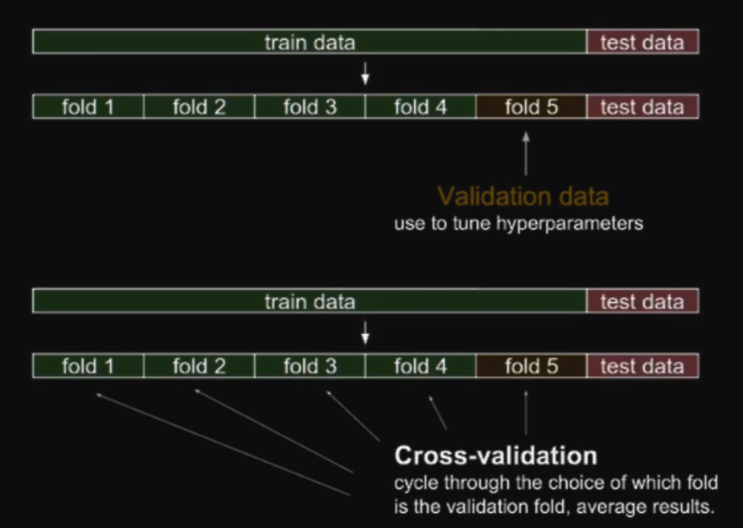

- Dividing dataset and cycle through folds and validating
- Updating and tuning hyperparameters when cycling through folds

### Bias and Variance tradeoff

What we are minimizing(cost) can be decomposed into three different parts: square of **bias**,**variance** and **noise**

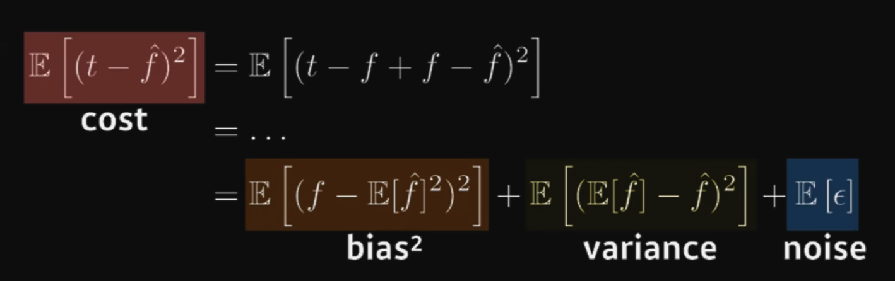

- Bias: deviation from mean
- Variance: deviation of each data
- Noise

### Bootstrapping

- Any test or metric that uses random sampling with replacement. For example subsampling inside training data

### Comparing Bagging vs Boosting

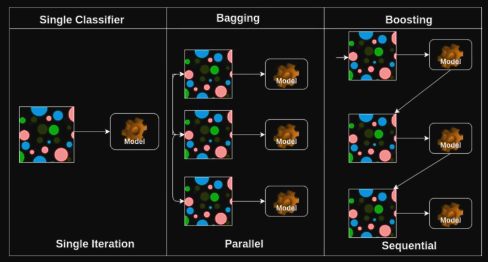

- Bagging: Bootstrapping aggregating.
  - **Same as Ensemble**
  - Making Models based on random subsets of dataset and averaging/voting the result of the model. We call this as "Multiple models are being trained with bootstrapping."
- Boosting
  - Focuses on specific training samples that are hard to classify
  - Strong model is built by combining weak learners sequentially where each learner learns from the mistakes of the previous weak learner.

### Gradient Descent Methods

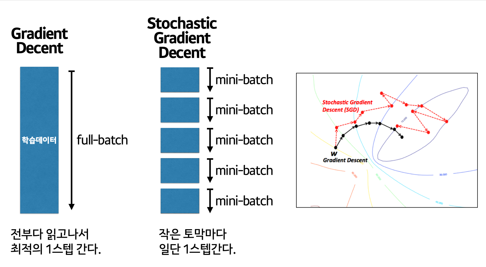

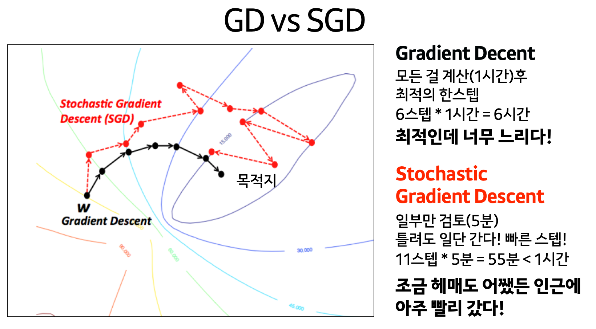

[🖼 Image Source](https://www.slideshare.net/yongho/ss-79607172)

- Batch Gradient Descent: Updating Gradient with the entire dataset(batch)
- Mini-batch Gradient Descent: dividing batch(the entire dataset) and getting gradient, updating gradient.
- Stochastic Gradient Descent(SGD): SGD is different from Mini-batch GD but Ian Goodfellow book explains it as the same concept.

Deciding batch size is important to prevent GPU overload.

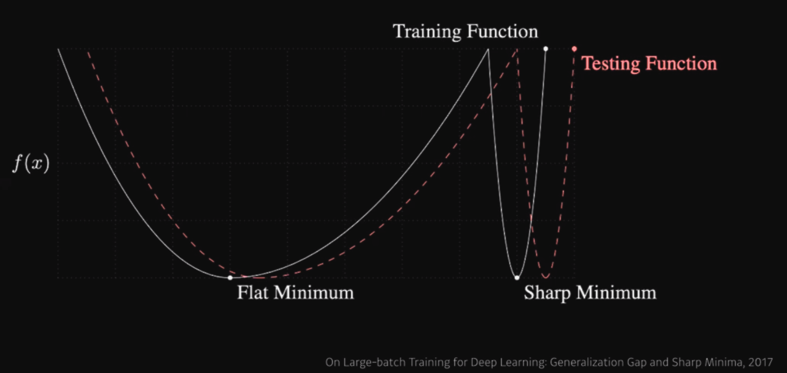

> "Large batch size tend to converge to sharp minimizers whereas small batch methods converge to flat minimizers."

Here, our purpose is to find minimum on loss function at training function which is approximately close to minimum for test function. Thus flat minimizer is more generalized result. However, sharp minimum on training function yields higher loss on test function. **Thus generalized performance is better when large batch size is used.**

### Choosing Optimizers

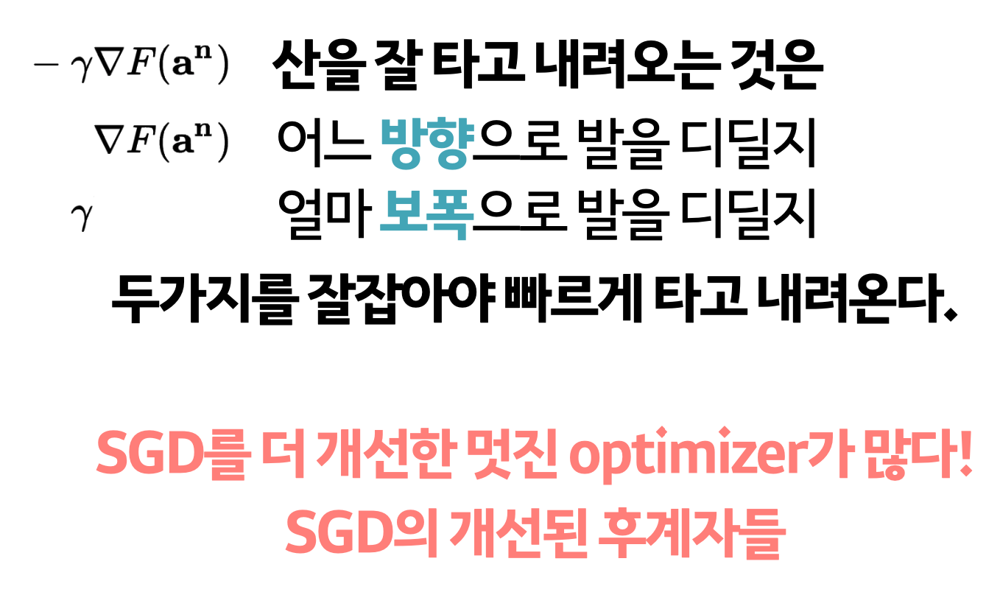

Key to understand optimizers are consisted of two elements. 1) Gradient Vector, 2) Learning rate

[🖼 Image Source](https://www.slideshare.net/yongho/ss-79607172)

### Types of Optimizers

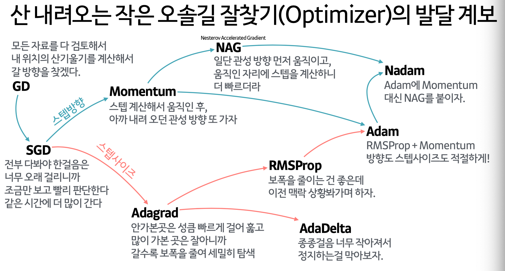

Check for [Dive into Deep Learning](https://d2l.ai/chapter_optimization/sgd.html#sec-sgd)

- Stochastic Gradient Descent
- Momentum
- Nesterov Accelerate
- Adagrad
- Adadelta
- RMSprop
- Adam

### Regularization for better generalization

- **Early Stopping**: stopping training before loss for validation dataset becomes bigger
  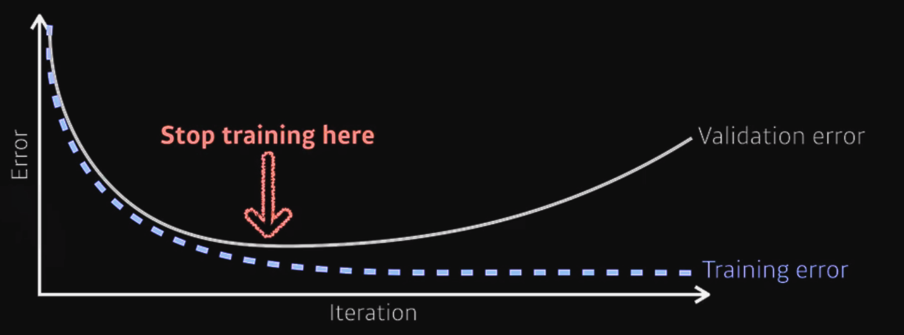

- Parameter Norm Penalty: adding smoothness to function space

- **Data Augmentation**: When dataset is small, ML methods(XGBoost, Random Forest) outperforms Deep learning.

  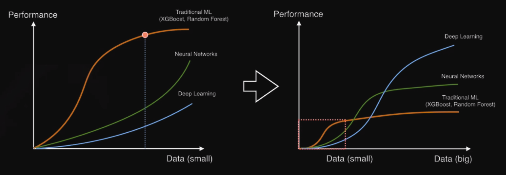
  Thus Data should be augmented for DL, like using [library such as imgaug](https://github.com/aleju/imgaug).

  

- Noise Robustness: Add random noises for input images or neural networks' weights.

- **Label Smoothing**: Increasing performance on classification problems. This is to smoothe the boundary between classes.
  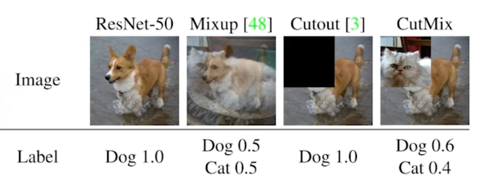

  - Mixup: overlaying two different images
  - Cutout: cutting out portion of image
  - Cutmix: mixing two cropped images

- Dropout: randomly set some neurons to zero. Neurons then can grap robust features from the input.

- Batch Normalization: Controversial. Known to improve performance when layers gets deeper. Layer Normalization, Instance Normalization, Group Normalization is also introduced on other papers.
  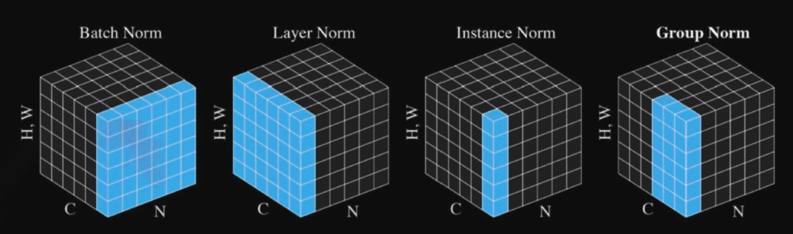
