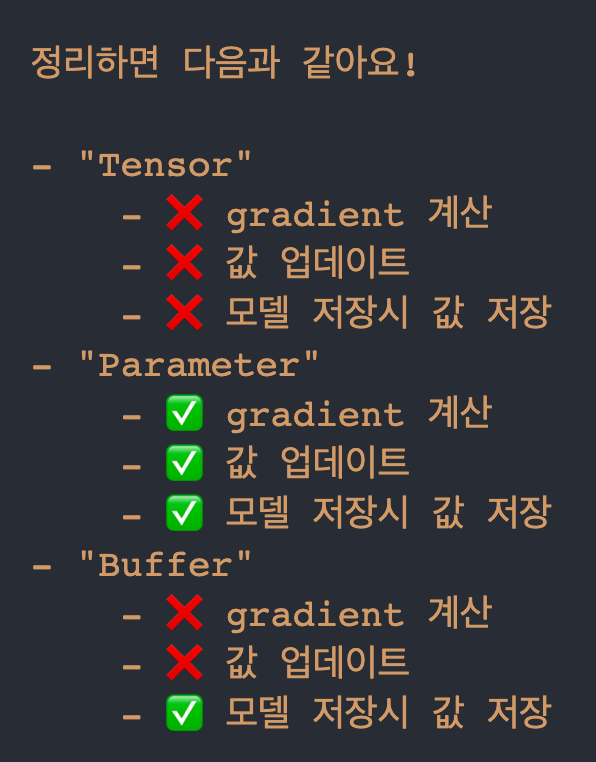

**Collection of questions of myself and my teammates' captures critical concepts for learning.**

While learning from certain study materials, usually there are numerous questions that arise in my head. Due to limitation of the time or lack of interest, only selected few questions are answered within my timespan. However, even if I think that I know for sure, unanswered questions will one day cause trouble. Attempting to answer other people's questions help to filter out possibly vauge knowledge of mine.

## Questions during Pytorch Study

https://github.com/Boostcamp-AI-Tech-Team123/meetup-log/wiki/2021-08-11

- Why does the class and attributes has to be reinitialized?

  - Initializing 왜 하는 지보다는 Initializing을 어떻게 해야 좋은지라는 질문이 더 적합한 것 같다. 처음에 모델을 학습할 때는 정답인 parameter 값을 모르기 때문에, 필연적으로 어떠한 값으로 초기값을 부여해줘야 한다. 그렇다면 **어떻게 initializing을 해야 효과적으로 학습을 진행할 수 있는지**가 더 중요한 것 같다.
  - https://www.deeplearning.ai/ai-notes/initialization/
  - https://stackoverflow.com/questions/63058355/why-is-the-super-constructor-necessary-in-pytorch-custom-modules

- Why is self.variable = variable needed?

  - self는 클래스의 인스턴스를 나타내는 변수이다. 반면 init의 parameter로 넘어온 ksize는 함수에서만 쓰이는 지역변수이다. 이런 개념을 생각했을 때 ksize대신 self.ksize로 쓰는 것이 올바른 것 같다.
  - init함수에서는 파라미터로 ksize를 받고 이를 self.ksize에 값을 할당해주고 있다. 따라서 init함수에서는 self.ksize나 ksize가 같은 값이므로 self.ksize대신 ksize를 써도 무방할 듯 하다.
  - init이 아닌 다른 함수에서는 ksize를 쓰고 싶다면 self.ksize을 이용해야 한다.

- How the numbers of input channel and output channel is decided?

- When should we use activiation function and pooling when adding layers for the transfer learning?

- How is transformers look like?

- What exactly is gradient descent? Any illustrations?

  - https://www.deeplearning.ai/ai-notes/optimization/

- How does torch.gather(input_tensor, dim, index) work??

  - https://stackoverflow.com/questions/50999977/what-does-the-gather-function-do-in-pytorch-in-layman-terms/51032153#51032153

- Why are Optimizer has to be initialized?

  - Because it saves gradient on the buffer

- 

  ```
  https://pytorch.org/tutorials/beginner/examples_nn/two_layer_net_optim.html
  
  # Before the backward pass, use the optimizer object to zero all of the
      # gradients for the variables it will update (which are the learnable
      # weights of the model). This is because by default, gradients are
      # accumulated in buffers( i.e, not overwritten) whenever .backward()
      # is called. Checkout docs of torch.autograd.backward for more details.
      optimizer.zero_grad()
  
  ```

  ## Questions during NLP study

  - ## LSTM 관련해서 토의... 강의 14분 30초 부분이 특히 어려웠다고.

  - i, f, o, g 간의 차이가 어떤 건지 모르겠다.

  

  - 정보를 전달할 떄 tanh 를 취하는 이유는 무엇일까요?
  - 틸드 C_t를 왜 제한하는 걸까요? 단순히 다음 층에 필요 없는 정보는 빼고 전달해야 하기 때문인가요?
  - GRU에서 rt에 대한 자세한 설명은 skip된 것 같습니다.
  - h와 c의 차이는 무엇일까?: 기억 셀(c)은 LSTM끼리만 주고 받는 정보, 은닉 상태(h)는 LSTM 바깥으로 출력 되는 output으로 일단 이해하면 될 듯.
  - [RNN에서 activiation function을 tanh(x)를 쓰는 이유는 뭘까?](https://coding-yoon.tistory.com/132)
    → 원래 있던 값을 그대로 가져가게끔 만들어져서 sigmoid를 쓰는 것보다 hyperbolic tangent를 쓰는 게 낫다고 판단했다. → BPTT를 쓰기 때문에 hyperbolic tangent는 미분값 range가 (0, 1) 사이이고, sigmoid는 (0, 0.25) 사이이기 때문에 이를 계속 곱해주면 sigmoid는 vanishing gradient 문제가 생긴다고 알고 있고, hyperbolic tangent는 그렇지 않다고 알고 있다. → 다만 ReLU를 BPTT 구조에서 사용하면 왜 안 되는지는 모르겠다. 누군가가 `RNN에서 relu를 사용하면 vanishing gradient 문제는 해결하지만 히든레이어 값이 exploding 하기 때문에 사용하지 않는다고 들었습니다.` 라고 얘기하기는 했다.
