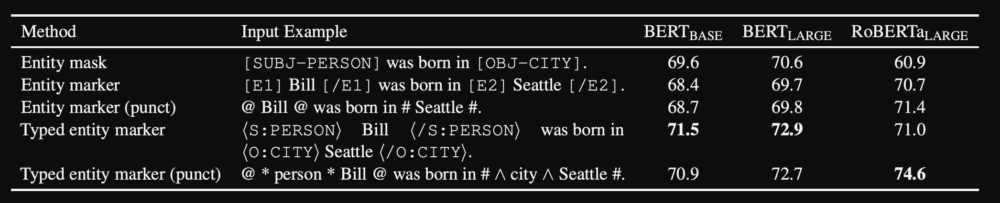
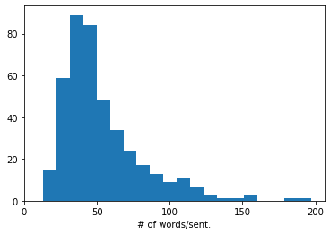
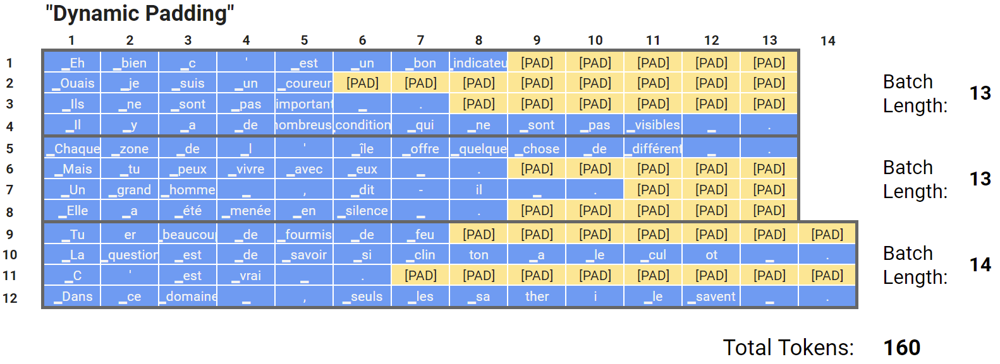
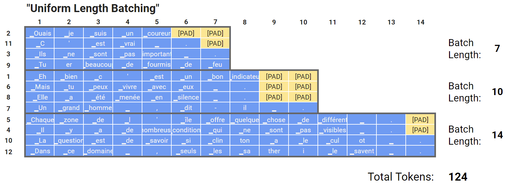
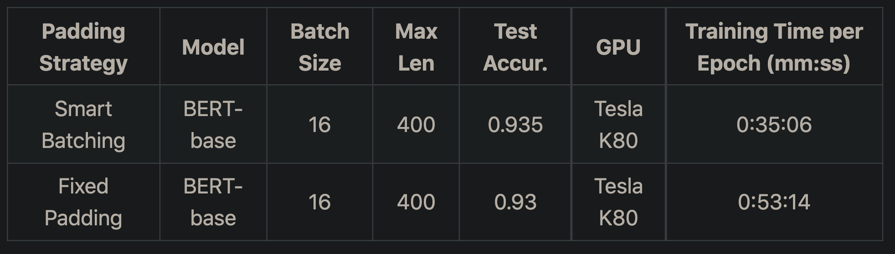
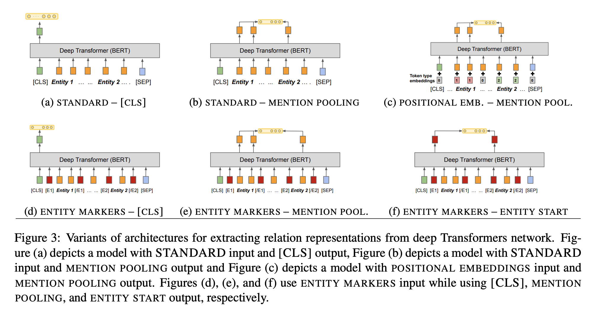
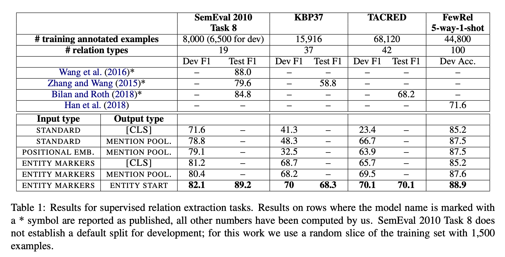
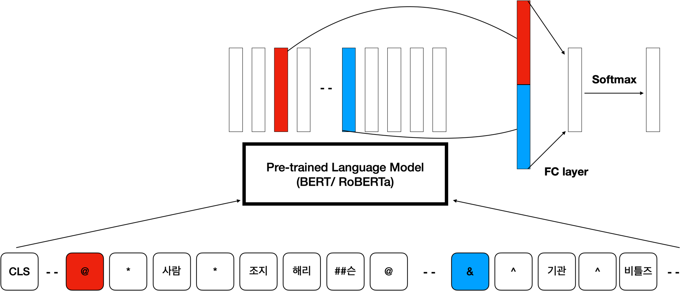
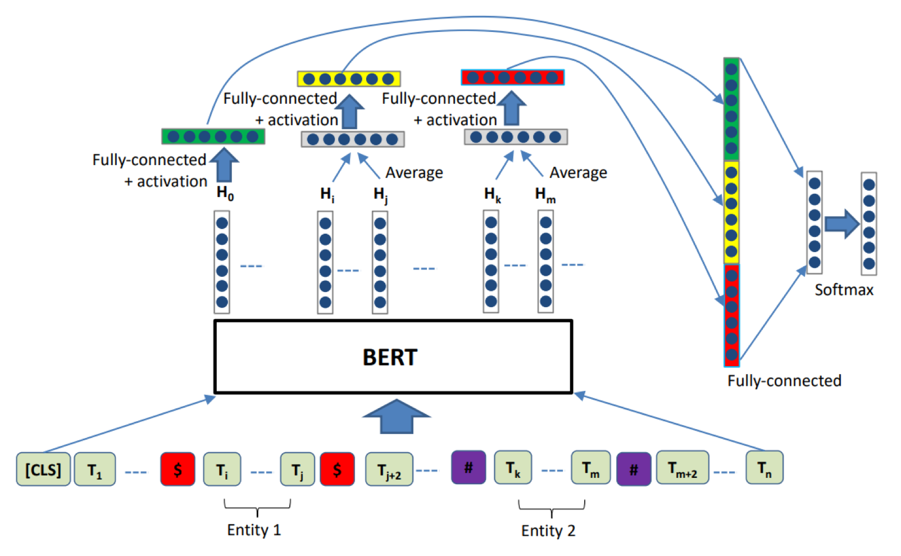
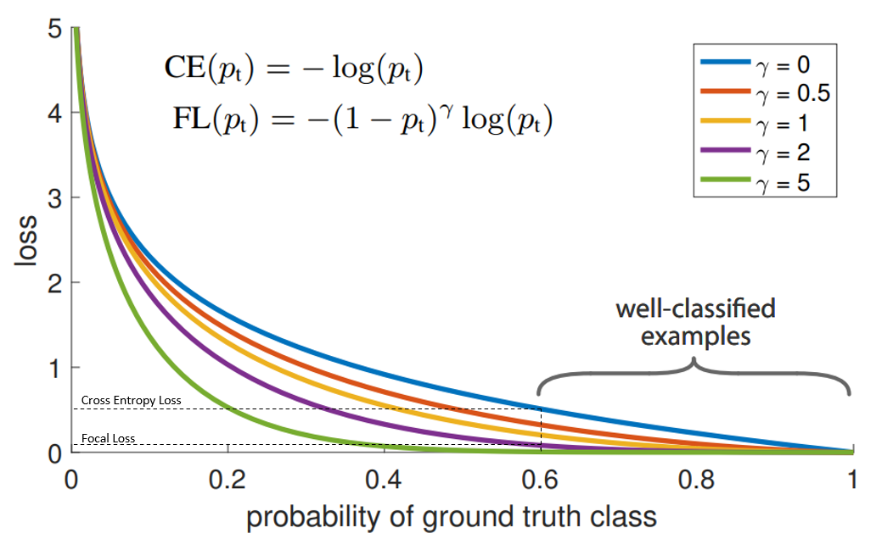

**🥇 AUPRC score of 83.2 ranked the 1st place / 19 teams**

**🥉 F1 score of 73.9 ranked 3rd place / 19 teams**

[KLUE(Korean Language Understanding Evaluation) Benchmark](https://paperswithcode.com/dataset/klue) is newly introduced Korean NLP Benchmark. In Naver Boostcamp, the team solved Relation Extraction task from KLUE Benchmark dataset within the span of 12 days.

## Dataset & Dataloader

### Entity Representation

**Putting labels(or entity markers) around the target entity has boosted the performance.**

|                                            |                                                   Sentence                                                    |
| :----------------------------------------: | :-----------------------------------------------------------------------------------------------------------: |
|                 Origianal                  |                     조지 해리슨이 쓰고 비틀즈가 1969년 앨범 《Abbey Road》에 담은 노래다.                     |
|            Entity Marker Method            |            [E2]조지 해리슨[/E2]이 쓰고 [E1]비틀즈[/E1]가 1969년 앨범 《Abbey Road》에 담은 노래다.            |
|      Entity Marker Punctuation Method      |                   #조지 해리슨#이 쓰고 @비틀즈@가 1969년 앨범 《Abbey Road》에 담은 노래다                    |
|         Entity Replacement Method          |                    [OBJ-ORG]이 쓰고 [SUBJ-ORG]가 1969년 앨범 《Abbey Road》에 담은 노래다.                    |
|         Typed Entity Marker Method         | [OBJ-ORG]조지 해리슨[/OBJ-ORG]이 쓰고 [SUBJ-ORG]비틀즈[/SUBJ-ORG]가 1969년 앨범 《Abbey Road》에 담은 노래다. |
| **Typed Entity Marker Punctuation Method** |            **#^ORG^조지 해리슨#이 쓰고 @*ORG*비틀즈@가 1969년 앨범 《Abbey Road》에 담은 노래다.**            |

How to annotate entity marker around the target entities was important point of discussion.The paper [An Improved Baseline for Sentence-level Relation Extraction(Zhou et al. 2021)](https://arxiv.org/pdf/2102.01373v3.pdf) gives 5 types of composite entity information labelling technique as depicted above.

Typed entity marker method was good but required two additional steps. It required adding special token to the tokenizer and resizing the embedding layer accordingly.

Even though it is good idea, this has few shortcomings. **Creating and importing new tokens with no pretrained hidden features might hinder the model's performance.** **Moreover, additional part of speech(POS) tagging information is not going in as the input to the pretrained model, but only regarded as special tokens.**

With such background, the paper Improved Baseline proposes "Typed entity marker punctioation method". **Enclosing the entity with entity span(POS) and entity types(SUB/OBJ) without introducing new special tokens**. This paper argues that enclosing the subject and object entities with “@” and “#” alone boosts the perfomance. Performance comparisions are given with the table below.



The team utilized [Pororo NER POS Tagging function](https://kakaobrain.github.io/pororo/tagging/ner.html) for both train and test dataset. With Pororo POS tagger, the team experimented both (1) typed entity marker and (2) typed entity punctutation method. (1) Typed entity marked was fed into as an input of RBERT custom model, whereas (2) typed entity punctuation method was fed into its own custom model.

### (1) Typed Entity Marker Dataset Creation

Instead of saving the tokenizer itself, the special tokens added with Pororo NER POS Tagging were saved as txt format file. It was later loaded as txt file, added to tokenizer with add_special_tokens() method. The embedding layer was resized accordingly. However, it is still remain unsolved that whether resizing embedding layer boosts the performance or harms the performance.

The following CSV files were created for time-saving purpose: Pororo POS tagging took 12+ hours for 40k train + test sentences.

- [Pororo POS Tagging with [SUB-{POS}] [/SUB-{POS}] entity special tokens](https://raw.githubusercontent.com/boostcampaitech2/klue-level2-nlp-15/main/dataset/train_pororo_sub.csv?token=AG3HZNZI4TIT7XLSBIMJYHDBL4EVE)
- [Pororo POS Tagging with improved baseline style `#^organization^대안신당#`](https://raw.githubusercontent.com/boostcampaitech2/klue-level2-nlp-15/main/dataset/train_typed_entity_marker_punct.csv?token=AG3HZN4TYFCN3HXLUWYQ7Y3BL4EVG)
- [Pororo POS Tagging with improved baseline style translated into Korean `#^사람^조지 해리슨#`](https://raw.githubusercontent.com/boostcampaitech2/klue-level2-nlp-15/main/dataset/train_punct_kor.csv?token=AG3HZN3VUMQMEUL337RH333BL4EVC)

### (2) Typed Entity Marker Punctuation Dataset Creation

Teammate has created typed entity marker punctuation function as following:

```python
def tokenized_dataset(dataset, tokenizer):
    """
    Inserting typed entity markers to each sentences
    subject: @*type*subject word@ (e.g.  김현수 -> @*사람*김현수@)
    object: #^type^object word# (e.g. #^지명^한국#)

    <<An Improved Baseline for Sentence-level Relation Extraction>>
    """

    type_dict = {
        "PER": "사람",
        "LOC": "지명",
        "ORG": "기관",
        "DAT": "날짜",
        "TIM": "시간",
        "DUR": "기간",
        "MNY": "통화",
        "PNT": "비율",
        "NOH": "수량",
        "POH": "기타"
    }
    sentences = []
    e01, e02, sent = dataset['subject_entity'], dataset['object_entity'], dataset['sentence']
    subject_start, subject_end, sub_type = e01
    object_start, object_end, obj_type = e02
    subj = sent[e01[0]: e01[1] + 1]
    obj = sent[e02[0]: e02[1] + 1]
    if subject_start < object_start:
        sent_ = sent[:subject_start] + f'@*{type_dict[sub_type]}*' + subj + '@' + \
                    sent[subject_end + 1:object_start] + f'&^{type_dict[obj_type]}^' \
                    + obj + '&' + sent[object_end + 1:]
        ss = 1 + len(tokenizer.tokenize(sent[:subject_start]))
        se = ss + 4 + len(tokenizer.tokenize(subj))
        es = 1 + se + len(tokenizer.tokenize(sent[subject_end + 1:object_start]))
        ee = es + 4 + len(tokenizer.tokenize(obj))
    else:
        sent_ = sent[:object_start] + f'&^{type_dict[obj_type]}^' + obj + '&' + \
                sent[object_end + 1:subject_start] + f'@*{type_dict[sub_type]}*' + subj + '@' + \
                sent[subject_end + 1:]
        es = 1 + len(tokenizer.tokenize(sent[:object_start]))
        ee = es + 4 + len(tokenizer.tokenize(obj))
        ss = 1 + ee + len(tokenizer.tokenize(sent[object_end + 1:subject_start]))
        se = ss + 4 + len(tokenizer.tokenize(subj))
    sentences.append(sent_)
    max_length = 256
    senttokens = tokenizer.tokenize(sent_)[:max_length - 2]
    input_ids = tokenizer.convert_tokens_to_ids(senttokens)
    input_ids = tokenizer.build_inputs_with_special_tokens(input_ids)
    return input_ids, ss, se, es, ee

  def processor(tokenizer, dataset, train_mode):
    '''
    train_dataset = processor(tokenizer, train_df))
    --> train_dataloader = Dataloader(train_dataset, batch_size = ...)
    '''
    features = []
    labels = dataset['label'].values
    if train_mode:
        labels = label_to_num(dataset['label'].values)
    for i in range(len(dataset)):
        input_ids, new_ss, new_se, new_es, new_ee = tokenized_dataset(dataset.iloc[i], tokenizer)
        label = labels[i]
        feature = {
            'input_ids' : input_ids,
            'labels' : label,
            'ss': new_ss,
            'se': new_se,
            'es' : new_es,
            'ee' : new_ee,
        }
        features.append(feature)
    return features

```

|                                                   |                                         Sentence                                          |
| :-----------------------------------------------: | :---------------------------------------------------------------------------------------: |
|    **Typed Entity Marker Punctuation Method**     |  **#^ORG^조지 해리슨#이 쓰고 @*ORG*비틀즈@가 1969년 앨범 《Abbey Road》에 담은 노래다.**  |
| **Typed Entity Marker Korean Punctuation Method** | **&^단체^조지 해리슨&이 쓰고 @*단체*비틀즈@가 1969년 앨범 《Abbey Road》에 담은 노래다.** |

Rather than merely implementing the paper [An Improved Baseline for Sentence-level Relation Extraction(Zhou et al. 2021)](https://arxiv.org/pdf/2102.01373v3.pdf), the team went two steps further.

First, we translated the english entity marker punctuation into Korean word. This was because pretraind `klue/roberta-large` tokenizer's english vocabulary sets are more or less than 800 words out of 32000 token vocab sets. Thus the team decided that using Korean punctuation rather than english punctuation in order to boost performance.

Moreover, the team replaced `#` punctuation representation with `&` representation. Since the team is using pretrained RoBERTa, `#` is often found in tokenizers as sub-word representations(`안녕하세요` -> [`안녕`, `##하세요`]). Therefore we thought that `&` would be better for annotation for the punctuation representation.

### Fixing Preprocessor

Upon receiving baseline code, I encountered that the baseline's code has errors. For example, the baseline's preprocessing code splitted nested json as column value of the pandas dataframe as such.

```python
def preprocessing_dataset(dataset):
  subject_entity = []
  object_entity = []
  for i,j in zip(dataset['subject_entity'], dataset['object_entity']):
    i = i[1:-1].split(',')[0].split(':')[1] # <- ERROR OCCURS
    j = j[1:-1].split(',')[0].split(':')[1] # <- ERROR OCCURS

    subject_entity.append(i)
    object_entity.append(j)
  out_dataset = pd.DataFrame({'id':dataset['id'], 'sentence':dataset['sentence'],'subject_entity':subject_entity,'object_entity':object_entity,'label':dataset['label'],})
  return out_dataset
```

When preprocessing CSV format dataset, handling the data's value with comma should be handled with care. According to the code above, numerical string `100,000` could be splitted into different columns.

So I fixed the code with the following code.

```python
def pull_out_dictionary(df_input: pd.DataFrame):
  """ pull out str `{}` values from the pandas dataframe and shape it as a new column"""

  df = df_input.copy()

  # assign subject_entity and object_entity column values type as dictionary
  df['subject_entity'] = df['subject_entity'].apply(lambda x: eval(x))
  df['object_entity'] = df['object_entity'].apply(lambda x: eval(x))

  # parse item inside of subject_entity and object_entity's dictionary values as columns of dataframe
  # word, start_idx, end_idx, type as new columns
  df = df.assign(
      # subject_entity
      subject_word=lambda x: x['subject_entity'].apply(lambda x: x['word']),
      subject_start_idx=lambda x: x['subject_entity'].apply(lambda x: x['start_idx']),
      subject_end_idx=lambda x: x['subject_entity'].apply(lambda x: x['end_idx']),
      subject_type=lambda x: x['subject_entity'].apply(lambda x: x['type']),

      # object_entity
      object_word=lambda x: x['object_entity'].apply(lambda x: x['word']),
      object_start_idx=lambda x: x['object_entity'].apply(lambda x: x['start_idx']),
      object_end_idx=lambda x: x['object_entity'].apply(lambda x: x['end_idx']),
      object_type=lambda x: x['object_entity'].apply(lambda x: x['type']),
  )

  # drop subject_entity and object_entity column
  df = df.drop(['subject_entity', 'object_entity'], axis=1)

  return df

def preprocessing_dataset(dataset):

  # pull out nested json into separate pandas columns
  dataset = pull_out_dictionary(dataset)

  # rename columns subject_word as subject_entity, object_word as object_entity
  dataset = dataset.rename(columns={'subject_word': 'subject_entity', 'object_word': 'object_entity'})

  out_dataset = pd.DataFrame({'id':dataset['id'], 'sentence':dataset['sentence'],'subject_entity':dataset['subject_entity'],'object_entity':dataset['object_entity'],'label':dataset['label'],})
  display(out_dataset.head(2))
  return out_dataset
```

### Setting maximum token length for RoBERTa tokenizer

[📈 wandb: Comparison through changing "max_length" parameter](https://wandb.ai/danielkim30433/huggingface/reports/Comparison-through-changing-max_length-parameter--VmlldzoxMDc1NTE0?accessToken=4r9exwlxam05iy0u0aaexwxfpgl041hyno7gsxthwygf37hgq4xg2kbj66dtj1gf)

[🐍 Jupyter Notebook for EDA for KLUE Relation Extraction dataset](<(https://github.com/boostcampaitech2/klue-level2-nlp-15/blob/dev/v03/token_length%EA%B4%80%EB%A0%A8.ipynb)>)

There are only 460 sentences out of 32.5k train set that exceeded the token length of 128, using `klue/roberta-base` wordpiece tokenizers. Thus we set the maximum token length as 128.

Thanks for my teammate's concise inspection for finding optimal max_token_length in EDA, **it is confirmed that each of the class label's token length distribution are uniform to one another**. Therefore even if we drop 460 sentences which exceeds maximum_token_length, balance of data between the classes wouldn't be affected.

|                                             Class 1                                              |                                             Class 2                                              |                                   Class 3                                    | ... |
| :----------------------------------------------------------------------------------------------: | :----------------------------------------------------------------------------------------------: | :--------------------------------------------------------------------------: | :-: |
|  |  |  |     |

It was important to summate token length +4 in order to compensate for later added special entity tokens. For example, four entity tokens added to the sentence were `[SUB-ORGANIZATION]`, `[/SUB-ORGANIZATION]`, `[OBJ-LOCATION]`, `[/OBJ-LOCATION]`.

It should be careful that padding="max_length", not set as padding=True, so that the sentences are truncated(or sliced) properly.





Batching strategies by [using huggingface's data collate class](https://huggingface.co/transformers/main_classes/data_collator.html), [applying dynamic padding](https://youtu.be/7q5NyFT8REg), or making custom [uniform length batching function](https://mccormickml.com/2020/07/29/smart-batching-tutorial/) is known to decrease the train time significantly as following. 

It is noteworthy that uniform length batching(or smart batching on the table) increased the model's performance. Due to time constraint, in this competition we applied dynamic padding only.

batch_size were selected to be bigger than 30 since we assumed batch numbers being bigger than class numbers would have reduced the bias towards certain classes.

### Data Augmentation

Attempted KoEDA(Easy Data Augmentation implemented in Korean Language) for the dataset. Teammate applied Random Insertion, Random Deletion, Random Swap, Synonym Replacement but this have not led to notable increase in performance.

## Model & Finetuning

### How to select pretrained model

We fixed error entailed from using klue/roberta-large huggingface model [and provided walk-through solution on this Github Issue](https://github.com/KLUE-benchmark/KLUE/issues/33). This was fixed by setting `return_token_type_ids=False` argument on the tokenizer encoding function. Since RoBERTa didn't have token type mask, tokenizer should not return token_type_ids.

```python
tokenized_sentences = tokenizer(
        concat_entity,
        list(dataset["sentence"]),
        return_tensors="pt",
        padding=True,
        truncation=True,
        max_length=256,
        add_special_tokens=True,
        token_type_ids = False )# for klue/roberta-large
```

Pretrained model selection was based on given model benchmarks in fields of task. The task we focused on were relation extraction. If not given the corresponding performance for RE(relation extraction), we looked at Named Entity Recognition and Natural Language Inference.

Model Benchmarks given by [KLUE's benchmark scores](https://github.com/KLUE-benchmark/KLUE#baseline-scores)

| Model                  | Total Combined | Natural Language Inference | Named Entity Recognition |             | Relation Extraction |           | MRC       |           |
| ---------------------- | -------------- | -------------------------- | ------------------------ | ----------- | ------------------- | --------- | --------- | --------- |
| **Score**              | F1             | ACC                        | entity F1                | char F1     | F1                  | AUPRC     | EM        | ROUGE     |
| **XLM-R-base**         | 83.52          | 77.33                      | 80.73                    | 91.37       | 57.46               | 54.98     | 27.48     | 53.93     |
| **XLM-R-large**        | 86.06          | 85.93                      | 81.81                    | 92.49       | 58.39               | 61.15     | 35.99     | 66.77     |
|                        |                |                            |                          |             |                     |           |           |           |
| **KR-BERT-base**       | 84.58          | 77.17                      | 75.37                    | 90.42       | 62.74               | 60.94     | 48.28     | 58.54     |
| **koELECTRA-base**     | 84.59          | _85.63_                    | **_86.82_**              | **_92.79_** | 62.85               | 58.94     | 59.82     | 66.05     |
|                        |                |                            |                          |             |                     |           |           |           |
| **KLUE-BERT-base**     | _85.49_        | 81.63                      | 84.77                    | 91.28       | 66.44               | 66.17     | 62.32     | 68.51     |
| **KLUE-RoBERTa-base**  | 85.12          | 84.97                      | 85.13                    | 91.52       | _66.66_             | _67.74_   | _68.52_   | _74.02_   |
| **KLUE-RoBERTa-large** | **86.42**      | **89.43**                  | 85.79                    | 91.77       | **69.59**           | **72.39** | **76.78** | **81.43** |

We also referred to another model benchmarks given by [Tunib-Electra's benchmark scores](https://github.com/tunib-ai/tunib-electra) and [KoElectra's benchmark scores](https://github.com/monologg/KoELECTRA)

|                                                                                  | **# Params** | **Avg.**  | **Naver NER** (F1) | **KorNLI** (acc) |
| :------------------------------------------------------------------------------: | :----------: | :-------: | :----------------: | :--------------: |
|                           **_TUNiB-Electra-ko-base_**                            |     110M     | **85.99** |       87.63        |    **82.27**     |
|                          **_TUNiB-Electra-ko-en-base_**                          |     133M     |   85.34   |       87.25        |      80.43       |
|            [KoELECTRA-base-v3](https://github.com/monologg/KoELECTRA)            |     110M     |   85.92   |     **88.11**      |      82.24       |
|               [KcELECTRA-base](https://github.com/Beomi/KcELECTRA)               |     124M     |   84.75   |       86.90        |      81.65       |
|                [KoBERT-base](https://github.com/SKTBrain/KoBERT)                 |     90M      |   81.92   |       86.11        |      79.00       |
|                  [KcBERT-base](https://github.com/Beomi/KcBERT)                  |     110M     |   79.79   |       84.34        |      74.85       |
| [XLM-Roberta-base](https://github.com/pytorch/fairseq/tree/master/examples/xlmr) |     280M     |   83.03   |       86.26        |      79.92       |
|                                     HanBERT                                      |      -       |     -     |       87.70        |        -         |
|                                 XLM-Roberta-Base                                 |      -       |     -     |       86.65        |        -         |

We first tested KoElectra as backbone model, since its NER performance was the highest. But we later on switched to RoBERTA.

[By counting the number of unk tokens of the pretrained models](https://github.com/boostcampaitech2/klue-level2-nlp-15/blob/snoop/notebooks/EDA.ipynb), we assumed that the lower unknown tokens appeared, the better the model's performance it would be. **Given that the number of unknown tokens are the fewest on klue/roberta-base model, we decided to stick with the klue-pretrained models.**

### How we Fine-tuned the model according to the relation extraction task

[Based on TACRED Benchmark Leaderboard](https://paperswithcode.com/sota/relation-extraction-on-tacred), our team decided to test SOTA model according to the order. Along with TACRED score, the team also referred to [Matching the Blanks: Distributional Similarity for Relation Learning. Soares et al. 2019](https://aclanthology.org/P19-1279.pdf) to find where to extract hidden features from.

According to [Matching the Blanks: Distributional Similarity for Relation Learning. Soares et al. 2019](https://aclanthology.org/P19-1279.pdf), The best tokens to extract features from were either (1) pooling multiple entity tokens' hidden states or (2) extract the first entity markers of each subject entity and object entity. Provided model's structure from the paper are given as below, along with its methods' performance.





Thus the team chose customized Improved Baseline model for `(f) Entity Markers -Entity First` method and RBERT for `(e) Entity Markers - Mention Pool` method.

**[🤖 Customized Improved Baseline Custom Model](https://paperswithcode.com/paper/an-improved-baseline-for-sentence-level) (f1 0.736)**


- [(1) first version code @dev branch](https://github.com/boostcampaitech2/klue-level2-nlp-15/tree/dev)
- [(2) Improved_Baseline code](https://github.com/boostcampaitech2/klue-level2-nlp-15/blob/main/RE_improved_baseline.ipynb) (f1 0.732)
- [(3) Improved Baseline kfold code]() (f1 0.736)
- [Notes for Improved Baseline](https://global-sunset-142.notion.site/RE_improved_baseline-a6f4bb9ecd2c4362996d18df507f4327)

**[🤖 Customized RBERT](https://paperswithcode.com/paper/enriching-pre-trained-language-model-with) (f1 0.745, [📈 wandb](https://wandb.ai/snoop2head/KLUE-RE?workspace=user-snoop2head))**

👉 [Please refer to my blog post for detailed RBERT finetuning process](https://snoop2head.github.io/Relation-Extraction-Code/)


**[🤖 Customized Concat Model](https://github.com/boostcampaitech2/klue-level2-nlp-15/blob/085dd842e93a8d1e0d30f8cf42268ddb96cafd4a/notebooks/train_with_pororo_with_val_klue-roberta.ipynb) (f1 0.730, [📈 wandb](https://wandb.ai/snoop2head/huggingface/runs/1d3hlfn6?workspace=user-snoop2head))**

The concat method was given from the boostcamp as a baseline. It was simply putting Entity 1 and Entity 2 with `[SEP]` separator in the beginning of the tokenized input. We tried to exclude the concat in the beginning of the tokenized sentence, but this led to worse evaluation loss and evaluation accuracy: [📈 wandb](https://wandb.ai/danielkim30433/huggingface/runs/3e1lomf5?workspace=user-danielkim30433). We concluded that putting concated subject entity and object entity in the beginning boosts the classification. Thus we also adopted customized concat model.

- [(1) pororo POS & Entity tagged & stratified 5-fold cross validation ](https://github.com/boostcampaitech2/klue-level2-nlp-15/blob/main/train_with_pororo.ipynb)
- [(2) replaced bert model with xlm-roberta & applied focal loss(gamma=0.5)](https://github.com/boostcampaitech2/klue-level2-nlp-15/blob/snoop/notebooks/train_with_pororo_with_val.ipynb) ([📈 wandb](https://wandb.ai/snoop2head/huggingface/runs/2576sujh), f1 0.70)
- [(3) used klue/roberta-large model & applied focal loss(gamma=0.5)](https://github.com/boostcampaitech2/klue-level2-nlp-15/blob/snoop/notebooks/train_with_pororo_with_val_klue-roberta.ipynb) ([📈 wandb](https://wandb.ai/snoop2head/huggingface/runs/1d3hlfn6?workspace=user-snoop2head), f1 0.733)

**[🤖 RECENT / Duo classifier](https://github.com/Saintfe/RECENT) (f1 0.60)** required more time to study for our team and has not been fully implemented.

### Findings from fine-tuning methods

Number of Epochs were decided by monitoring model's performance with 📈 wandb. KPI for the model's performance was set as evaluation loss.

- It was evident that concat model should not exceed more than 2000 training steps(or 3 epochs) as evaluation loss increased after then.
- However, RBERT's evaluation loss kept decreasing until 3200 training steps(or 5 epochs). This might possibly show that **RBERT providing more information about the entities' relation within the sentence with additional masks increases robustness.**
- Improved Baseline is light-weight. Compared to RBERT which takes up 26GB of GPU capacity and taking 10hrs for 5 fold training, Improved Baseline on the other hand takes up about 15GB of GPU capacity and takes more or less than 4 hours for training.
- Let's compare RBERT and Improved Baseline method. It is surprising that light-weight Improved Baseline(f1: 0.736) almost yielded similar performance as RBERT(f1: 0.745).
- Improved Baseline only extracts first entity token marker whereas RBERT averages all the tokens between the entity tokens. **One of the downside of averaging the hidden features of multiple entity tokens is that it ignores the order of the tokens given in the sentence.** I think this is the reason that extracting the first token of the entity resulted in similar f1 score with RBERT method.

## Training

### Why we selected FocalLoss as the criterion


Looking at such class imbalance, the team tried to apply the distrubution of such classes as weights to CrossEntropy criterion and to LabelSmoothing criterion. It was worth trying, but it was better to apply focal loss, which yielded better output for the previous p-stage competition, as the criterion.


### How we selected the gamma parameter for Focal Loss

The team experiment gamma paremeter by monitoring wandb for first 500 steps. For the first 500 steps, we designated f1 score and evaluation loss as the key primary index to determine the criterion's performance.

- FocalLoss 0.5, AdamP (lowest val/loss) -> 500 step, eval loss 0.69 is considered to be higher than the concat model's evaluation loss so the team increased the gamma value.
- FocalLoss 1.0, AdamP (lowest val/loss) -> 500 step, eval loss 0.56 is considered to be adequate which was lower than concat model's loss. I was aware of the fact that increasing gamma value might risk the model to fall within the local minimum, so I stopped at 1.0
- Teammate experimented gamma parameter started off from 2.0, which is concluded to be inadequate, thus the team's gamma parameter converged to 1.0.

### How we selected the optimizer AdamP vs AdamW

Custom model's results were compared using wandb for first 500 steps. We concluded that AdamP of ClovaAI allowed model to converge the loss slightly faster than AdamW provided by huggingface. This is in accordance with ClovaAI team's benchmark when compared AdamW and AdamP.


### Other important details

- Applying Stratified KFold alone increased the model's performance by +3%p for f1 score (0.67 -> 0.7) for public leaderboard
- Schedule: linear vs cosine
- Saving best model strategies were differed: accuracy, f1 score, eval/loss.

### Inferencing

- Out of fold ensemble when each of the is trained on train dataset.
- Soft-voting ensemble the 1) best concat model, 2) best improved baseline model, 3) best RBERT model. Each of the model's saving criteria was different, which enabled further performance boost when scored in private leaderboard.
  1. Best concat model was based on best accuracy
  2. Best Improved Baseline model was based on best f1 score
  3. Best RBERT model was based on lowest evaluation loss

---

### Other details to try Next time

- [ ] str.replace() sometimes replaces not only target words/tokens, but other words/tokens that has same characters. If given the index of the target entity/token, it is better to use that even if it is such a nuisance.
- [ ] Task Adaptive Pretraining(TAPT): Pretraining for the given dataset was refrained for this competition. Since Klue/roberta models were already pretrained on task dataset, we saved time not doing pretraining. However, when given with specific domains such as math, law, science, I think it is still worth trying MLM tasks and NSP tasks based pretraining. TAPT was allowed for both train and test datasets for this competition
- [ ] Uniform Length Batching using huggingface's collate class / or making on my own.
- [ ] optuna fine-tuning
- [ ] Round-trip translation / Back translation based on cosine similarity for data augmentation
- [ ] Adding bidirectional GRU(or LSTM) layers after the transformers layer for the sake of non-linearity.
  - [ ] [had difficulty of certain proportion of validation dataset being dropped]()
  - [ ] had difficulty of matching the torch tensor size in between transformers encoder layer to fully connected classifier layer.

### Teamwork 👨‍💻

- It was our team's first time to fine-tune BERT model for the Relation Extraction task. We set our goals to the absolute value of f1 score(0.75) and never gave up. I never looked at the leaderboard until the end of competition in order to enjoy the process of learning.
- Purpose of participating competition was to familiarize ourselves to fine-tuning BERT model. Finding the effective way to preprocess/train/infer was our objective.
- Thus our team spent most of the time doing custom preprocessing and custom model fine-tuning method of our own. Along with increasing the f1 score, it was our goal to practice writing code that reflects our idea.
- Since group of 7 people had to work as a team remotely, we set our ground rule not to cut in while other person is speaking.
- Our team decided to respect each teammate's beliefs. If teammate wants to commence certain experiment and believes that it will contribute to robustness and performance of model, we promised to patiently wait and help the experiment.
- By sharing both of Jupyter notebook links and wandb links, it helped other teammates to utilize(or copy & paste) code of the teammate and observe the performance.
- While running the model and GPU is occupied, our teammates helps to debug other teammate's code. For example, if one GPU is occpupied with MLM TAPT, then the teammate "live coded" putting bidirectional gru between the classifier and last transformer encoding layer.

### Reference

- [KLUE RE Relation Extraction Dataset / CC BY-SA](https://github.com/KLUE-benchmark/KLUE/tree/main/klue_benchmark)
- [An Improved Baseline for Sentence-level Relation Extraction(Zhou et al. 2021)](https://arxiv.org/pdf/2102.01373v3.pdf)
- [Matching the Blanks: Distributional Similarity for Relation Learning. Soares et al. 2019](https://aclanthology.org/P19-1279.pdf)
- [Enriching Pre-trained Language Model with Entity Information for Relation Classification, Wu et al. 2019](https://arxiv.org/pdf/1905.08284v1.pdf)
