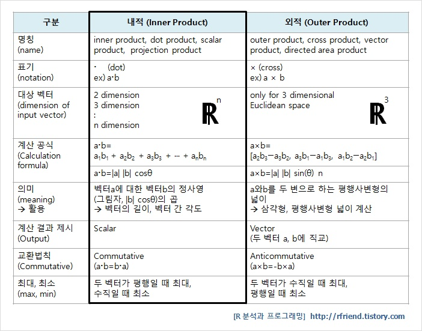
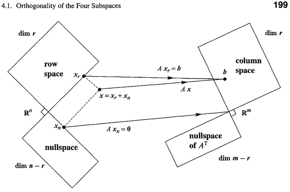
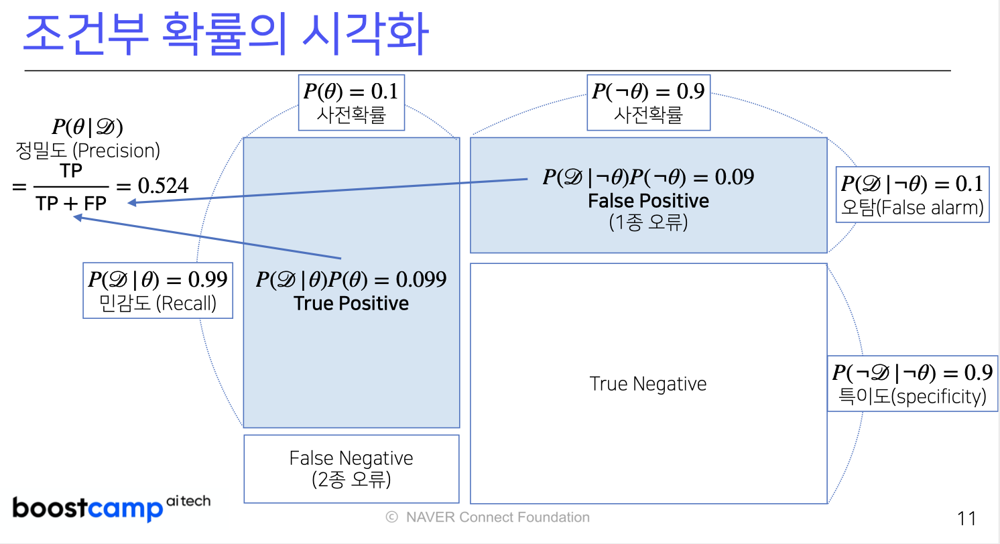

### References

- [Naver AI Boostcamp](https://www.boostcourse.org/boostcampaitech2/joinLectures/283128?isDesc=false)
- [Statistics 110 by Joseph Blitzstein](https://www.youtube.com/watch?v=KbB0FjPg0mw&list=PL2SOU6wwxB0uwwH80KTQ6ht66KWxbzTIo)
- [Linear Algebra by Gilbert Strang](https://www.youtube.com/watch?v=QVKj3LADCnA&list=PL49CF3715CB9EF31D)
- [Linear Algebra by 3Blue1Brown](https://www.youtube.com/watch?v=fNk_zzaMoSs&list=PLZHQObOWTQDPD3MizzM2xVFitgF8hE_ab)
- [Grokking Deep Learning](https://github.com/iamtrask/Grokking-Deep-Learning)
- [Dive into Deep Learning Mathematics Appendix](https://d2l.ai/chapter_appendix-mathematics-for-deep-learning/index.html)
- [Mathematics for Machine Learning](https://mml-book.github.io/)

### Lecture 1 | Vectors

[Image Reference](https://rfriend.tistory.com/145)

- What is Vector
- Distance between two vectors
- Angle between two vectors
- Vector's Norm
  - L1 Norm
  - L2 Norm
- Vector's Dot Product
  - same as Inner Product, Dot Product, Scalar Product, projection product
- Vector's Orthogonality
- Vector's Projection

### Lecture 2 | Linear Algebra

- What is Matrix
- Matrix Operations: Addition, Multiplication
- Spaces of Vectors
- Inverse Matrices
- Pseudo-inverse matrices (same as Moore-Penrose Matrix)

### Lecture 3,4 | Gradient Descent

- Differentiation
- Gradient Ascent & Gradient Descent
- Gradient Descent in Code
- Nabla & Partial Differentiation for vectors
- Gradient Vectors
- Linear Regression and pseudoinverse
- Getting beta's minimum using linear regression gradient descent
- Limitations of Gradient Descent

### Lecture 4 | Stochastic Gradient Descent(SGD)

- Stochastic Gradient Descent for non-convex functions
- Minibatch SGD

### Lecture 5 | Deep Learning

- Non-linear neural network
- softmax
- activation function - sigmoid, tanh(**hyperbolic tangent**), ReLU
- Multi-layer perceptron
- Forward Propogation
- Backpropogation
- Gradient vectors and chain rules

### Lecture 6 | Probabilities

- Loss function
- Probability distributions
- Discrete Random Variable, Probability Mass Function
- Continuous Random Variable, Probability Distribution Function
- Conditional Probability
- Expectations
- Variance, Covariance, SKewness
- Monte Carlo Sampling Method

### Lecture 7 | Statistical Inference

- Probability Distribution
- Sample Mean, Sample Variance
- Sampling Distribution
- Maximum Likelihood Estimation(MLE)
- Log-likelihood, Negative log-likelihood
- Sample MLE
- MLE Estimation
- KL Divergence
- Cross Entropy
- Entropy

### Lecture 8 | Bayesian Statistics

- Posterial, Prior, Evidence, Likelihood
- True Positive and Recall Rate
- False Negative
- True Negative and Specificty
- False Positive
- Precision

### Lecture 9 | Convolutional Neural Network(CNN)

- MLP vs CNN
- Kernal(same as Weight Matrix, Filters, Window)
- 1D Conv
- 2D Conv
- 3D Conv
  - 3D Conv are 2D conv stacked up as 3 Channels
  - Tensors are stacked matrices as much as 3 Channels
- Backpropogation in Convolution

### Lecture 10 | Recurrent Neural Network(RNN)

- Sequential Data
- Conditional Probability
- Backpropagation Through Time (BPTT)
- Truncated BPTT
- LSTM, GRU
