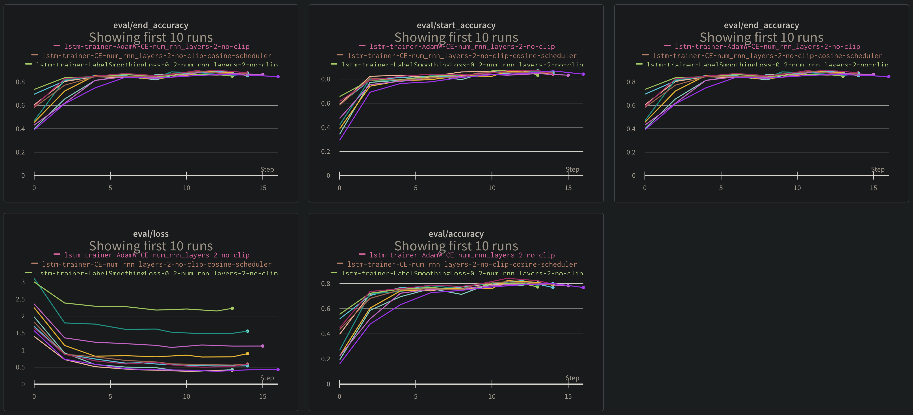
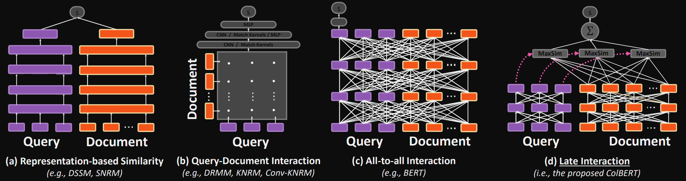

👍 **F1 score of 79.650 ranked the 5th place / 19 teams**

💪 **Exact Match score of 66.670 ranked 10th place / 19 teams**



**For Performance and Hyperparameters Comparison, Please refer to [🔗 wandb](https://wandb.ai/happyface-boostcamp/KLUE-QA?workspace=user-snoop2head)**

---

Extractive Machine Reading Comprehension can be divided into two sub-tasks which are 1) Retrieval and 2) Reader. Retrieval task fetches documents that are related to the tasks. Reader task aims to extract the answer phrase for the given question.

## Retrieval

For this competition, we tested all the available options given to us.



### 1) Sparse Retrieval

- BM25
- BM25+
- Elastic Search

### 2) Dense Retrieval

- Dense Passage Biencoder - (a)
- Cross Encoder - (c)
- ColBERT - (d)

## Reader

I was interested in building reader model. I thought that Dense Retrieval methods may overperform sparse retrieval methods, but using transformers model is disadvantage in both computation time and resource.

**For the reader, I thought it was essential to run small but representative tests for the optimization.**

Variables that I tried to control are

- K-Fold
- Learning Rate
- Optimizer
- Loss
- Batch Size and Batching Strategy
- Attaching different types of heads to the transformer backbone network(ex: bidirectional LSTM)
- Ensemble Strategy

**Reader's task is multi-class classification task where the model should identify 1) which token is the starting point and 2) which token is end point.** **Answer phrase are multiple tokens in between those predicted token indices.** Thus, both the start_logit and end_logit is given to each sequence tokens in the sentence.


[Image Source - Question Answering with a Fine-Tuned BERT](https://mccormickml.com/2020/03/10/question-answering-with-a-fine-tuned-BERT/)

**I customized experimentation code which satiesfied the following criteria.** I aimed to control different types of variables that might affect the Reader's performance.

Validation result should show key primary indices for optimization.

1. Start indexing accuracy(start_accuracy)
2. End indexing accuracy(end_accuracy)
3. Answer phrase Exact Match(EM) score

These following variables should be customizable where different sets of parameters can be set.

- Learning Rate
- Optimizer: AdamW, AdamP
- Loss: FocalLoss, CrossEntropyLoss, LabelSmoothingLoss
- Attaching different types of heads to the transformer backbone network(ex: bidirectional LSTM)

## Load Dataset

```python
import os
os.environ["TOKENIZERS_PARALLELISM"] = "false"
```

```python
class dotdict(dict):
    """dot.notation access to dictionary attributes, as dict.key_name, not as dict["key_name"] """
    __getattr__ = dict.get
    __setattr__ = dict.__setitem__
    __delattr__ = dict.__delitem__

```

```python
import yaml

# Read config.yaml file
with open("config.yaml") as infile:
    SAVED_CFG = yaml.load(infile, Loader=yaml.FullLoader)
    SAVED_CFG = dotdict(SAVED_CFG)

# arguments setting
data_args = dotdict(SAVED_CFG.data)
model_args = dotdict(SAVED_CFG.custom_model)

# adding additional arguments
model_args.batch_size = 10
model_args.num_rnn_layers = 2
model_args.learning_rate = 2e-5
model_args.num_folds = 4
model_args.gamma = 1.0
model_args.smoothing = 0.2
model_args
```

    {'model_name_or_path': 'klue/roberta-large',
     'save_steps': 100,
     'num_train_epochs': 3,
     'learning_rate': 2e-05,
     'batch_size': 10,
     'warmup_steps': 300,
     'weight_decay': 0.01,
     'validation': False,
     'max_length': 512,
     'DEBUG': True,
     'num_rnn_layers': 2,
     'num_folds': 4,
     'gamma': 1.0,
     'smoothing': 0.2}

```python
name_of_experiment = f'lstm-trainer-AdamW-CE-num_rnn_layers-{model_args.num_rnn_layers}-no-clip'
print(name_of_experiment)
```

    lstm-trainer-AdamW-CE-num_rnn_layers-2-no-clip

## Make Custom Dataset

**Remove Passages where Answers located > 512 token length**

```python
import torch
from datasets import load_from_disk
from torch.utils.data import (DataLoader, RandomSampler, TensorDataset)

# load dataset from the huggingface format dataset
datasets = load_from_disk(data_args.dataset_name)
train_dataset_from_huggingface = datasets['train']
valid_dataset_from_huggingface = datasets['validation']
```

```python
train_dataset_from_huggingface[0]
```

    {'title': '미국 상원',
     'context': '미국 상의원 또는 미국 상원(United States Senate)은 양원제인 미국 의회의 상원이다.\\n\\n미국 부통령이 상원의장이 된다. 각 주당 2명의 상원의원이 선출되어 100명의 상원의원으로 구성되어 있다. 임기는 6년이며, 2년마다 50개주 중 1/3씩 상원의원을 새로 선출하여 연방에 보낸다.\\n\\n미국 상원은 미국 하원과는 다르게 미국 대통령을 수반으로 하는 미국 연방 행정부에 각종 동의를 하는 기관이다. 하원이 세금과 경제에 대한 권한, 대통령을 포함한 대다수의 공무원을 파면할 권한을 갖고 있는 국민을 대표하는 기관인 반면 상원은 미국의 주를 대표한다. 즉 캘리포니아주, 일리노이주 같이 주 정부와 주 의회를 대표하는 기관이다. 그로 인하여 군대의 파병, 관료의 임명에 대한 동의, 외국 조약에 대한 승인 등 신속을 요하는 권한은 모두 상원에게만 있다. 그리고 하원에 대한 견제 역할(하원의 법안을 거부할 권한 등)을 담당한다. 2년의 임기로 인하여 급진적일 수밖에 없는 하원은 지나치게 급진적인 법안을 만들기 쉽다. 대표적인 예로 건강보험 개혁 당시 하원이 미국 연방 행정부에게 퍼블릭 옵션(공공건강보험기관)의 조항이 있는 반면 상원의 경우 하원안이 지나치게 세금이 많이 든다는 이유로 퍼블릭 옵션 조항을 제외하고 비영리건강보험기관이나 보험회사가 담당하도록 한 것이다. 이 경우처럼 상원은 하원이나 내각책임제가 빠지기 쉬운 국가들의 국회처럼 걸핏하면 발생하는 의회의 비정상적인 사태를 방지하는 기관이다. 상원은 급박한 처리사항의 경우가 아니면 법안을 먼저 내는 경우가 드물고 하원이 만든 법안을 수정하여 다시 하원에 되돌려보낸다. 이러한 방식으로 단원제가 빠지기 쉬운 함정을 미리 방지하는 것이다.날짜=2017-02-05',
     'question': '대통령을 포함한 미국의 행정부 견제권을 갖는 국가 기관은?',
     'id': 'mrc-1-000067',
     'answers': {'answer_start': [235], 'text': ['하원']},
     'document_id': 18293,
     '__index_level_0__': 42}

```python
import pandas as pd
import numpy as np

def pull_out_dictionary(df_input: pd.DataFrame):
    """pull out str `{}` values from the pandas dataframe and shape it as a new column"""

    df = df_input.copy()

    # assign subject_entity and object_entity column values type as dictionary
    # df["answers"] = df["answers"].apply(lambda x: eval(x))

    df = df.assign(
        # subject_entity
        answer_start=lambda x: x["answers"].apply(lambda x: x["answer_start"]),
        text=lambda x: x["answers"].apply(lambda x: x["text"]),
    )

    # drop subject_entity and object_entity column
    df = df.drop(["answers"], axis=1)

    return df

def pull_out_list(df_input: pd.DataFrame):
    """ pull out single item out of the list """

    df = df_input.copy()

    df["answer_start"] = df["answer_start"].apply(lambda x: int(x[0]))
    df["text"] = df["text"].apply(lambda x: x[0])
    return df
```

```python
""" Converting train and validation dataset to Pandas dataframe for convenience """

train_df = pull_out_dictionary(pd.DataFrame.from_records(datasets['train']))
val_df = pull_out_dictionary(pd.DataFrame.from_records(datasets['validation']))

train_df = pull_out_list(train_df)
val_df = pull_out_list(val_df)

print(train_df.shape)
print(val_df.shape)
```

    (3952, 8)
    (240, 8)

```python
print(train_df.columns)
```

    Index(['title', 'context', 'question', 'id', 'document_id',
           '__index_level_0__', 'answer_start', 'text'],
          dtype='object')

## Load Tokenizer

Fixed: roberta not receiving sequence ids

```python
from transformers import AutoModel, AutoTokenizer, AutoConfig

# load tokenizer and configuration according to the model (ex: klue/roberta-large)
if "roberta" in model_args.model_name_or_path:
    tokenizer = AutoTokenizer.from_pretrained(
        model_args.model_name_or_path,
        model_input_names = ["input_ids", "attention_mask"],
        use_fast=True # use rust based tokenizer
    )
    print("sequence id not used:", model_args.model_name_or_path)
else:
    tokenizer = AutoTokenizer.from_pretrained(model_args.model_name_or_path)
    print(model_args.model_name_or_path)

config = AutoConfig.from_pretrained(model_args.model_name_or_path)
```

    sequence id not used: klue/roberta-large

```python
# sample tokenization
tokens = tokenizer.tokenize(train_dataset_from_huggingface[1]['question'])
" ".join(tokens)
```

    '현대 ##적 인사 ##조 ##직 ##관리 ##의 시발점 ##이 된 책 ##은 ?'

```python
# test batch tokenization
# https://github.com/huggingface/transformers/issues/10297#issuecomment-783464293
sample_answer_token = ['크리스토', '##포', '알', '##하우스']
print(sample_answer_token)

print("Wrong Example:", tokenizer.encode(sample_answer_token, add_special_tokens=False, return_tensors='pt', is_split_into_words=True))
print("Correctly Encoded:" ,torch.IntTensor([tokenizer.convert_tokens_to_ids(sample_answer_token)])) # apply int for torch Tensor
```

    ['크리스토', '##포', '알', '##하우스']
    Wrong Example: tensor([[21533,     7,     7,  1862,  1381,     7,     7,  6634]])
    Correctly Encoded: tensor([[21533,  2208,  1381, 17975]], dtype=torch.int32)

## Custom Dataset Creation and Truncation

```python
train_df.shape
```

    (3952, 8)

```python
# change dataframe to dictionary
train_df_dict = train_df.to_dict('records')
valid_df_dict = val_df.to_dict('records')
print(train_df_dict[0])
print(train_df_dict[0].keys())
print(len(train_df_dict))
```

    {'title': '미국 상원', 'context': '미국 상의원 또는 미국 상원(United States Senate)은 양원제인 미국 의회의 상원이다.\\n\\n미국 부통령이 상원의장이 된다. 각 주당 2명의 상원의원이 선출되어 100명의 상원의원으로 구성되어 있다. 임기는 6년이며, 2년마다 50개주 중 1/3씩 상원의원을 새로 선출하여 연방에 보낸다.\\n\\n미국 상원은 미국 하원과는 다르게 미국 대통령을 수반으로 하는 미국 연방 행정부에 각종 동의를 하는 기관이다. 하원이 세금과 경제에 대한 권한, 대통령을 포함한 대다수의 공무원을 파면할 권한을 갖고 있는 국민을 대표하는 기관인 반면 상원은 미국의 주를 대표한다. 즉 캘리포니아주, 일리노이주 같이 주 정부와 주 의회를 대표하는 기관이다. 그로 인하여 군대의 파병, 관료의 임명에 대한 동의, 외국 조약에 대한 승인 등 신속을 요하는 권한은 모두 상원에게만 있다. 그리고 하원에 대한 견제 역할(하원의 법안을 거부할 권한 등)을 담당한다. 2년의 임기로 인하여 급진적일 수밖에 없는 하원은 지나치게 급진적인 법안을 만들기 쉽다. 대표적인 예로 건강보험 개혁 당시 하원이 미국 연방 행정부에게 퍼블릭 옵션(공공건강보험기관)의 조항이 있는 반면 상원의 경우 하원안이 지나치게 세금이 많이 든다는 이유로 퍼블릭 옵션 조항을 제외하고 비영리건강보험기관이나 보험회사가 담당하도록 한 것이다. 이 경우처럼 상원은 하원이나 내각책임제가 빠지기 쉬운 국가들의 국회처럼 걸핏하면 발생하는 의회의 비정상적인 사태를 방지하는 기관이다. 상원은 급박한 처리사항의 경우가 아니면 법안을 먼저 내는 경우가 드물고 하원이 만든 법안을 수정하여 다시 하원에 되돌려보낸다. 이러한 방식으로 단원제가 빠지기 쉬운 함정을 미리 방지하는 것이다.날짜=2017-02-05', 'question': '대통령을 포함한 미국의 행정부 견제권을 갖는 국가 기관은?', 'id': 'mrc-1-000067', 'document_id': 18293, '__index_level_0__': 42, 'answer_start': 235, 'text': '하원'}
    dict_keys(['title', 'context', 'question', 'id', 'document_id', '__index_level_0__', 'answer_start', 'text'])
    3952

```python
tokenizer.mask_token_id
```

    4

```python
DEBUG_MODE = True

def drop_truncated_data(dict_df):
    """ dataset creation reference: https://mccormickml.com/2021/05/27/question-answering-system-tf-idf/ """
    # Lists to store the encoded samples.
    all_input_ids = []
    attention_masks = []
    start_positions = []
    end_positions = []
    num_dropped = 0

    for num, item in enumerate(dict_df):
        answer_tokens = tokenizer.tokenize(item['text'], add_special_tokens=False)
        sentinel_str = " ".join([tokenizer.mask_token]*len(answer_tokens))
        start_char_i = item['answer_start']
        end_char_i = start_char_i + len(item['text'])

        context_w_sentinel = \
            item['context'][:start_char_i] \
            + sentinel_str \
            + item['context'][end_char_i:]

        encoded_dict = tokenizer.encode_plus(
            item['question'],
            context_w_sentinel,
            add_special_tokens=True,
            max_length = model_args.max_seq_length,
            padding='max_length',
            return_attention_mask=True,
            return_tensors='pt',
            truncation = True
        )

        input_ids = encoded_dict['input_ids']
        is_mask_token = (input_ids[0] == tokenizer.mask_token_id)
        mask_token_indeces = is_mask_token.nonzero(as_tuple=False)[:, 0]
        if not len(mask_token_indeces) == len(answer_tokens):
            num_dropped += 1
            continue

        start_index = mask_token_indeces[0]
        end_index = mask_token_indeces[-1]

        # change start_index tensor and end_index tensor into integer type
        start_index = start_index.item()
        end_index = end_index.item()
        answer_token_ids = tokenizer.convert_tokens_to_ids(answer_tokens)
        input_ids[0, start_index : end_index + 1] = torch.tensor(answer_token_ids)

        all_input_ids.append(input_ids)
        attention_masks.append(encoded_dict['attention_mask'])
        start_positions.append(start_index)
        end_positions.append(end_index)


    # Convert the lists of tensors into 2D tensors.
    all_input_ids = torch.cat(all_input_ids, dim=0)
    attention_masks = torch.cat(attention_masks, dim=0)

    # Convert the "labels" (the start and end indeces) into tensors.
    start_positions = torch.tensor(start_positions)
    end_positions = torch.tensor(end_positions)

    return all_input_ids, attention_masks, start_positions, end_positions
```


```python
from torch.utils.data import DataLoader

train_truncated = drop_truncated_data(train_df_dict)
train_dataset = TensorDataset(train_truncated[0], train_truncated[1], train_truncated[2], train_truncated[3])
train_dataloader = DataLoader(train_dataset, batch_size=model_args.batch_size, shuffle=True)

valid_truncated = drop_truncated_data(valid_df_dict)
valid_dataset = TensorDataset(valid_truncated[0], valid_truncated[1], valid_truncated[2], valid_truncated[3])
valid_dataloader = DataLoader(valid_dataset, batch_size=model_args.batch_size, shuffle=False)
```

```python
print(train_df.shape)
print(len(train_dataset)) # number of clipped samples where answers are located out of the maximum sequence length

print(val_df.shape)
len(valid_dataset) # number of clipped samples where answers are located out of the maximum sequence length
```

    (3952, 8)
    3706
    (240, 8)


    220

## Define Losses to use

- CrossEntropyLoss provided by torch.nn was the best
- For Performance Comparison, Please refer to [🔗 wandb](https://wandb.ai/happyface-boostcamp/KLUE-QA?workspace=user-snoop2head)

```python
import torch
import torch.nn as nn
import torch.nn.functional as F
from torch.autograd import Variable

class FocalLoss(nn.Module):
    # https://github.com/clcarwin/focal_loss_pytorch/blob/master/focalloss.py
    def __init__(self, gamma=0.5, alpha=None, size_average=True):
        super(FocalLoss, self).__init__()
        self.gamma = gamma
        self.alpha = alpha
        if isinstance(alpha, (float, int)):
            self.alpha = torch.Tensor([alpha, 1 - alpha])
        if isinstance(alpha, list):
            self.alpha = torch.Tensor(alpha)
        self.size_average = size_average

    def forward(self, input, target):
        if input.dim() > 2:
            input = input.view(input.size(0), input.size(1), -1)  # N,C,H,W => N,C,H*W
            input = input.transpose(1, 2)  # N,C,H*W => N,H*W,C
            input = input.contiguous().view(-1, input.size(2))  # N,H*W,C => N*H*W,C
        target = target.view(-1, 1)

        logpt = F.log_softmax(input)
        logpt = logpt.gather(1, target)
        logpt = logpt.view(-1)
        pt = Variable(logpt.data.exp())

        if self.alpha is not None:
            if self.alpha.type() != input.data.type():
                self.alpha = self.alpha.type_as(input.data)
            at = self.alpha.gather(0, target.data.view(-1))
            logpt = logpt * Variable(at)

        loss = -1 * (1 - pt) ** self.gamma * logpt
        if self.size_average:
            return loss.mean()
        else:
            return loss.sum()

```

```python
import torch
import torch.nn.functional as F
from torch.nn.modules.loss import _WeightedLoss


class LabelSmoothCrossEntropyLoss(_WeightedLoss):
    # https://github.com/NingAnMe/Label-Smoothing-for-CrossEntropyLoss-PyTorch/blob/main/label_smothing_cross_entropy_loss.py
    def __init__(self, weight=None, reduction='mean', smoothing=0.0):
        super().__init__(weight=weight, reduction=reduction)
        self.smoothing = smoothing
        self.weight = weight
        self.reduction = reduction

    @staticmethod
    def _smooth_one_hot(targets: torch.Tensor, n_classes: int, smoothing=0.0):
        assert 0 <= smoothing < 1
        with torch.no_grad():
            targets = torch.empty(size=(targets.size(0), n_classes),
                                  device=targets.device) \
                .fill_(smoothing / (n_classes - 1)) \
                .scatter_(1, targets.data.unsqueeze(1), 1. - smoothing)
        return targets

    def forward(self, inputs, targets):
        targets = LabelSmoothCrossEntropyLoss._smooth_one_hot(targets, inputs.size(-1),
                                                              self.smoothing)
        lsm = F.log_softmax(inputs, -1)

        if self.weight is not None:
            lsm = lsm * self.weight.unsqueeze(0)

        loss = -(targets * lsm).sum(-1)

        if self.reduction == 'sum':
            loss = loss.sum()
        elif self.reduction == 'mean':
            loss = loss.mean()

        return loss
```

```python
# https://github.com/cvqluu/Angular-Penalty-Softmax-Losses-Pytorch -> doesn't work, full of bugs
# https://github.com/ronghuaiyang/arcface-pytorch/blob/master/models/metrics.py -> fail
```

```python
# https://github.com/CoinCheung/pytorch-loss/blob/master/dice_loss.py -> Not working
# https://github.com/ShannonAI/dice_loss_for_NLP/blob/master/loss/dice_loss.py -> Loss too big: 300 or more

```

## Load Model

```python
model_args.DEBUG = False
device = torch.device('cuda:0' if torch.cuda.is_available() and model_args.DEBUG == False else 'cpu')
print(device)
!nvidia-smi
```

    cuda:0
    Tue Nov  2 07:16:46 2021
    +-----------------------------------------------------------------------------+
    | NVIDIA-SMI 450.80.02    Driver Version: 450.80.02    CUDA Version: 11.0     |
    |-------------------------------+----------------------+----------------------+
    | GPU  Name        Persistence-M| Bus-Id        Disp.A | Volatile Uncorr. ECC |
    | Fan  Temp  Perf  Pwr:Usage/Cap|         Memory-Usage | GPU-Util  Compute M. |
    |                               |                      |               MIG M. |
    |===============================+======================+======================|
    |   0  Tesla V100-PCIE...  Off  | 00000000:00:05.0 Off |                  Off |
    | N/A   34C    P0    36W / 250W |      4MiB / 32510MiB |      0%      Default |
    |                               |                      |                  N/A |
    +-------------------------------+----------------------+----------------------+
    
    +-----------------------------------------------------------------------------+
    | Processes:                                                                  |
    |  GPU   GI   CI        PID   Type   Process name                  GPU Memory |
    |        ID   ID                                                   Usage      |
    |=============================================================================|
    |  No running processes found                                                 |
    +-----------------------------------------------------------------------------+

```python
from transformers import AutoModelForQuestionAnswering, AutoConfig

""" default model, but not using this one """
if model_args.DEBUG == True:
    model_config = AutoConfig.from_pretrained(model_args.model_name_or_path)
    model = AutoModelForQuestionAnswering.from_pretrained(
        model_args.model_name_or_path,
        config=model_config,
        )
```


- t: length of passage (or input text)
- depth: number of rnn layers

```python
import torch
import torch.nn as nn
import torch.nn.functional as F
from transformers import AutoModel, AutoConfig, AutoModelForQuestionAnswering
from torch.cuda.amp import autocast

""" Reference: https://github.com/snexus/nlp-question-answering-system/blob/main/model.py """

class QAModel(nn.Module):
    """ Custom Question Answering Model with Bidirectionaal LSTM head attached """
    def __init__(self, MODEL_NAME, dropout_proba=0.1):
        super().__init__()
        self.model_config= AutoConfig.from_pretrained(MODEL_NAME)
        self.transformer = AutoModel.from_pretrained(MODEL_NAME, config= self.model_config)
        self.embed_dim = self.model_config.hidden_size # roberta hidden dim = 1024
        #self.device="cuda" if torch.cuda.is_available else "cpu"
        # We replace the head with lstm layer
        self.lstm= nn.LSTM(
            input_size= self.embed_dim,
            hidden_size= self.embed_dim,
            num_layers= model_args.num_rnn_layers,
            dropout= 0.2,
            batch_first= True,
            bidirectional= True
            )
        self.qa_head = nn.Linear(in_features=self.embed_dim*2, out_features=2, bias=True)
        self.dropout = nn.Dropout(p=dropout_proba)

    def forward(self, input_ids, attention_mask, start_positions, end_positions):
        """
        Forward step for the question-answering model

        Parameters
        ----------
        input_enc - encoding dictionary from the tokenizer.

        Returns
        -------
        start_logits - logit corresponding to the start position of the answer (batch_size, sentence_size, 1)
        start_positions - true start position (batch_size, 1) or None
        end_logits - logit corresponding to the end position of the answer (batch_size, sentence_size, 1)
        end_positions - ture end position (batch_size, 1) or None
        """

        trans_out = self.transformer(input_ids, attention_mask=attention_mask)
        hidden_state = trans_out.last_hidden_state  # (batch_size, len_sentence, embed_dim)
        hidden_out, (last_hidden, last_cell) = self.lstm(hidden_state)

        # Pass through the linear layer, we need to learn it's parameters
        final_output = self.qa_head(hidden_out)  # (batch_size, len_sentence, 2)
        start_logits, end_logits = final_output.split(1, dim=-1)
        start_logits = start_logits.squeeze(-1)  # (bs, max_query_len)
        end_logits = end_logits.squeeze(-1)

        return {
            "start_logits": start_logits,
            "start_positions": start_positions,
            "end_logits": end_logits,
            "end_positions": end_positions
            }


    def compute_loss(self, start_logits, start_positions, end_logits, end_positions, return_outputs=False):
        if len(start_positions.size()) > 1:
            start_positions = start_positions.squeeze(-1)
        if len(end_positions.size()) > 1:
            end_positions = end_positions.squeeze(-1)

        start_loss_fct, end_loss_fct = nn.CrossEntropyLoss(), nn.CrossEntropyLoss() # -> so far the best performance
        # start_loss_fct, end_loss_fct = FocalLoss(gamma=model_args.gamma), FocalLoss(gamma=model_args.gamma)
        # start_loss_fct, end_loss_fct = LabelSmoothCrossEntropyLoss(smoothing=model_args.smoothing), LabelSmoothCrossEntropyLoss(smoothing=model_args.smoothing)

        start_loss = start_loss_fct(start_logits, start_positions)
        end_loss = end_loss_fct(end_logits, end_positions)
        total_loss = (start_loss + end_loss) / 2

        return (total_loss, outputs) if return_outputs else total_loss

model = QAModel(model_args.model_name_or_path)
```

    Some weights of the model checkpoint at klue/roberta-large were not used when initializing RobertaModel: ['lm_head.layer_norm.weight', 'lm_head.layer_norm.bias', 'lm_head.decoder.weight', 'lm_head.dense.weight', 'lm_head.bias', 'lm_head.decoder.bias', 'lm_head.dense.bias']
    - This IS expected if you are initializing RobertaModel from the checkpoint of a model trained on another task or with another architecture (e.g. initializing a BertForSequenceClassification model from a BertForPreTraining model).
    - This IS NOT expected if you are initializing RobertaModel from the checkpoint of a model that you expect to be exactly identical (initializing a BertForSequenceClassification model from a BertForSequenceClassification model).
    Some weights of RobertaModel were not initialized from the model checkpoint at klue/roberta-large and are newly initialized: ['roberta.pooler.dense.weight', 'roberta.pooler.dense.bias']
    You should probably TRAIN this model on a down-stream task to be able to use it for predictions and inference.

```python
model.to(device)
!nvidia-smi
```

    Tue Nov  2 07:16:58 2021
    +-----------------------------------------------------------------------------+
    | NVIDIA-SMI 450.80.02    Driver Version: 450.80.02    CUDA Version: 11.0     |
    |-------------------------------+----------------------+----------------------+
    | GPU  Name        Persistence-M| Bus-Id        Disp.A | Volatile Uncorr. ECC |
    | Fan  Temp  Perf  Pwr:Usage/Cap|         Memory-Usage | GPU-Util  Compute M. |
    |                               |                      |               MIG M. |
    |===============================+======================+======================|
    |   0  Tesla V100-PCIE...  Off  | 00000000:00:05.0 Off |                  Off |
    | N/A   34C    P0    36W / 250W |   2931MiB / 32510MiB |      2%      Default |
    |                               |                      |                  N/A |
    +-------------------------------+----------------------+----------------------+
    
    +-----------------------------------------------------------------------------+
    | Processes:                                                                  |
    |  GPU   GI   CI        PID   Type   Process name                  GPU Memory |
    |        ID   ID                                                   Usage      |
    |=============================================================================|
    +-----------------------------------------------------------------------------+

## Define Optimizer and Scheduler

```python
from transformers import AdamW
# from adamp import AdamP

optimizer = AdamW(model.parameters(),
                  lr = model_args.learning_rate, # args.learning_rate - default is 5e-5
                  eps = 1e-8 # args.adam_epsilon  - default is 1e-8.
                )
```

```python
from transformers import get_linear_schedule_with_warmup
from transformers import get_cosine_schedule_with_warmup

epochs = model_args.num_train_epochs
total_steps = len(train_dataloader) * epochs
scheduler = get_linear_schedule_with_warmup(optimizer,
                                            num_warmup_steps = 0,
                                            num_training_steps = total_steps)
```

## Training

```python
class Metrics(object):
    def __init__(self):
        self.reset()

    def reset(self):
        self.val = 0
        self.avg = 0
        self.sum = 0
        self.count = 0

    def update(self, val, n=1):
        self.val = val
        self.sum += val * n
        self.count += n
        self.avg = self.sum / self.count
```

```python
name_of_experiment
```

    'lstm-trainer-AdamW-CE-num_rnn_layers-2-no-clip'

```python
import time
import wandb
import random
import numpy as np

from tqdm.auto import tqdm
import wandb

seed_val = 42

random.seed(seed_val)
np.random.seed(seed_val)
torch.manual_seed(seed_val)
torch.cuda.manual_seed_all(seed_val)

training_stats = []

# https://wandb.ai/happyface-boostcamp/KLUE-QA
print(name_of_experiment)
wandb.init(
    project='KLUE-QA',
    entity='happyface-boostcamp',
    name=name_of_experiment,
    config=model_args
    )


fold_num = 0
best_acc = 0.0

# Initialize using Metrics
train_acc, train_loss = Metrics(), Metrics()
dev_acc, dev_loss = Metrics(), Metrics()
dev_start_acc, dev_end_acc = Metrics(), Metrics()

for epoch_i in range(0, epochs):

    print("")
    print('======== Epoch {:} / {:} ========'.format(epoch_i + 1, epochs))
    print('Training {:,} batches...'.format(len(train_dataloader)))

    # change the model to train mode
    model.train()
    num_batches = len(train_dataloader)

    # For each batch of training data...
    for step, batch in enumerate(tqdm(train_dataloader)):

        # get info from batch
        b_input_ids = batch[0].to(device)
        b_input_mask = batch[1].to(device)
        b_start_pos = batch[2].to(device)
        b_end_pos = batch[3].to(device)

        # get outputs from the model
        model.zero_grad()
        outputs = model(
            b_input_ids,
            attention_mask=b_input_mask,
            start_positions=b_start_pos,
            end_positions=b_end_pos,
        )

        # get logits(probability) and loss
        start_logits = outputs['start_logits']
        end_logits = outputs['end_logits']
        loss = model.compute_loss(
            start_logits = start_logits,
            start_positions = outputs['start_positions'],
            end_logits = end_logits,
            end_positions = outputs['end_positions'],
        )

        # record train loss
        train_loss.update(loss.item(), len(b_input_ids))

        # backward propagation & optimizer stepping
        loss.backward()
        optimizer.step()
        scheduler.step()

        # EVALUATE every 100 steps
        if step != 0 and step % 100 == 0:
            print('Epoch: {}/{}'.format(epoch_i+1, model_args.num_train_epochs), 'Step: {}'.format(step), 'Train Loss: {:.4f}'.format(train_loss.avg))
            print("Running Validation...")

            # initialize prediction and labels for future accuracy calculation
            pred_start, pred_end, true_start, true_end = [], [], [], []

            # Evaluate data for one epoch
            for batch in tqdm(valid_dataloader):

                # get info from batch
                b_input_ids = batch[0].to(device)
                b_input_mask = batch[1].to(device)
                b_start_pos = batch[2].to(device)
                b_end_pos = batch[3].to(device)

                # Evaluate and get outputs
                # model.eval() # lstm does not accept model.eval()
                with torch.no_grad():
                    outputs = model(
                        b_input_ids,
                        # token_type_ids=b_seg_ids,
                        attention_mask=b_input_mask,
                        start_positions=b_start_pos,
                        end_positions=b_end_pos,
                    )

                # get logits(probability) and loss
                start_logits = outputs['start_logits']
                end_logits = outputs['end_logits']
                loss = model.compute_loss(
                    start_logits = start_logits,
                    start_positions = outputs['start_positions'],
                    end_logits = end_logits,
                    end_positions = outputs['end_positions'],
                )

                # record evaluation loss
                dev_loss.update(loss.item(), len(b_input_ids))

                # get logits and predictions for evaluation accuracy
                start_logits = start_logits.detach().cpu().numpy()
                end_logits = end_logits.detach().cpu().numpy()
                b_start_pos = b_start_pos.to('cpu').numpy()
                b_end_pos = b_end_pos.to('cpu').numpy()
                answer_start = np.argmax(start_logits, axis=1)
                answer_end = np.argmax(end_logits, axis=1)

                # append the prediction and ground truth to the list for comparison
                pred_start.append(answer_start)
                pred_end.append(answer_end)
                true_start.append(b_start_pos)
                true_end.append(b_end_pos)

            # compare start for accuracy calculation
            pred_start = np.concatenate(pred_start, axis=0)
            true_start = np.concatenate(true_start, axis=0)
            num_start_correct = np.sum(pred_start == true_start)
            dev_start_acc.update((pred_start == true_start).mean(), len(true_start))

            # compare end for accuracy calculation
            pred_end = np.concatenate(pred_end, axis=0)
            true_end = np.concatenate(true_end, axis=0)
            num_end_correct = np.sum(pred_end == true_end)
            dev_end_acc.update((pred_end == true_end).mean(), len(true_end))

            # compare both start and end for EM accuracy calculation
            total_correct = num_start_correct + num_end_correct
            total_indeces = len(true_start) + len(true_end)

            # get both cases where pred_start == true_start and pred_end == true_end
            both_correct = np.mean(np.logical_and(pred_start == true_start, pred_end == true_end))
            dev_acc.update(both_correct, len(b_input_ids))

            # Report the final accuracy for this validation run.
            print('Epoch: {}/{}'.format(epoch_i+1, epochs), 'Step: {}'.format(step), 'Dev Loss: {:.4f}'.format(dev_loss.avg), 'Dev Acc: {:.4f}'.format(dev_acc.avg))

            # log on wandb
            wandb.log(
                    {
                        'train/loss': train_loss.avg,
                        'train/learning_rate':optimizer.param_groups[0]['lr'],
                        'eval/loss': dev_loss.avg,
                        'eval/accuracy':dev_acc.avg,
                        'eval/start_accuracy':dev_start_acc.avg,
                        'eval/end_accuracy':dev_end_acc.avg,
                        }
                    )

            # save the best model based on EM accuracy
            if best_acc < dev_acc.avg:
                best_acc = dev_acc.avg
                torch.save(model.state_dict(), './results/{}-fold-{}-best-acc-model.pt'.format(fold_num+1, model_args.num_folds))
                print('Saved model with highest EM accuracy: {:.4f}'.format(best_acc))
                wandb.log({'best_acc':best_acc})

            # reset metrics
            train_loss.reset()
            dev_loss.reset()
            dev_acc.reset()
            dev_start_acc.reset()
            dev_end_acc.reset()


print("Training complete!")
```

    Failed to detect the name of this notebook, you can set it manually with the WANDB_NOTEBOOK_NAME environment variable to enable code saving.


    lstm-trainer-AdamW-CE-num_rnn_layers-2-no-clip


    wandb: Currently logged in as: snoop2head (use `wandb login --relogin` to force relogin)
    wandb: wandb version 0.12.6 is available!  To upgrade, please run:
    wandb:  $ pip install wandb --upgrade

Syncing run <strong><a href="https://wandb.ai/happyface-boostcamp/KLUE-QA/runs/v9a69h0d" target="_blank">lstm-trainer-AdamW-CE-num_rnn_layers-2-no-clip</a></strong> to <a href="https://wandb.ai/happyface-boostcamp/KLUE-QA" target="_blank">Weights & Biases</a> (<a href="https://docs.wandb.com/integrations/jupyter.html" target="_blank">docs</a>).<br/>


 ======== Epoch 1 / 3 ========
​ Training 371 batches...

    HBox(children=(FloatProgress(value=0.0, max=371.0), HTML(value='')))


    Epoch: 1/3 Step: 100 Train Loss: 3.1070
    Running Validation...


    HBox(children=(FloatProgress(value=0.0, max=22.0), HTML(value='')))

  

 Epoch: 1/3 Step: 100 Dev Loss: 1.6518 Dev Acc: 0.4455
​ Saved model with highest EM accuracy: 0.4455
​ Epoch: 1/3 Step: 200 Train Loss: 0.8847
​ Running Validation...

    HBox(children=(FloatProgress(value=0.0, max=22.0), HTML(value='')))

  

 Epoch: 1/3 Step: 200 Dev Loss: 0.8757 Dev Acc: 0.7364
​ Saved model with highest EM accuracy: 0.7364
​ Epoch: 1/3 Step: 300 Train Loss: 0.6086
​ Running Validation...

    HBox(children=(FloatProgress(value=0.0, max=22.0), HTML(value='')))

  

 Epoch: 1/3 Step: 300 Dev Loss: 0.6843 Dev Acc: 0.7591
​ Saved model with highest EM accuracy: 0.7591


 ======== Epoch 2 / 3 ========
​ Training 371 batches...

    HBox(children=(FloatProgress(value=0.0, max=371.0), HTML(value='')))


    Epoch: 2/3 Step: 100 Train Loss: 0.3378
    Running Validation...


    HBox(children=(FloatProgress(value=0.0, max=22.0), HTML(value='')))

  

 Epoch: 2/3 Step: 100 Dev Loss: 0.5934 Dev Acc: 0.7864
​ Saved model with highest EM accuracy: 0.7864
​ Epoch: 2/3 Step: 200 Train Loss: 0.2142
​ Running Validation...

    HBox(children=(FloatProgress(value=0.0, max=22.0), HTML(value='')))

  

 Epoch: 2/3 Step: 200 Dev Loss: 0.6438 Dev Acc: 0.7773
​ Epoch: 2/3 Step: 300 Train Loss: 0.2250
​ Running Validation...

    HBox(children=(FloatProgress(value=0.0, max=22.0), HTML(value='')))

  

 Epoch: 2/3 Step: 300 Dev Loss: 0.5673 Dev Acc: 0.7909
​ Saved model with highest EM accuracy: 0.7909


 ======== Epoch 3 / 3 ========
​ Training 371 batches...

    HBox(children=(FloatProgress(value=0.0, max=371.0), HTML(value='')))


    Epoch: 3/3 Step: 100 Train Loss: 0.1450
    Running Validation...


    HBox(children=(FloatProgress(value=0.0, max=22.0), HTML(value='')))

  

 Epoch: 3/3 Step: 100 Dev Loss: 0.4982 Dev Acc: 0.8409
​ Saved model with highest EM accuracy: 0.8409
​ Epoch: 3/3 Step: 200 Train Loss: 0.0798
​ Running Validation...

    HBox(children=(FloatProgress(value=0.0, max=22.0), HTML(value='')))

  

 Epoch: 3/3 Step: 200 Dev Loss: 0.5151 Dev Acc: 0.8227
​ Epoch: 3/3 Step: 300 Train Loss: 0.0685
​ Running Validation...

    HBox(children=(FloatProgress(value=0.0, max=22.0), HTML(value='')))

  

 Epoch: 3/3 Step: 300 Dev Loss: 0.5888 Dev Acc: 0.7955


 Training complete!

```python
!nvidia-smi
```

    Tue Nov  2 07:44:26 2021
    +-----------------------------------------------------------------------------+
    | NVIDIA-SMI 450.80.02    Driver Version: 450.80.02    CUDA Version: 11.0     |
    |-------------------------------+----------------------+----------------------+
    | GPU  Name        Persistence-M| Bus-Id        Disp.A | Volatile Uncorr. ECC |
    | Fan  Temp  Perf  Pwr:Usage/Cap|         Memory-Usage | GPU-Util  Compute M. |
    |                               |                      |               MIG M. |
    |===============================+======================+======================|
    |   0  Tesla V100-PCIE...  Off  | 00000000:00:05.0 Off |                  Off |
    | N/A   57C    P0    50W / 250W |  29163MiB / 32510MiB |      0%      Default |
    |                               |                      |                  N/A |
    +-------------------------------+----------------------+----------------------+
    
    +-----------------------------------------------------------------------------+
    | Processes:                                                                  |
    |  GPU   GI   CI        PID   Type   Process name                  GPU Memory |
    |        ID   ID                                                   Usage      |
    |=============================================================================|
    +-----------------------------------------------------------------------------+

```python

```
