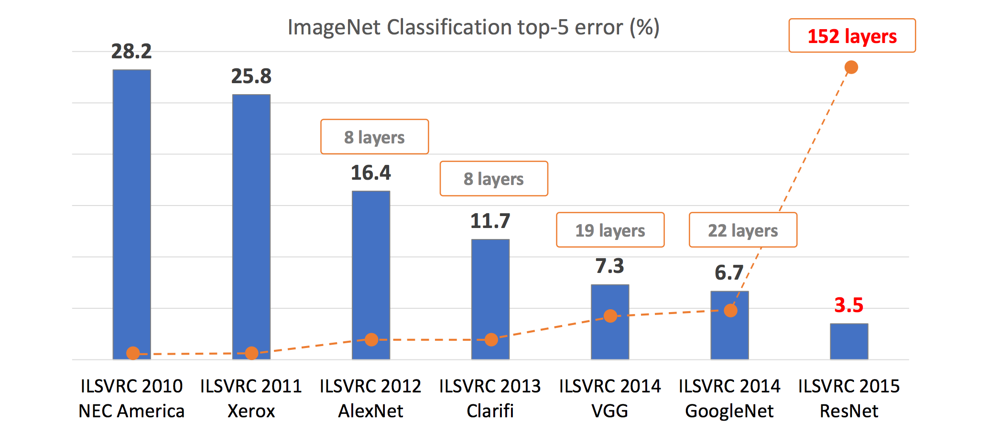

## Personal Tips for Reading Paper

- **Read Tables and Figures first**: Most of the papers summarizes important findings on the tables and figures. Often times, most of the text on the papers are peripheral explication of such tables and figures.
- **Read Methodology or Architecture before the Introduction**: introduction 1) is either relatively repetetive or 2) summary of preceding research.
- **Prior to reading the paper thoroughly, find which research are crucial to understand in the ongoing discourse in the Introduction part.**

## Personal Tips for Implementing Papers into Code

- **Implement an experiment what seems to represent the novel findings of the paper.** Implementing all of the experiments in the paper is nearly impossible without the help of the others.
- **Open-source the code if and only if the paper is already open to the public.** Most of the code requires refactoring. Being aware of the audience, public code under the personal authorship is more likely to be proofreaded again even without feedbacks from the others.
- **Develop the official implementations or other people's implementations which are likely to be imperfect.** Surprisingly, many of the official implementations lack details. This is probably because of lack of time for version management where private code remains covert.

## Review on [Very Deep Convolutional Networks for Large-Scale Image Recognition](https://arxiv.org/pdf/1409.1556.pdf)

Convolutional neural network's purpose is to extract representative features from the given input.

Historically, simply stacking up multiple blocks of [3 x 3 convolution, activation, max-pooling] to achieve desired performance was gargantuan contribution.

1. **Compared to prior neural networks, numbers of layers in VGG was considered to be "very deep".** Convolutional layers + fully connected layers totaled 19 layers for VGG19. However, in the following year, numbers of layers shoots up to 152 layers in ResNet architecture.
   

2. Compared to GoogleNet, VGG's architecture was simple. Googlenet which acheived SOTA performance consisted of 1) inception modules and 2) intermediate classifier branches in the middle of the architecture.

   Inception modules illustrated below uses heterogeneous sizes of convolutional layers, ranging from 1x1 to 5x5, which are concatenated at the end.
   

   Moreover, GoogleNet had intermediate auxiliary classifier, represented as the yellow block in the diagram below, used during the training. The architecture was computationally efficient but the structure was less intuitive.

   

   **On the other hand, VGG is monotonous repetition of [3 x 3 convolution, activation, max-pooling] before the classifier.**

   

## Implementing VGG on ImageNet Subset

In order to replicate the experiment, [ImageNet1K dataset](https://huggingface.co/datasets/imagenet-1k) should be used. However, ImageNet training dataset takes up more than 130GB of storage which makes it a great benchmark to compare between the models but a bad testing bed for trial and errors.

Thus for this blog post, 10 subset classes of ImageNet is used as the dataset. [Imagenette Dataset by FastAI](https://github.com/fastai/imagenette) allows us to test the models on easy classification task(Imagenette) and difficult classification task(imagewoof). Former one is classifying distinctive classes of objects/animals and the latter one is classifying species of dog.

1. 3 x 3 convolution is relatively small-sized filter.

   - Small is good enough

   - Better to stack up 3 x (3 x 3) than 1 x (7 x 7)

2. Consequent max-pooling operations reduces resolution into half. e.g (224 x 224) -> (112 x 112)

```python
# unzip .tgz file
# Subset of ImageNet: 1000 class -> 10 class and 130GB -> 300MB: https://github.com/fastai/imagenette
# !tar -xvzf /home/ubuntu/imagenet/imagenette2-320.tgz # easy classification task for 10 classes
# !tar -xvzf /home/ubuntu/imagenet/imagewoof2-320.tgz # hard classification task for 10 classes
```

### Trouble Encountered

- Implemented VGG16 underperforms torchvision vgg16
  - Top1 Acc 44% vs 9.7%
  - Loss 2.3 vs 6.8
- Loss is reluctant to be updated as training progresses

### AdaptiveAvgPool

- Why is there AdaptiveAvgPool at the torchvision implementation whereas none-existent in paper?

### Weight Initialization

- Why initialization increases performance?
- Difference between each Weight Initialization methods
- How to initialize weights in Pytorch
  - [Loss Intialization](https://jh-bk.tistory.com/10)
  - [torch.nn.init documentation](https://pytorch.org/docs/stable/nn.init.html)
  - [How to Initialize Weights in PyTorch](https://wandb.ai/wandb_fc/tips/reports/How-to-Initialize-Weights-in-PyTorch--VmlldzoxNjcwOTg1)

-> Slight performance increase to 10%

### Batch normalization

- location of batch normalization?
- function of batch normalization?
- Why does batch normalization does not appear in torch summary?
- Why does batch normalization increase memory space of the model?

-> Batch normalization didn't make any differences

### Weight vs Bias

- Difference between weight and bias

```python
import torch
import torch.nn as nn # import basic components
import torch.nn.functional as F # import functions
from torchsummary import summary

# VGG16, Configuration D
class VGG16(nn.Module):
    def __init__(
        self,
        dropout_ratio=0.5,
        input_channels=3,
        input_resolution=224,
        num_classes=1000,
    ):
        """
        VERY DEEP CONVOLUTIONAL NETWORKS FOR LARGE-SCALE IMAGE RECOGNITION
        https://arxiv.org/pdf/1409.1556.pdf

        - Implemented by @snoop2head and @lylajeon
        - Implementation of Table 1's ConvNet D Configuration
        - Each of the layers' output notated as channel@heightxwidth on the comments
        """
        super(VGG16, self).__init__()
        self.apply(self._initialize_weights)

        # instantiate input variables as class attributes
        self.dropout_ratio = dropout_ratio
        self.input_channels = input_channels
        self.input_resolution = input_resolution
        self.num_classes = num_classes

        # convolutional layers configuration
        self.conv_size = (3, 3)
        self.conv_stride = 1
        self.conv_padding = 1

        # max-pooling operations configuration
        self.pool_size = (2, 2)
        self.pool_stride = 2  # max pooling halves the image's resolution
        self.num_pooling = 5  # number of max-pooling operations

        # fully-connected layers configuration
        self.final_conv_output_resolution = (
            self.input_resolution // self.pool_stride ** self.num_pooling
        )
        self.fc_size = 4096

        self.conv1 = nn.Sequential(
            nn.Conv2d(
                in_channels=self.input_channels,
                out_channels=64,
                kernel_size=self.conv_size,
                stride=self.conv_stride,
                padding=self.conv_padding,
            ),  # 64@224x224
            nn.ReLU(),
            nn.Conv2d(
                in_channels=64,
                out_channels=64,
                kernel_size=self.conv_size,
                stride=self.conv_stride,
                padding=self.conv_padding,
            ),  # 64@224x224
            nn.ReLU(),
            nn.MaxPool2d(kernel_size=self.pool_size, stride=self.pool_stride),
        )  # 64@112x112

        self.conv2 = nn.Sequential(
            nn.Conv2d(
                in_channels=64,
                out_channels=128,
                kernel_size=self.conv_size,
                stride=self.conv_stride,
                padding=self.conv_padding,
            ),  # 128@112x112
            nn.ReLU(),
            nn.Conv2d(
                in_channels=128,
                out_channels=128,
                kernel_size=self.conv_size,
                stride=self.conv_stride,
                padding=self.conv_padding,
            ),  # 128@112x112
            nn.ReLU(),
            nn.MaxPool2d(kernel_size=self.pool_size, stride=self.pool_stride),
        )  # 128@56x56

        self.conv3 = nn.Sequential(
            nn.Conv2d(
                in_channels=128,
                out_channels=256,
                kernel_size=self.conv_size,
                stride=self.conv_stride,
                padding=self.conv_padding,
            ),  # 256@56x56
            nn.ReLU(),
            nn.Conv2d(
                in_channels=256,
                out_channels=256,
                kernel_size=self.conv_size,
                stride=self.conv_stride,
                padding=self.conv_padding,
            ),  # 256@56x56
            nn.ReLU(),
            nn.Conv2d(
                in_channels=256,
                out_channels=256,
                kernel_size=self.conv_size,
                stride=self.conv_stride,
                padding=self.conv_padding,
            ),  # 256@56x56
            nn.ReLU(),
            nn.MaxPool2d(kernel_size=self.pool_size, stride=self.pool_stride),
        )  # 256@28x28

        self.conv4 = nn.Sequential(
            nn.Conv2d(
                in_channels=256,
                out_channels=512,
                kernel_size=self.conv_size,
                stride=self.conv_stride,
                padding=self.conv_padding,
            ),  # 512@28x28
            nn.ReLU(),
            nn.Conv2d(
                in_channels=512,
                out_channels=512,
                kernel_size=self.conv_size,
                stride=self.conv_stride,
                padding=self.conv_padding,
            ),  # 512@28x28
            nn.ReLU(),
            nn.Conv2d(
                in_channels=512,
                out_channels=512,
                kernel_size=self.conv_size,
                stride=self.conv_stride,
                padding=self.conv_padding,
            ),  # 512@28x28
            nn.ReLU(),
            nn.MaxPool2d(kernel_size=self.pool_size, stride=self.pool_stride),
        )  # 512@14x14

        self.conv5 = nn.Sequential(
            nn.Conv2d(
                in_channels=512,
                out_channels=512,
                kernel_size=self.conv_size,
                stride=self.conv_stride,
                padding=self.conv_padding,
            ),  # 512@14x14
            nn.ReLU(),
            nn.Conv2d(
                in_channels=512,
                out_channels=512,
                kernel_size=self.conv_size,
                stride=self.conv_stride,
                padding=self.conv_padding,
            ),  # 512@14x14
            nn.ReLU(),
            nn.Conv2d(
                in_channels=512,
                out_channels=512,
                kernel_size=self.conv_size,
                stride=self.conv_stride,
                padding=self.conv_padding,
            ),  # 512@14x14
            nn.ReLU(),
            nn.MaxPool2d(kernel_size=self.pool_size, stride=self.pool_stride),
        )  # 512@7x7

        # count number of nn.maxpool2d layers
        self.fc_module = nn.Sequential(
            nn.Linear(512 * self.final_conv_output_resolution ** 2, self.fc_size),
            nn.Dropout(self.dropout_ratio),
            nn.ReLU(),
            nn.Linear(self.fc_size, self.fc_size),
            nn.Dropout(self.dropout_ratio),
            nn.ReLU(),
            nn.Linear(self.fc_size, self.num_classes),
        )

    def forward(self, x):
        # forward pass through convolutional layers
        out = self.conv1(x)
        out = self.conv2(out)
        out = self.conv3(out)
        out = self.conv4(out)
        out = self.conv5(out)

        # flatten the output
        out = out.flatten(start_dim=1)  # assuming batch size is first dimension

        # forward pass through fully connected layers
        out = self.fc_module(out)

        # yield prediction probabilities for each class using softmax
        return F.softmax(out, dim=1)  # assuming batch size is first dimension

    def _initialize_weights(self, module):
        if isinstance(module, nn.Conv2d):
            nn.init.kaiming_normal_(module.weight, mode="fan_out", nonlinearity="relu")
            if module.bias is not None:
                nn.init.constant_(module.bias, 0)
        elif isinstance(module, nn.Linear):
            nn.init.normal_(module.weight, 0, 0.01)
            nn.init.constant_(module.bias, 0)
```

```python
from torchvision.models import vgg16

# Setting device
is_cuda = torch.cuda.is_available()
device = torch.device('cuda:0' if is_cuda else 'cpu')
print ('Current cuda device is', device)

# Both are VGG16, Configuration D
custom_vgg_model = VGG16()
torch_vgg_model = vgg16(pretrained=False) # pretrained=False for random initialization


print("--------------------Custom VGG16--------------------")
print(summary(custom_vgg_model.to(device), (3, 224, 224)))

print("--------------------Torch VGG16--------------------")
print(summary(torch_vgg_model.to(device), (3, 224, 224)))
```

    --------------------Custom VGG16--------------------
    
            Layer (type)               Output Shape         Param #
    ================================================================
                Conv2d-1         [-1, 64, 224, 224]           1,792
                  ReLU-2         [-1, 64, 224, 224]               0
                Conv2d-3         [-1, 64, 224, 224]          36,928
                  ReLU-4         [-1, 64, 224, 224]               0
             MaxPool2d-5         [-1, 64, 112, 112]               0
                Conv2d-6        [-1, 128, 112, 112]          73,856
                  ReLU-7        [-1, 128, 112, 112]               0
                Conv2d-8        [-1, 128, 112, 112]         147,584
                  ReLU-9        [-1, 128, 112, 112]               0
            MaxPool2d-10          [-1, 128, 56, 56]               0
               Conv2d-11          [-1, 256, 56, 56]         295,168
                 ReLU-12          [-1, 256, 56, 56]               0
               Conv2d-13          [-1, 256, 56, 56]         590,080
                 ReLU-14          [-1, 256, 56, 56]               0
               Conv2d-15          [-1, 256, 56, 56]         590,080
                 ReLU-16          [-1, 256, 56, 56]               0
            MaxPool2d-17          [-1, 256, 28, 28]               0
               Conv2d-18          [-1, 512, 28, 28]       1,180,160
                 ReLU-19          [-1, 512, 28, 28]               0
               Conv2d-20          [-1, 512, 28, 28]       2,359,808
                 ReLU-21          [-1, 512, 28, 28]               0
               Conv2d-22          [-1, 512, 28, 28]       2,359,808
                 ReLU-23          [-1, 512, 28, 28]               0
            MaxPool2d-24          [-1, 512, 14, 14]               0
               Conv2d-25          [-1, 512, 14, 14]       2,359,808
                 ReLU-26          [-1, 512, 14, 14]               0
               Conv2d-27          [-1, 512, 14, 14]       2,359,808
                 ReLU-28          [-1, 512, 14, 14]               0
               Conv2d-29          [-1, 512, 14, 14]       2,359,808
                 ReLU-30          [-1, 512, 14, 14]               0
            MaxPool2d-31            [-1, 512, 7, 7]               0
               Linear-32                 [-1, 4096]     102,764,544
              Dropout-33                 [-1, 4096]               0
                 ReLU-34                 [-1, 4096]               0
               Linear-35                 [-1, 4096]      16,781,312
              Dropout-36                 [-1, 4096]               0
                 ReLU-37                 [-1, 4096]               0
               Linear-38                 [-1, 1000]       4,097,000
    ================================================================
    Total params: 138,357,544
    Trainable params: 138,357,544
    Non-trainable params: 0
    ----------------------------------------------------------------
    Input size (MB): 0.57
    Forward/backward pass size (MB): 218.59
    Params size (MB): 527.79
    Estimated Total Size (MB): 746.96
    ----------------------------------------------------------------

```python
MINI_BATCH_SIZE = 256 # numbers of images in a mini-batch
VALID_BATCH_SIZE = 64 # numbers of images in a mini-batch
LEARNING_RATE = 1e-4
EPOCHS = 100
RESOLUTION = (224, 224)
```

```python
# import dataset structuring and image transformation modules
from torchvision.datasets import ImageFolder # Load dataset
from torchvision import transforms

DATA_PATH = "imagenette2-320"

imagenet_transforms = transforms.Compose([
    transforms.Resize(RESOLUTION),
    transforms.ToTensor(),
    transforms.Normalize(mean=[0.485, 0.456, 0.406], std=[0.229, 0.224, 0.225])
])

train_data = ImageFolder(root=f'./{DATA_PATH}/train', transform=imagenet_transforms)
print('number of training data: ', len(train_data))
```

    number of training data:  9469

```python
valid_data = ImageFolder(root=f'./{DATA_PATH}/val', transform = imagenet_transforms)
print('number of test data: ', len(valid_data))
```

    number of test data:  3925

```python
sample_idx = 1001
sample_img, sample_label = train_data[sample_idx]
print('sample image shape: ', sample_img.size())
print('sample image label: ', sample_label)
```

    sample image shape:  torch.Size([3, 224, 224])
    sample image label:  1

```python
from matplotlib import pyplot as plt
# show image from training data
plt.imshow(sample_img.numpy().transpose(1,2,0))
plt.title(f'label is {sample_label}')
plt.show()
```

    Clipping input data to the valid range for imshow with RGB data ([0..1] for floats or [0..255] for integers).


```python
# using torch dataloader to divide dataset into mini-batch
# https://pytorch.org/docs/stable/data.html
train_loader = torch.utils.data.DataLoader(
  dataset = train_data,
  batch_size = MINI_BATCH_SIZE,
  shuffle = True
)
eval_loader  = torch.utils.data.DataLoader(
  dataset = valid_data,
  batch_size = VALID_BATCH_SIZE,
  shuffle = True
)

first_batch = train_loader.__iter__().__next__()
print('{:<21s} | {:<25s} | {}'.format('name', 'type', 'size'))
print('{:<21s} | {:<25s} | {}'.format('Number of Mini-Batchs', '', len(train_loader)))
print('{:<21s} | {:<25s} | {}'.format('first_batch', str(type(first_batch)), len(first_batch)))
print('{:<21s} | {:<25s} | {}'.format('first_batch[0]', str(type(first_batch[0])), first_batch[0].shape))
print('{:<21s} | {:<25s} | {}'.format('first_batch[1]', str(type(first_batch[1])), first_batch[1].shape))
```

    name                  | type                      | size
    Number of Mini-Batchs |                           | 37
    first_batch           | <class 'list'>            | 2
    first_batch[0]        | <class 'torch.Tensor'>    | torch.Size([256, 3, 224, 224])
    first_batch[1]        | <class 'torch.Tensor'>    | torch.Size([256])

```python
# bring optimizers from torch
import torch.optim as optim

# Hyperparameter Setting
model = custom_vgg_model.to(device)

# Defining optimizer
optimizer = optim.Adam(model.parameters(), lr = LEARNING_RATE)

# Using Cross entropy loss function
criterion = nn.CrossEntropyLoss()
```

```python
# Print model's architecture
print(model)
```

    VGG16(
      (conv1): Sequential(
        (0): Conv2d(3, 64, kernel_size=(3, 3), stride=(1, 1), padding=(1, 1))
        (1): ReLU()
        (2): Conv2d(64, 64, kernel_size=(3, 3), stride=(1, 1), padding=(1, 1))
        (3): ReLU()
        (4): MaxPool2d(kernel_size=(2, 2), stride=2, padding=0, dilation=1, ceil_mode=False)
      )
      (conv2): Sequential(
        (0): Conv2d(64, 128, kernel_size=(3, 3), stride=(1, 1), padding=(1, 1))
        (1): ReLU()
        (2): Conv2d(128, 128, kernel_size=(3, 3), stride=(1, 1), padding=(1, 1))
        (3): ReLU()
        (4): MaxPool2d(kernel_size=(2, 2), stride=2, padding=0, dilation=1, ceil_mode=False)
      )
      (conv3): Sequential(
        (0): Conv2d(128, 256, kernel_size=(3, 3), stride=(1, 1), padding=(1, 1))
        (1): ReLU()
        (2): Conv2d(256, 256, kernel_size=(3, 3), stride=(1, 1), padding=(1, 1))
        (3): ReLU()
        (4): Conv2d(256, 256, kernel_size=(3, 3), stride=(1, 1), padding=(1, 1))
        (5): ReLU()
        (6): MaxPool2d(kernel_size=(2, 2), stride=2, padding=0, dilation=1, ceil_mode=False)
      )
      (conv4): Sequential(
        (0): Conv2d(256, 512, kernel_size=(3, 3), stride=(1, 1), padding=(1, 1))
        (1): ReLU()
        (2): Conv2d(512, 512, kernel_size=(3, 3), stride=(1, 1), padding=(1, 1))
        (3): ReLU()
        (4): Conv2d(512, 512, kernel_size=(3, 3), stride=(1, 1), padding=(1, 1))
        (5): ReLU()
        (6): MaxPool2d(kernel_size=(2, 2), stride=2, padding=0, dilation=1, ceil_mode=False)
      )
      (conv5): Sequential(
        (0): Conv2d(512, 512, kernel_size=(3, 3), stride=(1, 1), padding=(1, 1))
        (1): ReLU()
        (2): Conv2d(512, 512, kernel_size=(3, 3), stride=(1, 1), padding=(1, 1))
        (3): ReLU()
        (4): Conv2d(512, 512, kernel_size=(3, 3), stride=(1, 1), padding=(1, 1))
        (5): ReLU()
        (6): MaxPool2d(kernel_size=(2, 2), stride=2, padding=0, dilation=1, ceil_mode=False)
      )
      (fc_module): Sequential(
        (0): Linear(in_features=25088, out_features=4096, bias=True)
        (1): Dropout(p=0.5, inplace=False)
        (2): ReLU()
        (3): Linear(in_features=4096, out_features=4096, bias=True)
        (4): Dropout(p=0.5, inplace=False)
        (5): ReLU()
        (6): Linear(in_features=4096, out_features=1000, bias=True)
      )
    )

```python
from tqdm import tqdm
""" Training the model """

# Change the model to training mode
model.train()

# A training step is one gradient update. In one step batch_size many examples are processed.
# training step = dataset size / mini-batch size
# https://stackoverflow.com/questions/38340311/what-is-the-difference-between-steps-and-epochs-in-tensorflow

# Updating Gradient in each training steps
for epoch in range(EPOCHS):
    for training_step, (data, target_tensor) in enumerate(tqdm(train_loader)): # bringing dataset from train_loader() function
        # data is [Batch Size = 50, Channel Size = 1, Height = 28, Width = 28] tensor
        data = data.to(device)
        # Tagets is label [Labels = 50] tensor
        target_tensor = target_tensor.to(device)

        # Gradient Descent process
        optimizer.zero_grad() # initializing previously saved gradient's value to zero # https://jaeyung1001.tistory.com/115
        output = model(data) # feed forward to get one-hot-encoded output probabilities
        loss = criterion(output, target_tensor) # comparing prediction and ground truth to get loss
        loss.backward() # backpropagating loss
        optimizer.step() # updating weights with single optimization step

        # print status every 1000 training steps
        if training_step % 500 == 0:
            loss_rounded_to_3 = round(loss.item() * 1000) / 1000 # loss is a single value, so we need to round it to 3 digits
            print(f'Train Step: {training_step} \t Loss: {loss_rounded_to_3}')
```

      3%|▎         | 1/37 [00:03<01:49,  3.03s/it]
    
    Train Step: 0 	 Loss: 6.908


    100%|██████████| 37/37 [00:56<00:00,  1.53s/it]
      3%|▎         | 1/37 [00:02<01:26,  2.40s/it]
    
    Train Step: 0 	 Loss: 6.792


    100%|██████████| 37/37 [00:53<00:00,  1.46s/it]
      3%|▎         | 1/37 [00:02<01:29,  2.50s/it]
    
    Train Step: 0 	 Loss: 6.8


    100%|██████████| 37/37 [00:53<00:00,  1.45s/it]
      3%|▎         | 1/37 [00:02<01:29,  2.48s/it]
    
    Train Step: 0 	 Loss: 6.773


     78%|███████▊  | 29/37 [00:42<00:11,  1.44s/it]

```python
""" Evaluating the model """

# Switching to evaluation mode
model.eval()

correct = 0
for data, target_labels in tqdm(eval_loader):
    # data is [Batch Size = 50, Channel Size = 1, Height = 28, Width = 28] tensor
    data = data.to(device)
    # Tagets is label [Labels = 50] tensor
    target_labels = target_labels.to(device)

    # getting predicted output label out of maximum probabilities' output in the tensor
    output = model(data)
    predicted_output_labels = output.data.max(1)[1]

    # add numbers of correct predictions
    correct += predicted_output_labels.eq(target_labels.data).sum()

print('Test set: Accuracy: {:.2f}%'.format(100. * correct / len(eval_loader.dataset)))
```

    100%|██████████| 62/62 [00:21<00:00,  2.84it/s]
    
    Test set: Accuracy: 9.91%

### References

https://www.geeksforgeeks.org/understanding-googlenet-model-cnn-architecture/
