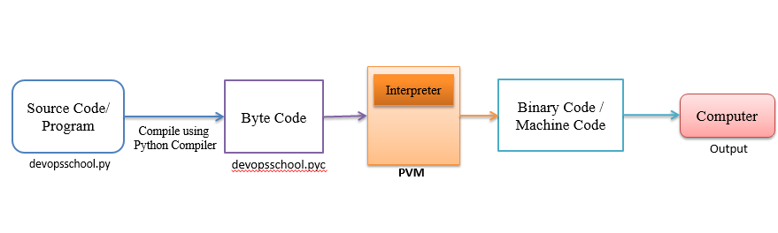

In the GDSC Yonsei Seoul session held at September 20th, Computer Science & Engineering Basic Knowledge Test was tested on all of the members. There were total 16 questions regarding Data Structure, Computer Architecture, Operating System and Network.

I found that basics on Python language necessary for me to study on. After the session, I purchased [CPython Internals Book](https://realpython.com/products/cpython-internals-book/) published by Real Python to continue the endeavor.

### Q10. State the differences between compiled languages and interpreted languages

- Compiled languages: Rust, C++
- Interpreted language: Python, JS

**Q10-1. Explain how example.py works**

example.py (source code) ➡️ example.pyc (byte code) ➡️ CPython Virtual machine ➡️ Binary code / Machine Code

**Q10-2. Explain JIT(Just in Time) Compiler**

pypy is one type of the interpreter that is known to be faster than CPython. IT adapts JIT compiler structure, where JIT is compiling frequently used codes before the code is run. Also, it compiles bytecodes into machine code at run time which is known to reduce time.

**Q14-1. Python's multi thread programming works differently compared to other langauges. What is/are the difference/differences?**

Python has Global Interpretor Lock(GIL) which is well-known performance bottleneck of the language. [GIL allows only one thread to execute at a time even in multi-threaded arcitecture with more than one CPU Core.](https://realpython.com/python-gil/)
