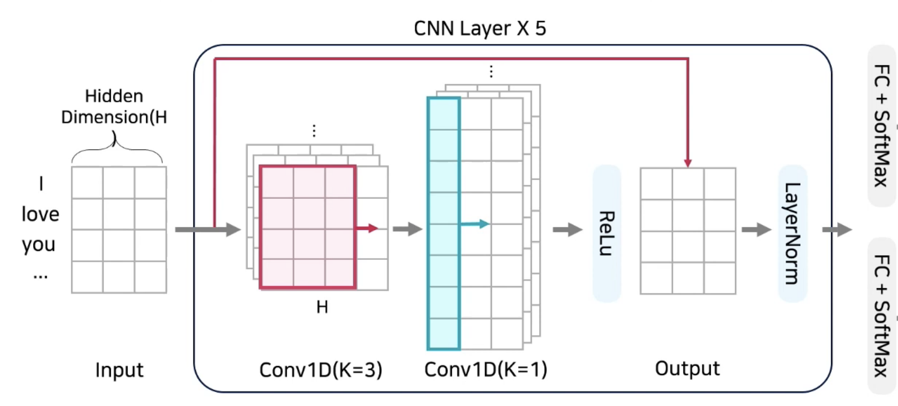
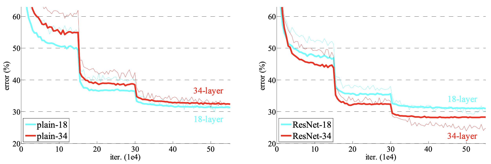
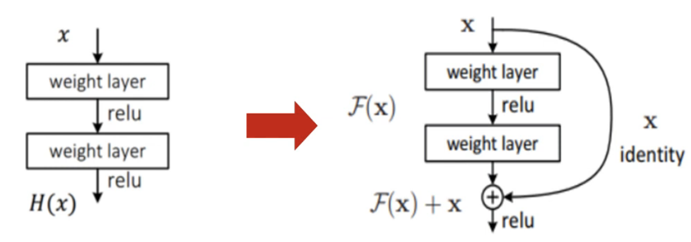

## Residual Connection is Good, Up to Now

ResNet was introduced in 2015 on the paper [Deep Residual Learning for Image Recognition](https://www.cv-foundation.org/openaccess/content_cvpr_2016/papers/He_Deep_Residual_Learning_CVPR_2016_paper.pdf). **Nevertheless, residual connection is often found on SOTA neural network even in 2020s.** For example, skip connection can be found on NLP domain's KorQuad Machine Reading Comprehension's [SOTA model introduced by Samsung SDS](https://www.youtube.com/watch?v=ovD_87gHZO4&t=832s). QuestionAnswering classifier of Samsung SDS is illustrated and represented as pytorch code below.



```python
import torch
from torch import nn


class ConvSDSLayer(nn.Module):
    def __init__(self, input_size: int, hidden_dim: int):
        """
        Samsung SDS Convolution Layer Block
        - input_size: token sequence length of the input
        - hidden_size: embedding dimension ranging from 768(base) ~ 1024(large)
        - Implemented by @j961224 and @snoop2head
        """
        super().__init__()
        self.conv1 = nn.Conv1d(
            in_channels=input_size,
            out_channels=input_size * 2,
            kernel_size=3,
            padding=1,
        )
        self.conv2 = nn.Conv1d(
            in_channels=input_size * 2,
            out_channels=input_size,
            kernel_size=1,
        )
        self.layer_norm = nn.LayerNorm(hidden_dim)
        self.activation = nn.ReLU()

    def forward(self, x: torch.Tensor) -> torch.Tensor:
        out = self.conv1(x)
        out = self.conv2(out)
        out = x + self.activation(out)  # Residual Connection
        out = self.layer_norm(out)
        return out


class ConvSDSHead(nn.Module):
    """
    Classifier Head for the Machine Reading Comprehension
    - Input: batch_size x sequence_length x hidden_size
    - Output: batch_size x sequence_length x (start_logits, end_logits)
    - Implemented by @j961224 and @snoop2head
    """

    def __init__(
        self,
        n_layers: int = 5,
        input_size: int = 512,
        hidden_size: int = 768,
        num_labels: int = 2, # output of start of the span and end of the span
    ):
        super().__init__()
        self.n_layers = n_layers
        self.input_size = input_size
        self.hidden_size = hidden_size
        self.classifier = nn.Linear(self.hidden_size, num_labels)

    def forward(self, x: torch.Tensor) -> torch.Tensor:
        convs = [
            ConvSDSLayer(self.input_size, self.hidden_size)
            for _ in range(self.n_layers)
        ]
        self.convs = nn.Sequential(*convs)
        out = self.convs(x)
        return self.classifier(out)

# sample input
x = torch.randn(1, 512, 768) # 1 batch x 512 seq length x 768 dimension size
model = ConvSDSHead()
model(x).shape
```

```
torch.Size([1, 512, 2])
```

Regarding Machine Reading Comprehension, please refer to my blog post of [Customizing Question Answering Reader Model](https://snoop2head.github.io/Engineering/Custom-MRC-Reader/).

Moreover, [multi-modal model architecture that 2022 Dacon competition introduced by @affjljoo3581](https://github.com/affjljoo3581/Job-Recommend-Competition) also utilizes the skip connection as the following.

|                        Residual Block                        |                      Model Architecture                      |
| :----------------------------------------------------------: | :----------------------------------------------------------: |
|  |  |

```python
from torch import nn


class SiDResidualBlock(nn.Module):
  	""" 
  	- Referencing https://github.com/affjljoo3581/Job-Recommend-Competition/blob/bb41cdd02161d97813f03eb9d23ff8c186b7da83/src/modeling.py#L117-L133
  	- Both model architecture illustration and code implemented by @affjljoo3581
  	"""
    def __init__(self, config: SiDConfig):
        super().__init__()
        self.feedforward = nn.Sequential(
            nn.Linear(config.hidden_size, config.intermediate_size),
            nn.GELU(),
            nn.Linear(config.intermediate_size, config.hidden_size * 2),
        )
        self.dropout = nn.Dropout(config.hidden_dropout_prob)

    def forward(self, hidden_states: torch.Tensor) -> torch.Tensor:
        output = self.feedforward(hidden_states)
        output, gating = output.chunk(2, dim=1)
        output = output * gating.sigmoid() 
        return hidden_states + self.dropout(output) # Residual Connection
```

## Problem with Deeper Neural Network

ResNet is introduced as the extension from how to make deeper neural network. Please refer to my previous blog post of [VGG Implementation with Trial and Error](https://snoop2head.github.io/Researching/Friendly-VGG-Implementation/) to grasp the context before the advent of ResNet. 

**Long-lasting problem was that performance gain from stacking up deeper convolution layers was limited.** It was underlying assumption is that deeper neural network has advantages in terms of feature extraction. VGG16 and VGG19 was one of the attempt to introduce deeper neural network. However, such notion didn't hold true in reality, if more layers are adjoined. 

**Residual connection between the layers resolved such problem.** Below is the diagram of validation error according to the number of layers. Figure on the left shows that 34 layers of VGG-alike CNN model underperforming that of 18 layers. ResNet's main contribution was that it resolved such issue by introducing skip connection. Figure on the right displays that deeper the ResNet model, the lower the model's validation error on ImageNet dataset.



## Residual Connection and Residual Learning

- Two shortcuts were proposed, where one is identity summation and the other one is projection summation.
- Previously, H(x) was the original output where such layers were directly fitted according to the output H(x).
- F(x) = H(x) - x is the new objective function to fit proposed in ResNet architecture. Fitting on the residual, F(x) may converge to zero in backpropagation.
- H(x) = F(x) + x is then feedforward output of the neural network.



Other details posed at previous VGG post: Batch normalization and weight initialization on also appears on ResNet paper which will be discussed in other posts.

## What is behind Residual Connection?

It is naively assumed that gradient vanishing problem was averted through identity addition. The paper [Residual Networks Behave Like Ensembles of Relatively Shallow Networks](https://arxiv.org/pdf/1605.06431.pdf) closely examines the behavior of ResNet.

